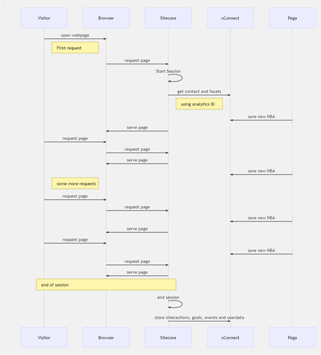
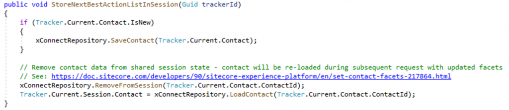

In our road towards realtime personalization, we were in need of reloading our xDB contact on every request, as external systems might have updated several facets with information that could or should be used within Sitecore. Out of the box, this does not happen.

### Why changes to the contact xDB do not reflect to the contact in Sitecore

The problem within Sitecore lies within how and when xDB contacts are retrieved from the xDB. let's take a look at the diagram below:

In the sequence diagram, it becomes clear that after the start of the Session, a contact will be retrieved from the xDB. This is the only time in de default lifecycle of a session that this happens, which means that, whenever an update to the xDB contact will be written to the xDB, this change does not reflect the state within the private session database. In order to be able to reflect those changes, the contact needs to be reloaded. This can be done using the following code:

The code consists of three parts:

### Ensure that the contact exists.

When the "IsNew" property has been set to true, the contact only exists in the Sitecore environment. An explicit save is needed, before the contact can be reloaded. This is _only_ the case when the visitor doesn't send a SC\_GLOBAL\_ANALYTICS\_COOKIE - this is a persistent cookie which is stored over sessions and contains an identifier which can be used to identiy a user in the xDB. When this information is not available, the contact will be marked as "IsNew". _whenever a user leaves information, which can be used to identify this user, a merge of contacts can be executed._

### Remove the contact from the current session

By removing a contact entirely from the current session, his interactions and goals will be saved, but the contact details and its facets will be reloaded upon the _next request._

### Explicitly reload the contact

When the contact is removed from the session, the contact can be reloaded explicitly. By removing the contact from the session at the start of the request and reloading that same contact immediately, all the latest, fresh information for this contact, with its facets, will be made availabe to sitecore.

## Summary

The default working of Sitecore loads a contact into the session, but does not sync updates to the xDB immediately to Sitecore. By explicitly removing and reloading the contact at the start of a request, all the latest changes to a contact can be made availabe to sitecore. This data can be used to for, for example, smart personalizations.
