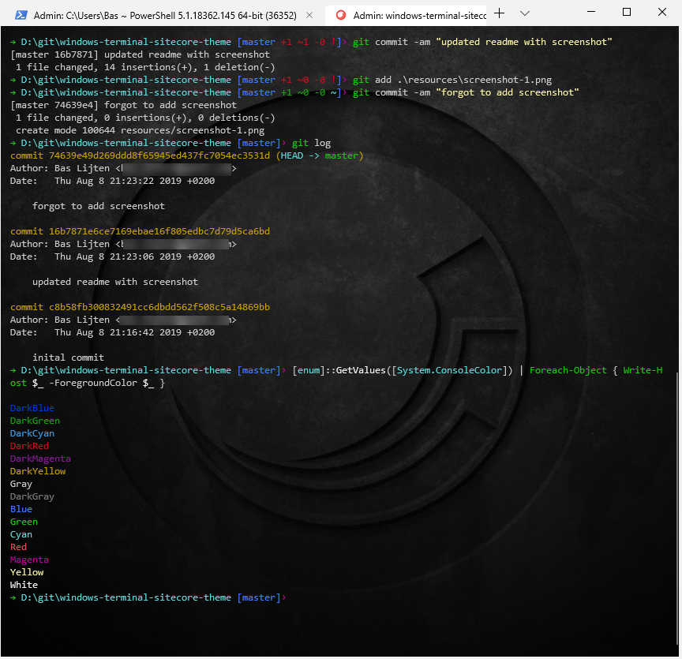

Microsoft recently released the Windows terminal in the windows store and I must say: I love it. Highly configurable, so I decided to create a small Sitecore theme for it. I hope you will love it! The code can be found [here](https://github.com/BasLijten/windows-terminal-sitecore-theme)

The theme has been made up of

- a Background created by [Jason "Taco" Wilkerson](https://citizensitecore.com/author/longhorntaco/)
- a randomly found icon on google search
- the dracula theme for Powershell

which results in the following look and feel:

I just grabbed everything together and put it into a repository ;)
