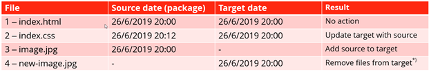
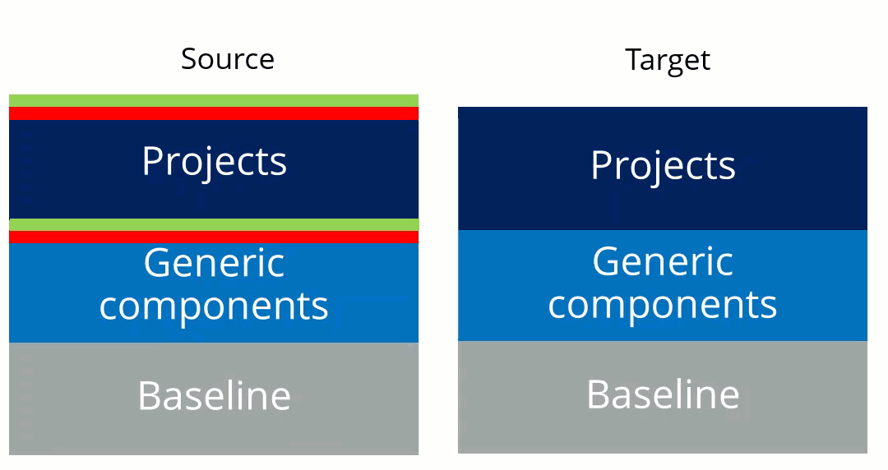
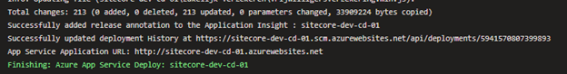

In my Sitecore symposium session “Sitecore in the enterprise: Optimize your time to deliver toward the speed of light, using all the new love in Azure DevOps” (and yes that is a mouth full) I spend quite some time on the “mono-package” approach. This blogpost what a mono-package is and why it is (much) faster in terms of deployments as opposed to using multiple web deployment packages.

_Disclaimer 1:_ _In this blogpost I talk (a bit) about Sitecore, but it is applicable for any application that is being deployed using msdeploy or the app service task in Azure DevOps. The blogpost “Sitecore challenges on the mono-package approach” contains the specific challenges faced that had to be solved._

_Disclaimer 2: Some people might immediately be opinionated: “how could you ever end up with multiple packages, you have a bad architecture”. I understand your pain and in some cases you might be right. But there are cases where you have to deal with external factors, such as existing platforms and organizational challenges, where a layered approach is a not to weird solution._

## The layered approach – part 1

When using a layered deployment, multiple web deployment packages are needed to deploy an application. This approach could lead to increased deployment times and reduced quality. But why? To understand this, it’s important to know how msdeploy works. When having a single solution with a single web deployment package, stop reading: you won’t learn anything here.

## Msdeploy 101

Msdeploy has a \*lot\* of different functionalities, but it the end, it comes down to the following: Let’s say there is a source (your compiled code and all the assets) and a target (the place where your code and assets need to be deployed to). A few different situations can happen:

- The source has a file which already exists at the target and is newer or older (situation 1 and 2)
- The source has a file which doesn’t already exist in the target (scenario 3)
- The source omits a file that exists at the target

In the first situation (1 and 2 in the table), the file will be added or omitted. In the second situation, the file will be added and in the third situation, the file \*might\*, based on your deployment settings, be removed. If the setting “remove additional files from target is enabled”, msdeploy works in a modus that I call “sync” modus: it removes everything that is not in the current source and updates everything that is newer. All the files that didn’t change are untouched.

## Layered approach – part two

In a layered approach, the first package is often installed with the “removed files from target” option enabled, which means that on every release, the application syncs back to that single package. In other words: all the files that have been deployed using another package, will be removed or set back to the state as defined in the current source package. Every following package for this deployment will \*not\* have this option enabled, otherwise it would undo the previous deployment. These packages just add new or update existing files.

If the first package doesn’t have “remove files from target” enabled, it doesn’t remove old files at all. With other words, old stuff stays on the app service (or iis server).

Below is an example on how such a deployment could occur:

In the first situation (1 and 2 in the table), the file will be added or omitted. In the second situation, the file will be added and in the third situation, the file \*might\*, based on your deployment settings, be removed. If the setting “remove additional files from target is enabled”, msdeploy works in a modus that I call “sync” modus: it removes everything that is not in the current source and updates everything that is newer. All the files that didn’t change are untouched.

## Layered approach – part two

In a layered approach, the first package is often installed with the “removed files from target” option enabled, which means that on every release, the application syncs back to that single package. In other words: all the files that have been deployed using another package, will be removed or set back to the state as defined in the current source package. Every following package for this deployment will \*not\* have this option enabled, otherwise it would undo the previous deployment. These packages just add new or update existing files.

If the first package doesn’t have “remove files from target” enabled, it doesn’t remove old files at all. With other words, old stuff stays on the app service (or iis server).

Below is an example on how such a deployment could happen

In the first situation (1 and 2 in the table), the file will be added or omitted. In the second situation, the file will be added and in the third situation, the file \*might\*, based on your deployment settings, be removed. If the setting “remove additional files from target is enabled”, msdeploy works in a modus that I call “sync” modus: it removes everything that is not in the current source and updates everything that is newer. All the files that didn’t change are untouched.

## Layered approach – part two

In a layered approach, the first package is often installed with the “removed files from target” option enabled, which means that on every release, the application syncs back to that single package. In other words: all the files that have been deployed using another package, will be removed or set back to the state as defined in the current source package. Every following package for this deployment will \*not\* have this option enabled, otherwise it would undo the previous deployment. These packages just add new or update existing files.

If the first package doesn’t have “remove files from target” enabled, it doesn’t remove old files at all. With other words, old stuff stays on the app service (or iis server).

Below is an example on how such a deployment could occur:

The problem lies with the growing packages. An application grows and gets new assets, so eventually the set of “generic components + projects” will grow (very) large. Which basically means: this will take more time to deploy. In our specific scenario, the following happens _every_ deployment:

- Reset to baseline: compare the baseline package to the target and remove everything that is not in there. With 25000+ files, this is quite a lot and takes a lot of time
- Add project + baseline: add every file in these packages.

This happens every deployment over- and over- again, while the actual changeset (the delta in green and red) might be very, very small.

## The mono package approach

“Normal” projects have a mono package approach by default: a single web deployment package will be created after the build and it can be deployed. In environments such as Sitecore, this cannot be done in a convenient way (yet). Due to their architecture (helix), installation (single wdp) and module approach we end up with _at least_ two packages, but it isn’t uncommon to have five, six or even more packages. But what would a world look like if we _could_ have a mono-package?

### The mono package world

When talking about mono packages, we should be able to merge all different packages into one. This makes the deployment much, much faster. The source and target should look a lot like each other and only _differences (the delta)_ have to be deployed:

This brings deployments down from 7-8 minutes, back to just 1 minute, when talking about 25000+ files. The amount of files updates are greatly reduced (just 213 in my case)

# Conclusion & Challenges

Moving from a multi-layered deployment to a mono-package reduces the deployment time. Based on different factors, such as vendors and architecture it might be hard to achieve this. The following blogpost will explain the main challenges for Sitecore and show how to solve them.
