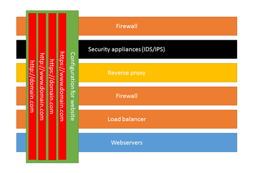
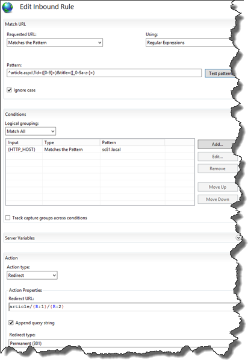
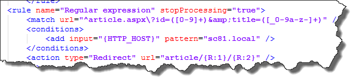
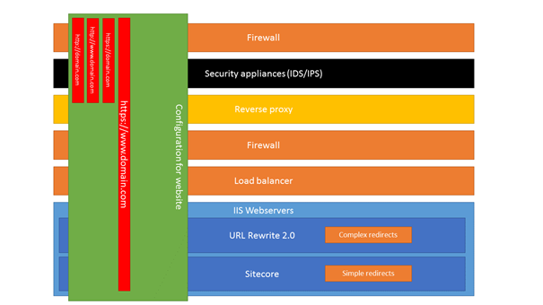

Redirection of urls, it’s a very common action, it’s important to maintain your SEO-value when URL’s move around and to provide friendly, short URLs. The only thing that you have to do is to create a permanent or temporary redirect, right? There are some solutions which add redirect functionality to Sitecore, for example the great [Url Rewrite](https://github.com/iamandycohen/UrlRewrite) module by Andy Cohen, which is based on the [IIS Url Rewrite 2.0](http://www.iis.net/downloads/microsoft/url-rewrite) module by Microsoft. But there are several scenario’s when you can solve several redirects in other parts of the infrastructure, or with other products. This may, for example, be the case in in larger companies, hosting multiple Sitecore instances with multiple sites, where configuring certain types of redirects in different parts of the infrastructure can prevent a lot of other configuration in those same layers, reduce complexity or prevent issues on the permissions to configure redirects.

This blogpost explains why we chose to handle redirects in different parts of our infrastructure, from a technical _and_ a functional perspective.

## A small look at the infrastructure and the way it gets managed

If we look into a typical infrastructure to serve websites, this could be visualized as follows. For every website that needs to be accessed via the internet, configuration is needed (not on every layer of the infrastructure, but on several layers). In small organizations, some layers are not present, this may be done by a single team, or even a single person, but in larger organizations, those tasks are usually split amongst several teams, with different workloads, procedures, schedules and priorities. Those tasks vary from configuring DNS, Virtual IP’s, create/order new certificates for connections over SSL, to block incoming requests to specific paths/locations. All these layers are in place to keep the entire infrastructure as safe as possible. Imagine what happens when you are hosting not a single site, but tens, or even hundreds of sites. When those sites should all be accessible over http/https _and_ the sites should be available via a www- and non-www entry, the workload of all the teams grows and with a lot of sites, the traffic will grow as well. Think about what happens to the infrastructure when _every_ request would reach the webservers: every layer would get a lot of traffic. Those are just a few reasons which can contribute to the choice of aborting/redirecting requests as early as possible in the chain.

_Note: an example of a path that should be blocked over the internet (thus, the Content Delivery servers), are the /Sitecore/ and /App\_config paths. They should be blocked for anonymous users on IIS as well, but defense in depth (multiple layers of security) is always a good practice._

## Redirect requirements

When only taking into account the technical aspects of a solution, all the redirects would be handled by the Reverse proxy. This wouldn’t be a suitable solution for the content editors, as they have the need to create new redirects on the fly. In our situation they don’t have access to the reverse proxy, so the only possibility that they would have, was to provide a task to the team which administrates the reverse proxy, with a request to configure those redirects. That would create serious delay in providing new redirects. Imagine what would happen when they make some errors. That would take ages ;).

That’s why we split the redirects into 4 categories:

### Redirect all http requests to https

Serving sites over http is not safe for the end user. Google is even using https as a ranking signal; thus boosting sites that use https. This kind of redirect should be handled as early as possible in the infrastructure and it’s a one-time configuration which has become part part of our standard operation procedures when configuring new sites. This configuration takes place on the reverse proxy.

Redirecting early in the chain, prevents a lot of configuration that was needed on other layers otherwise. Think about configuring firewalls, load balancers and webservers, they all should support the http _and_ https traffic, the www- _and_ non-www url’s. At Sitecore level, extra configuration should be needed to serve both sites and it would introduce complex scenario’s when posting data over the internet. When do you choose to use http, when to use https. What would it mean for developers? What kind of security flaws would you introduce?

_Note: in the end you want to get rid of non-encrypted traffic. By implementing_ [_Http Strict Transport Security_](https://en.wikipedia.org/wiki/HTTP_Strict_Transport_Security)_, it’s possible to protect against_ [_downgrade attacks_](https://en.wikipedia.org/wiki/Downgrade_attack) _and it’s easier to protect against_ [_cookie hijacking_](https://en.wikipedia.org/wiki/Session_hijacking)_. Read_ [_this excellent article_](http://www.troyhunt.com/2015/06/understanding-http-strict-transport.html) _by Troy hunt on this technique._

### Redirect www to non-www, or vice-versa

All of our sites should be accessible via www- or via the non-www variant, this is a single configuration that should happen once during a lifecycle for a domain. Customers tend to access sites as “domain.com” in the browser, which lacks the “https” protocol and the “www” subdomain. As for the http/https redirect, the same reasons apply: it prevents a lot of configuration. An extra benefit is that it’s easier to configure and maintain canonical urls for your content if you just have one endpoint for one site on the IIS-servers, which is very important for the SEO-value of your site.

_Note: the http/https and www/non-www redirects could be included in one redirection rule: this might prevent one additional redirect in the process of redirecting._

### Complex redirects

A complex redirect is a redirect which uses regular expressions or other conditions; those kind of redirects are not configured often, but often happen during migrations, after rebuilding, or after restructuring a site. As those regular expressions should be tested thoroughly (preferably over the DTAP), as they can break the sites, _we_ prefer that content managers are not able to configure them.

An example of redirecting urls using regular expressions is the following. An old asp.net site was presenting articles using the following url: [http://www.domain.com/article.aspx?id=2&title=some-cool-title](http://www.domain.com/article.aspx?id=2&title=some-cool-title). When migrating to Sitecore, a more friendly url would be: [https://www.domain.com/article/2/some-cool-title](https://www.domain.com/article/2/some-cool-title). This can be achieved by using regular expressions. These are the places _where_ these regular expressions can be configured:

- Solve the complex redirects in the Reverse proxy
- Solve the complex redirects in Sitecore
- Solve the complex redirects in IIS using the [URL Rewrite 2.0](http://www.iis.net/downloads/microsoft/url-rewrite) module

#### Solve complex redirects in the reverse proxy

When it would be possible to configure those redirects by the build-team, this would be a superb solution, but often, this is not possible. This means:

- larger throughput time,
- changes for DTAP would take a lot of time
- very application specific changes
- Often the reverse proxies are not configured in such a way, that they can redirect the paths

This is, on our case, not really a viable option.

#### Solve the complex redirects in Sitecore

Solving complex redirects in Sitecore could be an option. It causes pretty much and complex, tailor-made code, while the same solution could be implemented using out of the box IIS functionality. The [URL Rewrite module](https://github.com/iamandycohen/UrlRewrite) by Andy could help here, it offers some of the functionality as the IIS URL Rewrite 2.0 Module, but it has, _for us,_ some drawbacks:

- It’s custom code. IIS and the reverse proxy offer functionality that is, we assume, thoroughly tested. Is it optimized for performance?
- Although the code has a high quality level, it causes a dependency on an open source project that is not very actively maintained. (if we decide that we are going to use it, we will actively contribute to the project)
- It doesn’t provide testing of patterns, which the IIS URL Rewrite 2.0 module does offer. (however it does have a neat page to test url’s, to see what rules are being hit).
- More complexity on denying access to content editors for certain redirect rules.

Although this option could work in other scenario’s, for other customers, we didn’t choose for it (yet).

#### Solve the complex redirects in IIS using the URL Rewrite 2.0 module

This module is an officially supported module and created by Microsoft. It even fits in a cloud scenario, as the azure web applications can make use of this module as well. However, not all the capabilities of this module are supported: It’s possible to write a custom provider for this module. This means that this module can be pointed to other sources, for example databases, files or even Sitecore, to get it’s configuration. Those providers need to be deployed to the Global Assembly Cache, which isn’t possible on Azure.

An advantage of the redirect module is that it has an complete interface with a lot of options. Complex (very complex) rules can be configured and it’s possible to include conditions, for example to match the HTTP\_HOST server to the hostname of the site. Another advcantage of the URL Rewrite 2.0 module is that it will kick in before the Sitecore pipeline, so no additional processing power is needed and no additional database queries are made when a request meets the rule conditions.

The output of testing the pattern results in the following screen:

These results can be used to concatenate the new url (article/{R:1}/{R:2}

Adding configuration changes can be done easily by editing the web.config. In a later blogpost, I will explain on how to do this easily using web.config transormations during deployments; no manual changes will be necessary, they look as follows and can easily be templated:

This means that, the condition match for the hostname, the regular expression and the action type easily can be injected using MRM tokenization or the facilities in octopus-deploy, thus, deployment-time. This will help in the continuous delivery or even continuous deployment process when having one of those mechanisms in place.

As administrators have access to those environments and changes can be automated using the web.config transformations, this seems to be a very viable solution: preventing content editors to make complex changes, while having the needed velocity to make changes.

### Simple redirects

The last category is “simple redirects”. An example is redirecting [https://www.domain.com/actionable-url](https://www.domain.com/actionable-url) to [https://www.domain.com/path/to/page](https://www.domain.com/path/to/page), thus an incoming path to any other URL, internal or external. The content editor must be able to set the friendly url to redirect it to an existing page. Sitecore offers the “alias” feature, but this feature doesn’t cut it: it doesn’t redirect but rewrite _and_ it’s only viable when working with single sites _and_ it doesn’t work with external url’s. Aliases with the same name for different sites cannot be configured. This is the part where _some_ tailor-made code will do it’s job. There are two options in this one:

- Writing an IIS URL Rewrite 2.0 provider which interacts with Sitecore
- Write a custom pipeline for Sitecore

#### Writing an IIS URL Rewrite 2.0 provider which interacts with Sitecore

As stated before, this provider does not work in Azure, as it has to be deployed in the Global Assembly Cache. A great advantage could be that Sitecore can act as a provider. Content editors would be able to configure simple redirects, which are handled by the provider. My gut feeling is that Microsoft doesn’t actively put any effort in this provider-pattern anymore, as it’s hard to find the SDK’s for these providers.

#### Writing a custom pipeline for Sitecore

This solution can be very viable. Content editors would only have to configure the from-path and the to-url, (exactly the same as in the IIS URL Rewrite 2.0 provider), but the redirects would be handled by a custom pipeline extension. A simple caching mechanism could be used here, to improve performance.

This module should handle the real Sitecore scenario’s: multi-language, configurable for multi-site solutions, easy access for editors, and reporting on redirects using the analytics database.

## When a plan comes together

When those 4 kind of redirects are being combined, the following scenario’s are handled as followed:

### http://domain.com/action-path -> https://www.domain.com/the/real/path/for/sitecore

1. Reverse proxy redirects [http://domain.com](http://domain.com)/action-path to [https://www.domain.com/action-path](https://www.domain.com/action-path) using a 301-redirect
2. IIS Url Rewrite – no regular expression has been configured, so this url doesn’t match, no redirect takes place
3. The path /action-path is being redirected to /the/real/path/for/sitecore , so [https://www.domain.com/action-path](https://www.domain.com/action-path) is being redirected to [https://www.domain.com/the/real/path/for/sitecore](https://www.domain.com/the/real/path/for/sitecore) using a 301 redirect.

### http://domain.com/article.aspx?id=2&title=some-cool-title -> https://www.domain.com/articles/2/some-cool-title

1. Reverse proxy redirects [http://domain.com/article.aspx?id=2&title=some-cool-title](http://domain.com/article.aspx?id=2&title=some-cool-title) to [https://www.domain.com/article.aspx?id=2&title=some-cool-title](https://www.domain.com/article.aspx?id=2&title=some-cool-title) using a 301-redirect
2. The IIS URL-rewrite module kicks in: the article.aspx?id=2&title=some-cool-title matches the regular expression “^article.aspx\\?id=(\[0-9\]+)&amp;title=(\[\_0-9a-z-\]+)” and 301-redirects this page to /article/2/some-cool-title
3. This page is available in Sitecore and is being served. This page could have been redirected on it’s turn by a content editor to another location.

As seen in the two scenario's above, most of the time, the amount of redirects is limited to two. Theoretically, there could be a 3rd redirect, but this shouldn't happen too often. Another advantage of this mechanism, is that paths, which were coming from the different https/http and www/non-www configurations, can be handled in a single configuration item, instead of 4 different mappings.

Using these 4 kind of redirects, all page requests that will reach the IIS-webservers, are having the [https://www.domain.com](https://www.domain.com) structure, which greatly reduces complexity. All redirects that are more application specific, can be handled by IIS. Complex and simple redirect only have to be configured for a single URL, instead of 4:

As seen in the picture above, a single domain on https has to be configured throughout the food-chain, while the application specific redirects can be handled by IIS

## Conclusion

When taking another approach on redirects, and by configuring redirects on other parts in the infrastructure, this can greatly reduce complexity, traffic throughput and it might increase security. This can reduce the need for custom code in your Sitecore modules and greatly reduce the complexity of this code. Sitecore is not the centre of the Universe. (well, not always ;))
