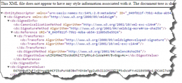
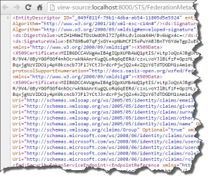

I was working on a small addition to the [Thinktecture EmbeddedSTS](https://www.nuget.org/packages/Thinktecture.IdentityModel.EmbeddedSts/), to ease up local development for our development teams, who are building a lot of MVC applications and SharePoint provider hosted apps. We don’t want to bother them with setting up a separate AD and ADFS, so we decided to use a simple, small STS: the Thinktecture Embedded STS. One of the actions was to add a FederationMetdata endpoint. This is a small improvement, as it’s now possible to setup claims based identities via OWIN, which is [way easier](http://blogs.msdn.com/b/webdev/archive/2014/02/21/using-claims-in-your-web-app-is-easier-with-the-new-owin-security-components.aspx) to setup than via the typical web.config configuration. But there was one nifty error that was, in my case, very hard to find, but easy to fix. It turned out that the signature node may not contain any formatting, this means that spaces, line feeds and carriage returns should not be included in this Federationmetadata file

## The signature is not valid

I added some code to create a metadata endpoint. This endpoint is used by the Microsoft.Owin.Security.WsFederation component to gather some metadata information on the STS. When I navigated manually to the endpoint, I got a correct set of information: a nice XML was returned.

But when I tried to connect via the Microsoft.Owin.Security.WsFederation modules, I got a pretty server error, the message I got was really cryptic:

The signature verification failed.

In the stacktrace, it turned out that there were problems with the signature _verification:_

System.IdentityModel.SignedXml.VerifySignature(HashAlgorithm hash, AsymmetricSignatureDeformatter deformatter, String signatureMethod).

Initially, I was fiddling around, thinking that I had a problem with my certificates as I used a self signed certificate. But when I connected to the STS via classic web.config configuration, there was no issue at all. Eventually, I even stored the certificate in the Trusted Root Authority certificate store, but it still didn’t work at all. As I could connect via the classic configuration, it was very unlikely that there was a certification issue.

Due to the nature on how the metadata is constructed, it was not possible that the SignatureInfo meta-information was not valid. After a few hours of fiddling around, I almost gave up. When I looked _again_ at the metadata information of other products, I initially saw no differences:

But when I looked at it via the source-view, there was a clear difference with XML that I showed in the first image:

The formatting of the XML was quite different! In the "correct" FederationMetadata, there where no white spacings, carriage returns or linfeeds, as opposed to "my" Federation Metadata.

## The solution

Converting the XML into a string was not enough. To remove all of the formatting of an XElement file, add the SaveOptions.DisableFormatting parameter when converting the XElement to a string:

config.GetFederationMetadata(uri, claims).ToString(SaveOptions.DisableFormatting);

This causes all formatting, whitespaces, linefeeds and carriage returns to be removed. Et voila, my error message disappeared.

## Conclusion

The error message “The signature verification failed” doesn’t have to mean that the signature certifications are wrong, it may have to do with the metadata arriving within a wrong format.
