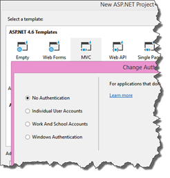
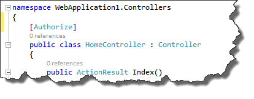
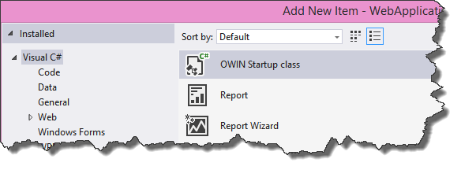
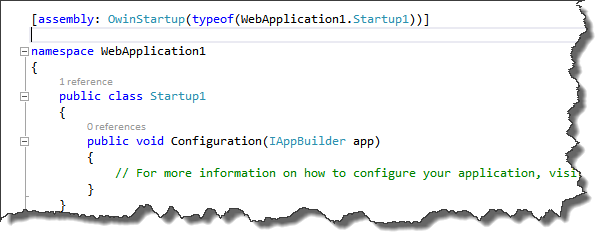
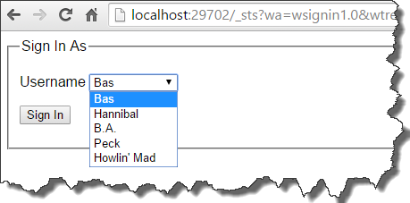

In my previous blogpost about setting up a simple STS for web application development I wrote on how to setup this web application using the classic web.config modifications. But this can be a _lot_ easier, by using the OWIN middleware WsFederation module. This blogpost describes how to setup a secured web application using the OWIN WsFederation modules; This is the second blogpost in a blogpost series of three, where we work towards a simple (local development) solution to build High trust claims based SharePoint provider hosted apps .

1. [How to setup a simple STS for web application development](http://blog.baslijten.com/how-to-setup-a-simple-sts-for-web-application-development)
2. How to configure WsFederation for webapplications using OWIN (this blogpost)
3. How to mix in SharePoint 2013 and hight trust claims based provider hosted apps using OWIN and the thinktecture Embedded STS

## Configuration using OWIN

OWIN is the Open Web Interface for .Net. The definition according to [Owin.org](http://owin.org/):

_OWIN defines a standard interface between .NET web servers and web applications. The goal of the OWIN interface is to decouple server and application, encourage the development of simple modules for .NET web development, and, by being an open standard, stimulate the open source ecosystem of .NET web development tools._

Freely explained: it defines a standard interface between .Net web servers and web applications and should make it possible to run (asp.net) web applications on other servers than, for example, IIS. In this case, the OWIN modules for WsFederation make it very easy to configure authentication, as opposed to the classic web.config configuration. [Daniel Roth](https://social.msdn.microsoft.com/profile/daniel%20roth/) summarized it in one simple image in his [blogpost](http://blogs.msdn.com/b/webdev/archive/2014/02/21/using-claims-in-your-web-app-is-easier-with-the-new-owin-security-components.aspx):

\[caption id="" align="alignnone" width="630"\] configuration comparison between web.config and OWIN - property of Daniel Roth\[/caption\]

## Why so easy?

The WsFederation module can be configured in such a way, that it requests the federation metadata of the STS. This Federation metadata contains information on the Identity Provider with information on the signing certificates, provided claims and much more info, which normally have to be configured by hand, which often go _wrong._ All other information that has to be provided, is the requested realm.

In the case of the Thinktecture Embedded STS, there was no Federation Metadata endpoint, but I added one and offered it as a [pull request](https://github.com/IdentityModel/Thinktecture.IdentityModel/pull/134) to the owners of the Embedded STS. Writing one was pretty simple, but getting it to work, caused a major “challenge”: I had [some severe issues](http://blog.baslijten.com/claims-based-authentication-the-signature-verification-failed/) to get the endpoint to work, but hey, I got the job done ;).

This STS is so easy, because it doesn’t require any form of setup:

1. Edit the EmbeddedStsUsers.json, to add users and/or claims
2. Run the application

In addition to the easy setup, it always returns the information you request, without the hassle of configuring reply-addresses, realms, claim rules or whatever – the perfect solution when developing new webapplications!

## How to configure

To create a webapplication that makes use of OWIN, do the following:

- Create a new web application
- Install OWIN and the WsFederation middleware
- Configure the application
- Run

### Create a new webapplication

First, create a new webapplication. It doesn’t matter which kind of application you choose, it works both with Webforms and MVC web applications. Make sure to choose “No Authentication” in the wizard, as the authentication will be handled by the middleware, not by the build-in ASP.Net authentication facilities.

Second, make sure to add an “Authorize” attribute to the landing page or HomeController, this forces and authentication challenge. All logged in people will have access to this resource.

_Make sure to use the attribute in System.Net.Http for webforms, and System.Net.Mvc for MVC applications_

### Install OWIN and the WsFederation middleware

Install the required packages using the following commands:

- install-package Microsoft.OWIN – this installs OWIN and the Microsoft.OWIN modules in your webapplication
- install-package Microsoft.OWIN.Host.SystemWeb – this one injects the Microsoft OWIN infrastructure
- install-package Microsoft.Owin.Security.WsFederation – installs the WsFederation middleware and all prerequisites
- install-package Owin.Security.Cookies

### Configure the application to run the middleware

First, the application needs to be configured to run the OWIN middleware. To do this, add a new class. This class is initialized on startup when marked with the OWIN startup attribute. A template has been provided: Make sure to choose the OWIN startup template when creating the new class:

The template looks as follows:

The namespace has been marked with the OwinStartUp attribute. This means for this assembly that the Startup1 class will be used to configure the application. The Configuration class will always be used to configure the application and accepts an IAppBuilder parameter as input. This is the generic interface to configure OWIN middleware. The

The next, and last step, is to configure the application to use the WsFederation middleware:

\[csharp highlight="3,4,5"\] public void Configuration(IAppBuilder app) { app.SetDefaultSignInAsAuthenticationType(CookieAuthenticationDefaults.AuthenticationType); app.UseCookieAuthentication(new CookieAuthenticationOptions()); app.UseWsFederationAuthentication( new WsFederationAuthenticationOptions { MetadataAddress = "http://localhost:29702/FederationMetadata", Wtrealm = "urn:SupaDoopaRealm", Wreply = "http://localhost:16635/" } ); } \[/csharp\]

Line 5 configures the default login option to use “Cookies”. In this example, we use a constant string to specify this, but a plain old string with the text “Cookies” will be sufficient as well.

Line 6 sets the authentication options for the Cookie Authentication, which is empty in this case.

Line 8 is the line of code, where _all_ the magic happens. The WsFederationAuthentication module is loaded, with 3 parameters:

- MetadataAddress – endpoint where to get the wsfederationmetadata from
- Wtrealm: the requested realm – in the case of the thinktecture embedded STS, this can be any value, is it always returns the requested realm
- Wreply – Normally, this parameter can be specified on the STS itself, but in case of the EmbeddedSTS, this parameter has to be provided, otherwise, you’ll be redirected to the STS itself.

### Run

Hit F5 and see the magic happen. Whenever you press the login button, you’ll be redirected to the EmbeddedSTS, because the Authorize attribute triggered the authentication challenge:

After signing in, you are authenticated and redirected to the page that triggered the challenge. And because _all_ logged in users are authorized in this example, you will have permission to view the page.

## Conclusion

Setup claims based authentication in a web application using OWIN is very easy, it just consists of pulling in a few packages, define a startup class, and configure the WsFederation Middleware. It’s way easier then doing this manually, due to the fact that the magic is handled by the middleware, using the WsFederation Metadata.

Next blogpost will explain on how to use the Embedded STS, SharePoint 2013 _and_ High trust Claims based provider hosted applications using OWIN. That's a mouth full for a title ;)

The Embedded STS sources can be [downloaded here](https://github.com/BasLijten/Thinktecture.IdentityModel/tree/FederationMetadata) (own fork of the [Thinktecture.IdentityModel](https://github.com/IdentityModel/Thinktecture.IdentityModel/pull/134)).

The example project for configuring claims based web applications using OWIN [can be found here.](https://github.com/BasLijten/EmbeddedStsSample/blob/master/webapp1/Assets/thinktectureEmbeddedSTSPublic.cer)
