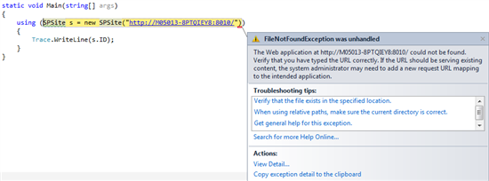
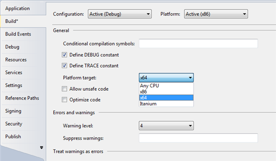

A collegue of mine had the following problem: he wanted to write a console application to test some SharePoint code, but whenever he opened a new SPSite, the following File Not Found Exception was thrown:

after being triggered about a possible problem with  the wrong Target Framework, as Visual Studio defaults to .Net 4.0 as target framework, I remembered some wise words that were spoken during the Dutch SharePoint Connections 2010:

"When you are building a console app to work with SharePoint 2010, _never_ forget to change your Platform target from x86 to x64! And I can tell you: You _will_ forget it"

Changing this platform target to x64 was (of course)  the solution to the problem:

My suggestion to him: buy a lot in the lottery, as he can forsee the future ;)
