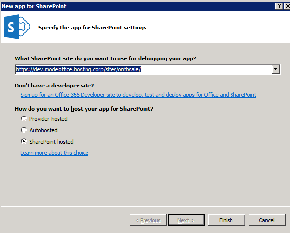
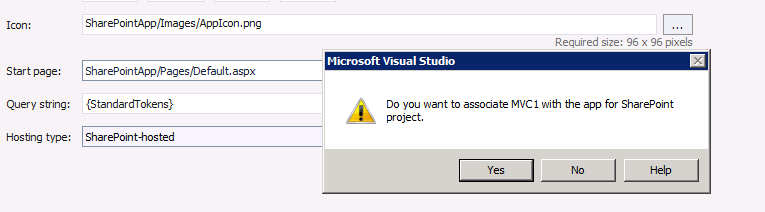
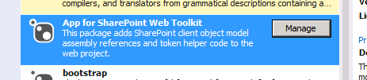
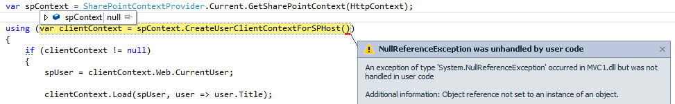

With the introduction of the SharePoint App model, it becomes more and more interesting to convert existing applications in your organisation from a "plain" MVC application to a SharePoint app. This makes it easy to integrate SharePoint capabilities such as Search, UserProfiles and newsfeeds within your application, to make it even cooler! This blogpost describes the steps that are required to convert a MVC application to a SharePoint 2013 app using [Visual Studio 2013](http://www.visualstudio.com/en-us/downloads/ "Download Visual Studio 2013")

First, open up your MVC project. In this example, I just use a project based on the standard MVC5 template that was delivered with Visual Studio 2013. Please note that when a new MVC application has been created with the default options, the remote application will break due to authentication settings. In a lot of cases, the application is configured with some kind of authentication. We'll get back to that later.

## Step 1: Adding a SharePoint hosted app

The first step is to add a the app part that will be deployed to SharePoint. It contains the app manifest settings, and makes sure that the app will be registered. Add a new project to the solution, choose "App for SharePoint 2013" and click OK. Next, in the dialog where to choose hosting options, choose "SharePoint hosted". This sounds strange, because we definately want to end up with a Provider hosted app, but when "autohosted" or "provider hosted" will be chosen, a new MVC (or Forms) project will be added, which isn't needed. The existing Web application will be associated later.



## Step 2: Associate the SharePoint app with the Web Application

When the app has been created, open the appmanifest and choose as hosting type "Provider-hosted". A dialog pops up with the question whether or not the MVC webapplication needs to be associated with the SharePoint app:



Make sure to choose "yes". When choosing "No", no other chance will be offered to associated the web application with your SharePoint App. After choosing "Yes", not only the association will be created, but a nuget package will be added to the MVC project too:



this package adds three files to the project:

- Filters\\SharePointContextFilterAttribute.cs
- SharePointContext.cs
- TokenHelper.cs

These files contain logic to easily build up the SharePoint context, both for SharePoint apps that make use of Azure Access Control Services, as well as High trust apps.

## Step 3: cleaning up and fixing the SharePoint app

At first, an app.config file is introduced into the SharePoint solution, which shouldn't be there. Remove this file, I blogged about it here: [Failed to install app for SharePoint - Exception from hresult:0x81070964](http://blog.baslijten.com/failed-to-install-app-for-sharepoint-exception-from-hresult-0x81070964/ "Failed to install app for SharePoint – Exception from HRESULT: 0×81070964") .

Afterwards, remove all modules, as they aren't needed.

## Step 4: Edit the web.config

The web.config has already been updated with a ClientID and a ClientSecret. To be able to be run as a High Trust application, 3 keys need to be added:

- ClientSigningCertificatePath - path to the pfx file
- ClientSigningCertificatePassword - password associated with the pfx file
- IssuerId - IssuerID of the client certificate

In the system.web section, replace the authorization node with the following snippet. This is required because other authorization options can cause the app to break.

```xml

<authorization> <deny users="?" /> </authorization> 
```

The module in system.WebServer should be removed as well:

```xml

<system.webServer> <modules> <remove name="FormsAuthenticationModule" /> </modules> </system.webServer> 
```

## Step 5: Remove the Authentication middleware

The authention middleware that gets instantiated when a MVC5 Application with default options is created, also needs to be removed. This code can be found in: App\_Start\\Startup.Auth.cs

```csharp
 
// Enable the application to use a cookie to store information for the signed in user 
app.UseCookieAuthentication(new CookieAuthenticationOptions { AuthenticationType = DefaultAuthenticationTypes.ApplicationCookie, LoginPath = new PathString("/Account/Login") }); 
// Use a cookie to temporarily store information about a user logging in with a third party login provider app.
UseExternalSignInCookie(DefaultAuthenticationTypes.ExternalCookie);
```

## Step 6: Add some logic to interact with SharePoint 2013

The next step, is to add some logic, to interact with SharPoint. The following code has been shamelessly copied from the standard _SharePoint_ MVC template. This code creates a SharePoint context (the code contains logic to create a Azure Access Control Services or High Trust Context, based on the presence of a ClientCertificate (as described in the previous step), Dont forget to update your references to the SharePoint.Client.dll.

```csharp
 
public ActionResult Index() { User spUser = null;
var spContext = SharePointContextProvider.Current.GetSharePointContext(HttpContext);
using (var clientContext = spContext.CreateUserClientContextForSPHost()) { if (clientContext != null) { spUser = clientContext.Web.CurrentUser;

clientContext.Load(spUser, user => user.Title);

clientContext.ExecuteQuery();

ViewBag.UserName = spUser.Title; } }

return View(); } 
```

In some cases, the context that is needed can't be created. This causes the error below



This is where the SharePointContextFilter comes in place.

## Step 6: Decorate an Action in a Controller with the SharePointContextFilter attribute.

This SharePointContextFilter attribute enforces the SharePoint context whenever interaction with SharePoint is required. For example, when a user tries to visit the remote web, and has not been logged in, this SharePointContextFilter causes a redirect to the SharePoint site, to login to the site. Afterwards, when the user has been logged in, the user will be redirected back to the remote web: the real logic in the action can be executed afterwards. When the action in the controller wouldn't be decorated with this attribute, and the SharePoint context is created in code, this could end up in error, as we saw in the previous step.

Whenever a user can't login, the context can't be created and thus, the code within the action, won't be executed. The SharePoint ContextFilter causes a redirect to the error page in that case.

_note: this SharePointContextFilterAttribute can be used to decorate complete controllers either!_

```csharp
 \[SharePointContextFilter\] public ActionResult Index() { User spUser = null;

var spContext = SharePointContextProvider.Current.GetSharePointContext(HttpContext);

using (var clientContext = spContext.CreateUserClientContextForSPHost())

```

After completing this last step, your app is ready to make use of the all the beautiful SharePoint capabilities!

## Summary

Converting an existing MVC app into a SharePoint 2013 provider hosted app is not hard. In 7 small, simple steps, your MVC app can make use of all the SharePoint 2013 capabilities. Just imagine how authentication, userprofiles, newsfeeds or search can enrich your existing application!
