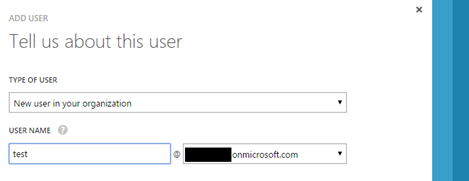
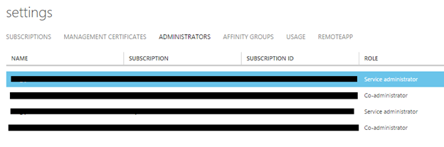
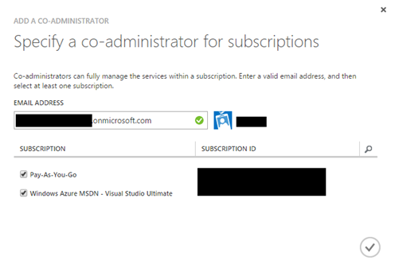

When you created your Microsoft Azure subscription with a personal Microsoft Account, it’s likely that you won’t be able to use some azure services, for example, [the new Power BI service](http://www.powerbi.com/), as they require an organizational account. This blogpost describes on how to create an organizational account and delegate the azure administrator role to this account, so you’ll be free to use _any_ azure service.

# Creating a Organizational account with windows azure administrator permissions

To create a organizational account, you’ll need to take 3 steps:

## 1 – Create a Windows Azure Active Directory to store organizational accounts

This AD is automatically created If you created your windows azure subscription _after_ October 2013, otherwise, you need to create this one yourself. How to do this is described over here: [https://msdn.microsoft.com/en-us/library/azure/jj573650.aspx](https://msdn.microsoft.com/en-us/library/azure/jj573650.aspx)

## 2 – Create a new Windows Azure Active Directory to create an organizational account

To create a new account, navigate to your Azure Active Directory Tenant:

- Select Active Directory
- Select your directory
- Select “Users”
- Select Add User
    - In step 1), Make sure to select under “type of user”: “New user in your organization” write down the user account name of your user:
    - In step 2), make sure to select “global admin”
    - Write down the email address of the new user: you will need it in the next step:
- Finish the creation of your new organizational account using the wizard

## 3 – Assign an Azure Subscription to your organizational account to administrate your Azure service

To give your newly created organizational administrator account administrator permissions, your Azure subscription(s) need to be assigned to this account. To do this, execute the following steps:

- Go to “settings”, it’s the last option in the vertical navigation menu
- Select “administrators” in this overview

- Click “Add” on the menu below and assign the email address of the newly created organizational account
    - It’s the same account as you wrote down in the previous step. When you entered a correct value (an account which exists in your Windows Azure active Directory), you’ll get a notification as shown in the image below:

By finishing this step, your organizational account is allowed to fully manage azure and thus, create services which require an organizational account!

**Summary**

Creating a new organizational account with azure administration permissions isn’t too hard, but requires several steps to achieve. When
