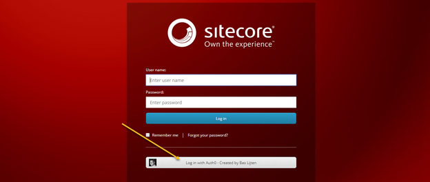
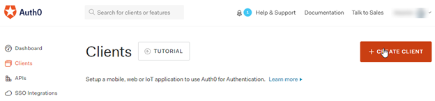
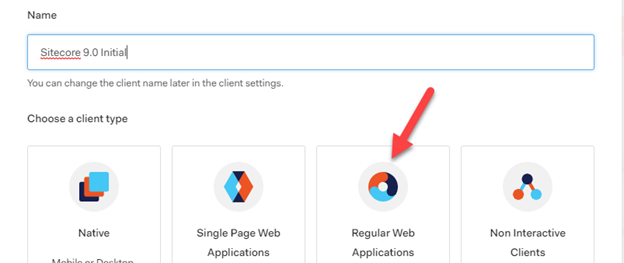
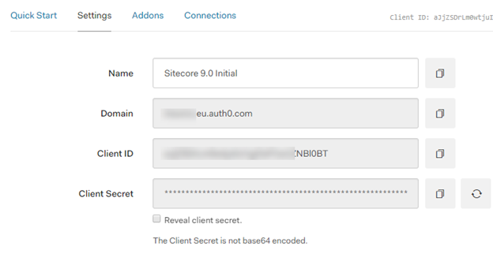
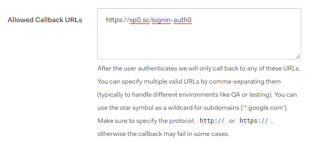
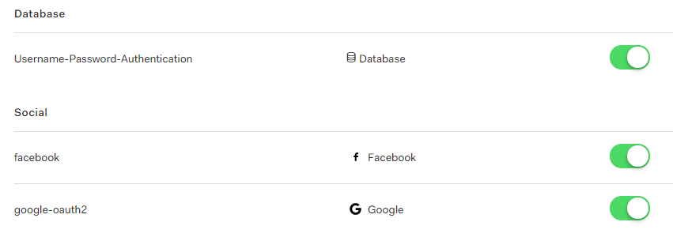

Sitecore 9.0 has shipped and one of the new features of this new release is the addition of a federated authentication module. I wrote a module for Sitecore 8.2 in the past ([How to add support for Federated Authentication and claims using OWIN](http://blog.baslijten.com/how-to-add-federated-authentication-with-sitecore-and-owin/)), which only added federated authentication options for visitors. Backend functionality was a lot harder to integrate, but I am glad that Sitecore took the challenge and solved it for both the front- and backend. It means that I can get rid of the old code and finally can use the out of the box solution provided by Sitecore. They created a very pluggable solution which can basically register any kind of authentication module via the OWIN middleware. This blogpost will show how I integrated the Identity broker [Auth0](https://auth0.com/) with Sitecore. Auth0 is a platform which can act as an Identity Broker: it offers solutions to connect multiple identity providers via a single connection. Code is available at [my github repository](https://github.com/BasLijten/sitecore-federated-authentication):

PS: in this example I use Auth0 as Identity broker for Facebook and Google. It's of course possible to connect directly to Google and Facebook, I just chose not to do this.

# Enable federated authentication

At first sight, getting federated authentication in the Sitecore context to work looks a bit complex, but in the end, it’s just a bit of configuration, a few lines of code and configuring the OWIN middleware. [Martina Welander](https://t.co/hBZo1L6mtG) did a great job to document the steps to create your own provider, but some small examples always help, right?  In the end, you’ll end up with some extra login options, for example with this Auth0 variant:

## Create an application in Auth0

Two connections have already been created for Facebook and Google, which can be used to authenticate via Auth0. They offer multiple different options, but for the sake of simplicity, I will stick to these. If you want to know how to configure these: the Auth0 documentation is outstanding!

To create a new provider for Sitecore, the first step would be to register a new client:

As we are integrating Auth0 with Sitecore, “Regular Web Application” should be chosen as client type.

After the client has been created, navigate to the settings tab. This overview will contain all information that is needed to configure the provider in Sitecore.

Take note of the ClientId, ClientSecret and domain. These will be needed in the Sitecore configuration to connect to the authentication endpoint. However, one setting has to be provided by the developer: the callback url has to be added. This will be <hostname> + “/signin-” + <identityprovidername>, This is [https://xp0.sc/signin-auth0](https://xp0.sc/signin-auth0) in this example.

In the “Connections” – tab I already selected Facebook and Google as external Identity providers. Please take note that I also enabled another kind of login: Auth0 offers its own user database as well.

That’s all that was need to setup a new client.

# Write the code

Coding is not too much of a hassle and is identical to how you would register middleware in a regular ASP.Net application. The difference is that a pipeline should be used in which the authentication middleware can be registered.

The IdentityProviderPipeline processor must inherit from the “IdentityProvidersProcessor“-class and return a unique IdentityProvidername. The overridden “ProcessCore” contains code to actually load the middleware. In a regular ASP.Net application, the OWIN middleware would have been registered in the startup class, but in this case the middleware needs to be registred in the pipeline. The ProcessCore functionparameter “IdentityProviderArgs” exposes the App property, which in fact has the IAppBuilder interface.

Adding the Middleware is business as usual: register the middleware and you’re good to go. Important to know is that the claims transformation must be executed explicitly after the user has been authenticated.

## Wiring it all together

The last part is to configure the new identityprovider, which consists of a few steps:

- Register the OWIN Authenticationprovider middleware pipeline
- Define for which sites an identityprovider needs to registered
- Define the identityprovider itself and configure the claim mappings

But just adding configuration isn’t enough. As this kind of authentication is completely different from the default authentication, federated authentication must be explicitly enabled.

### Enable the federated authentication module

As the technique behind the authentication is completely different as opposed to the default authentication provider, Sitecore made the authenticationmanager injectable with an owin based version. To get it to work, enable the \\Include\\examples\\ Sitecore.Owin.Authentication.Enabler.config patch-file. This patchfile will inject a different AuthanticationManager, which supports OWIN authentication modules.

 

### Register the AuthenticationProvider middleware pipeline

This is basically one line of configuration; the pipeline which registers the middleware needs to be added here.

### Define for which sites an identityprovider needs to registered

Within the federatedAuthentication node, the authentication providers need to be attached to the sites in which they can be used. This will make the authentication endpoint available to those sites.

### Define the identityprovider itself

And last, but not least, the identity provider itself needs to be registered. In this section, the name of the provider will be registered, for what Sitecoredomain the provider will be registered and how claims should be transformed. In the included example, the role Sitecore\\Developer will be added if the idp is equal to Auth0. On it’s turn, the role-claim “Sitecore\\Developer” will be mapped to the Sitecore-role “Sitecore\\Developer”. Although my advice would be to provide those roles within your Identity management solution, if possible, it’s a very welcome solution for  the cases when those are not available.

## Bonus: Map user properties

As the Administrator role isn’t a real role, but more a Sitecore user property, this “role” needs to be set in a different way. The Propertyinitializer can be used to achieve this. First, it reads a claim (and its value) and if that claim has the defined value, the property will be set:

# Conclusion

Sitecore did an awesome job on integrating federated authentication within Sitecore. All the OWIN authentication middleware that exists can be used without any modification and is easily integrated within Sitecore. A very flexible solution has been created which will make Sitecore again a little bit more mature.
