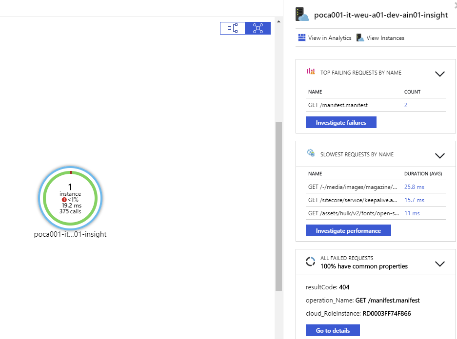
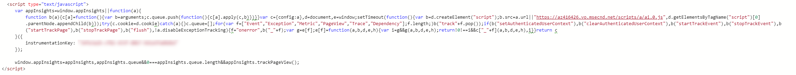
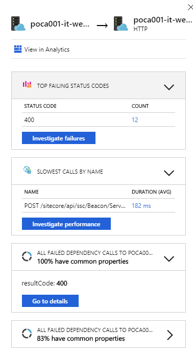
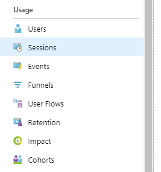

In the out of the box configuration for Sitecore on Azure, application insights has been enabled by default. However, this configuration is optimally configured. In normal situations, it's very valuable to have insights in your infrastructure: what connections provide a lot of errors, latency or other issues. This blogpost explains on how to get these insights with for Sitecore.

It's possible to enable Application Insights in two different ways:

- Enable it buildtime, by adding the Application Insights SDK to the application
- Enable it runtime, by enabling an extension on the web application

these methods will enable you to monitor your application. Whenever this has been enabled, custom logging can be written. For the serverside logging, Sitecore already has replaced the log4net logger by the application insights logger, but Sitecore has omitted the clientside logging.

## Enabling the application Map by updating the buildtime configuration

Luckily, Application Insights is enabled using the SDK by default for Sitecore, but as mentioned earlier, the configuration is not optimal. The insights you would like to get, is are the following:

but all that is provided, is the following information. A single application, which displays all requests, but there isn't any dependency information available.

This is due to the following configuration in the applicationInsights.config:

\[code language="xml"\] <TelemetryModules> <!-- Uncomment the following line to enable dependency tracking --> <!-- <Add Type="Microsoft.ApplicationInsights.DependencyCollector.DependencyTrackingTelemetryModule, Microsoft.AI.DependencyCollector"/> --> <Add Type="Microsoft.ApplicationInsights.Extensibility.PerfCounterCollector.PerformanceCollectorModule, Microsoft.AI.PerfCounterCollector"> <! -- cut a lot if information --> </TelemetryModules> \[/code\]

By removing the comment and restarting the application (this is mandatory), the detailed "web" of dependencies is shown. Every element in this overview, like the application, the different  connections and the actual services can be selected and give a different overview of information. In the case below, the sql connection has been highlighted, indicating that 19.2% of the requests cause errors:

### Looking at depenencies

When taking a look at the performance blade, we now do have an overview of all the dependencies of Sitecore: xConnect, the CES discovery service, all SQL dependencies and your own custom build dependencies.

Drilling down on these depenendencies, for example, long running dependencies, might give a very insightfull overview on what is actually happening within Sitecore:

## Integrate clientside logging

Adding clientside logging is easy _and_ gives great insights as well! The first step is to include this javascript into your page:

_please copy the code from [this page](https://docs.microsoft.com/nl-nl/azure/application-insights/app-insights-javascript) as I can't reference the code: it turns into a tracking pixel ;)_

Using this code will result in the following information. In my case, I have a few errors that are automatically logged to Application Insights _and_ there are some generated insights on my slowest clientside calls.

Another benefit of enabling application insights at the client, is that Microsoft is creating functionality for client analytics, like funnels, flows, et cetera. This might overlap with Sitecore analytics in some ways, but it's always fun to have an extra bit of data available, right?

# Summary

By just slighty changing the Application insights configuration, much more insights can be gained from the application map. A very interesting insight is the failed SQL statements that are triggered from your environment; this is often an indication in problems with your "tasks"  database. Happy monitoring!
