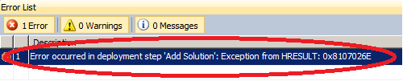
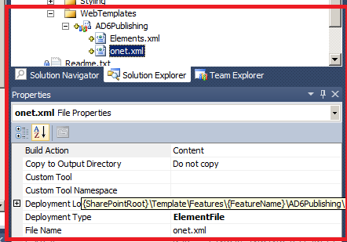
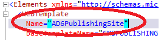

Recently I was working on a sandboxes solution, which included a WebTemplate ([Vesa "Vesku" Juvonen](http://blogs.msdn.com/b/vesku/) wrote a really nice [post](http://blogs.msdn.com/b/vesku/archive/2010/10/14/sharepoint-2010-and-web-templates.aspx) about it), but I couldn't deploy it, the followin error was displayed into Visual Studio 2010:

_Error occurred in deployment step 'Add Solution': Exception from HRESULT: 0x8107026E_

After checking the Logs (in %SHAREPOINT ROOT%\\\\LOGS) the following error was found: _Failed to open the file 'Features\\AD6.Public\_AD6\_Web\\AD6PublishingSite\\onet.xml'. #2006e: The specified path "" does not exist. Failed to read file "Features\\AD6.Public\_AD6\_Web\\AD6PublishingSite\\onet.xml" from feature id "6f87a30b-b785-4483-a1f4-25a1150ebda4"._ 

After comparing that location to the supposed deployment location, I found out why the error was generated: the onet.xml was deployed to _another_ location:

Instead of "_Features\\AD6.Public\_AD6\_Web\\AD6PublishingSite\\"_ the onet.xml was deployed to "_Features\\AD6.Public\_AD6\_Web\\AD6Publishing"._ But why? A "Find" (ctrl+shift+f) on "AD6PublishingSite" scoped to the complete solution, gave me one single result. The name of the webtemplate was the exact match:

After changing the webtemplate name to "AD6Publishing" (or changing the Module name to AD6PublishingSite"), I was able to deploy the solution correctly.

Lessons learned: the webtemplate name and it's module it resides in, require you to have the same name!
