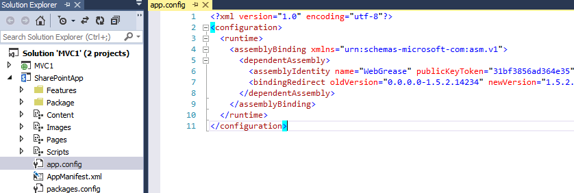
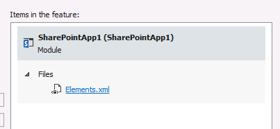

Sometimes, when creating new SharePoint applications, the following error occurs:

``` CorrelationId: 014b8442-57e1-41ef-9172-db01d9482844 3> ErrorDetail: There was a problem with activating the app web definition. 3> ErrorType: App 3> ErrorTypeName: App Related 3> ExceptionMessage: Exception from HRESULT: 0x81070964 3> Source: AppWeb 3> SourceName: App Web Deployment ```

This error occurs because a file is added to the SharePoint Hosted app, which shouldn't be deployed to SharePoint. In my case, this was the "app.config" file, which was added to the solution and was marked as elementfile:



The deployment type needs to be changed to"NoDeployment". In some cases, the reference to app.config needs to be removed from an elements.xml, which is not visible in the solution. To get there, open up your features and check every file. One of those elements.xml contains a Rootmodule with the reference to this app.config; this _reference_ should be removed.



After these actions, the app will be able to be deployed without an error.

## Summary

Sometimes, some files are added to a SharePoint hosted app which shouldn't be added at all. This causes app deployments to end up in error, with some error codes that are not very clear. One of these errors is: "Exception from HRESULT: 0x81070964" and is caused by a file that should'nt be deployed.
