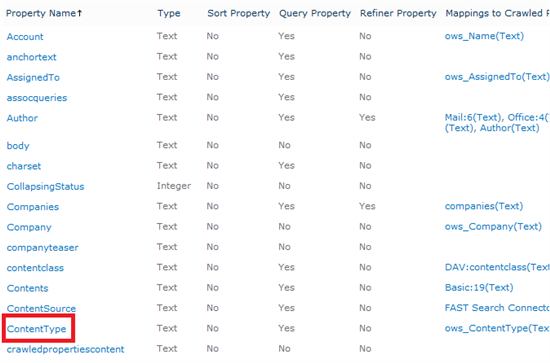
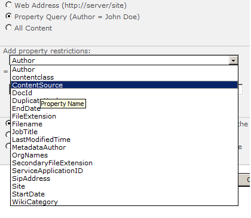
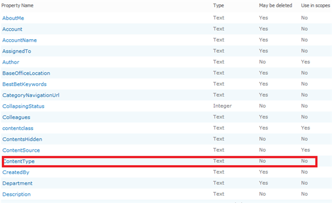

Lately I was working on a project that required to make use of scopes and some managed metadata properties in those scopes. For some reason, those managed metadata properties didnt show up in my scope selection dropdownlist, but I was sure that this metadata property was available in my Fast Managed Metadata properties list

as you can see, this property doesnt show up in my properties list:

Whenever the SharePoint Search metadataproperties page is accessed, the option "Use in scopes" for the managed property ContentType is turned off:

When this property is turned on, the property is available to be used in the scopes. [According to MSDN](http://msdn.microsoft.com/en-us/library/ff453895.aspx#BKMK_MakeFASTPropertiesAvailableForUseInScopes), this is working "as intended". The managed properties that are created in the SharePoint search administration page, are just **_placeholders_** for the Fast managed metadata properties. The configuration of this managed property is, however, done in the Fast Managed metadata properties page.

So, to be able to use managed properties in Fast Search scopes, the following steps need to be taken:

1. Add a Managed Metadata property via the Fast Search Administration page and configure it
2. Add a metadata property via the SharePoint search administration page (found on the Fast Query SSA) and make it available for the use in scopes. No other configurations need to be made.
3. Now you're ready to use your managed metadata property
