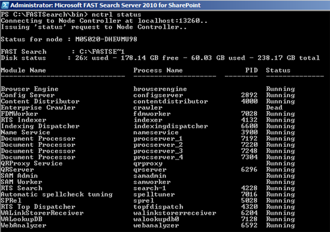

Lately, I installed Fast locally on my machine for development purposes, and it was working as intended. Crawled a lot of local (and external) content, but suddenly, my Enterprise crawler was not working. nctrl status showed me that the Enterprise crawler was Dead

but _WHY_ it was dead? I had no idea at all! Checking the event logs only told me:

- M05020-DHEVMU98:13260: Process crawler was not running, restarting it
- M05020-DHEVMU98:13260: Process crawler ports are already in use, will not start it

After checking the port 13260 on my machine, I concluded that there was nothing wrong with it. But that port, 13260 is the node controller, the enterprise crawler doesn't use that port. After checking the hostsconfiguration.xml I concluded that I made a mistake: This file contains a property: baseport with value 13000. That day, I created a new SharePoint webapplication on port 13000. I always create new web applications at those ranges (10000, 11000, 12000), it's a automatism of me. After deleting that web application, my Fast Enterprise crawler is up and running again! Too bad that the Fast Logging doesn't include portnumbers in their errorlog when a port is already occupied .

Conclusion: never create a webapplication in the 13000 range when running Fast locally ;)
