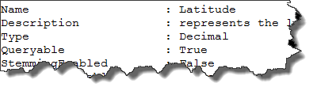
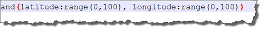
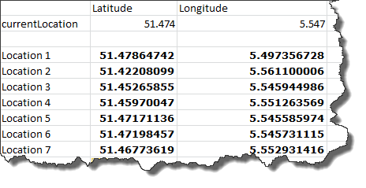
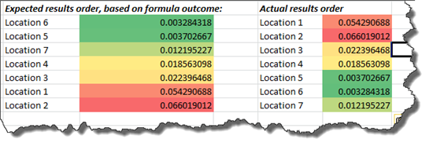
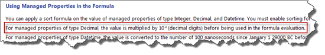
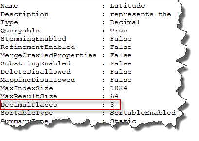
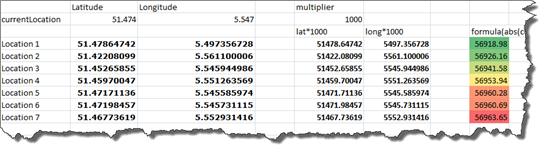
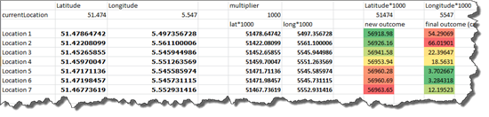
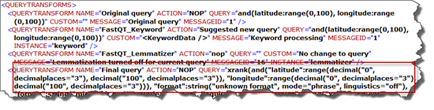

Fast Search for SharePoint provides [four great possibilities](http://msdn.microsoft.com/en-us/library/ff394654.aspx "ranking and sorting in Fast Search for SharePoint 2010") to influence the sort order of your resultset that was returned:

- Sort by Managed property
- Sort by Rank
- Sort by Formula
- Sort in Random order

When I was working on my presentaion and demo for the [diwug](http://www.diwug.nl/ "Dutch Information Worker User Group") (Dutch Information Worker User Group) last week, to show off on how you can improve your search experience by using custom ranking models, custom sort orders and extending the pipeline, I ran into an issue that I wasn't aware off. When I used a custom sort formula, I did get the right **_result set_**, but not the right **_result order_**.

## The Scenario

I created a custom pipeline extension, which should enrich the Fast index with the latitude and longitude of a given Location (how this works, will be shown in my next blogpost). Whenever I create custom query, based on a given location, I could create a custom sortformula for Fast, which sorts the resultset for the query based on distance.

## The Issue

the issue I came accross, was that the resultset I got returned, wasn't in line with the results I expected at all. The data that was returned from the custom pipeline extensions, were mapped to my mananged properties latitude and longitude, both of type decimal:

The query I executed was the following:

and this query provided me the following dataset. the result_set_ returned by the query was correct!

Based on the sortformula below, I tried to predict the outcome:

The expected results and the actual results:

As seen in the table, the actual resultorder that was returned, wasn't in line with the expected resultorder at all.

##  What Happened?

When I digged into this problem, my eye felled on [one line of documentation on MSDN](http://msdn.microsoft.com/en-us/library/ff394654.aspx "custom ranking and sorting in Fast Search for SharePoint 2010"):

this line tells us that every managed property of type decimal that is used in a formula, is treated in another way then other numeric types like integers and doubles. Whenever a sortformula is applied to the resultset, all managed properties of type _'decimal',_ are multiplied by (10^decimal digits). Retrieving the managed property via powerShell, does learn us that "decimal digits" is not a property of that managed property, but it's called "decimal places":

Taken this into account, I made a new computation in excel, and this provided me exactly the results that were returned to me: In the formula I used, fast replaces managed properties based on type decimal by 10^decimalPlaces.

**_latitude = (latitude \* 10^decimalPlaces)_**

In my case, this becomes:

_**latitude = latitude \* 1000.**_

Whenever this computation is taken into account with excel, it explains that I didn't get the "right" sort order.

## How to Solve this?

Now it is known that Fast handles managed properties of type decimal in another way, we can take this into account into our code. Simply multiply the value that you want to use by 10^decimal places. The results are exactly in line with the results that I couldn't explain before:

While solving the issue,  I was thinking about the query I executed. While I made use of the same managed properties, the resultset that was returned by the query, was correct, while the sortorder, wasn't. Analyzing the query executed, learned me that FAST handles the decimalPlaces in the query parameters itself using a query transform:

## Conclusion

We learned that Fast does handle managed properties of type decimal in different way than other numeric values when results are sorted using a sortformula. We also learned that Fast does handle the sortFormula in another way then it does when querying Fast: Fast takes the digital places into account when querying the index, but doesn't do this when sorting the results when using a sort formula. Keep in mind, then when those managed properties are used in sortformulas, that the computation you want to execute with that managed property, must take the digital places into account.
