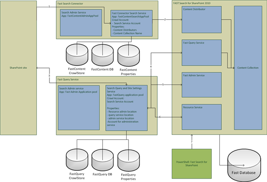
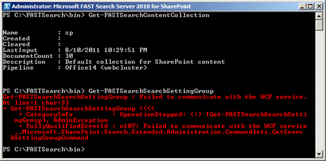

Recently I had a few colleagues (and myself) who tried to install FAST search for SharePoint on their development workstation. Despite the [well written installation guidelines on MSDN](http://technet.microsoft.com/en-us/library/ff381243.aspx "Fast installation and configuration guide on MSDN"), they had several problems, and sadly enough, they all faced different problems. These problems varied from not able to crawl the content to not being able to query the indexed content. As most of the colleagues weren't too familiar with Fast (and SharePoint search in general), I decided to create a small architecture diagram of the SharePoint 2010 Search Service Applications, Fast Search for SharePoint and (some of) their junction points. These junction points are displayed in the image below. To simplify the diagram, some items have been removed, the search query proxy is one example.

The diagram helped me and my colleagues to pinpoint the problems and I hope it will help you in the future with pinpointing problems (well, I hope you wont have any problems at all, but hey, it's Fast ;)).  This post just covers a small subset of problems, but I think that the majority of most common problems are covered here. Whenever you think that a certain common problem is missing in here, please contact me, I will add it as soon as possible.

Use the following log/event locations to pinpoint problems:

- c:\\fastsearch\\var\\log
    - contains a _lot_ of folders with logging. Whenever problems arise, I check the folder "syslog" first
- the Eventlog - increase the loglevels in the sharepoint diagnostic logging to verbose for extensive logging
    - Application log
    - Fast Search
    - Fast Search Farm
- SharePoint diagnostic logging - increase the log level to verbose
- The IIS authentication logging
- use nctrl status to check the status of your Fast installation

Some basic guidance:

- Whenever no log errors appear on the Fast Search farm (event log as well as the \\var\\log), the problem lies within the SharePoint configuration
- Whenever no errors appear on the Fast Search application, but errors do appear on the Fast IIS log, it's most likely a permission problem. My guess: database and/or
- Whenever errors appear in Fast, you may not have SharePoint or permission problems, but a wrongly configured Fast environment. I didn't write about these errors below, but hostname configurations appeared to cause problems a lot.

As seen in the diagram, there are several junction points that can cause problems when not configured correctly:

1. Crawling SharePoint content
2. Push content into Fast
3. Communicatin with the Search Query and Settins Service
4. Accessing the admin service the search query and site settings service
5. Configure Fast via PowerShell

I have seen problems on all of these levels and I will try to (shortly) describe the possible problems, their symptoms and (a link to) their solution. A small disclaimer is in place: this is by no means a full overview of possible problems, but it should help in troubleshooting whenever problems arise.

### 1 - Crawling SharePoint content (1)

One of the most common problems are the problems with crawling content. Make sure that your default content access account has read permissions on the sharepoint sites that need to be crawled. Normally, this is handled by SharePoint. Possible error message:

- Access is denied. Verify that either the Default Content Access Accouont has access to this repository, or add a crawl rule to crawl this repository. If the repository being crawled is a SharePoint repository, verify that the account you are using has "Full Read" permissions on the SharePoint Web Application being crawled.

### 2 - Push content into Fast (2)

After installing fast, pushing content into Fast can be a problem too. Several problems are possible here:

**_\- SSL communication between the Fast Content Service and the Content Distributor is not configured correctly._**

Visit [technet](http://technet.microsoft.com/en-us/library/ff381261.aspx#BKMK_Configure_ssl_enabled_communication) on how to configure SSL communication. Please make sure that the account used in "**.\\SecureFASTSearchConnector.ps1 –certPath "path of the certificate\\certificatename.pfx" –ssaName "name of your content SSA" –username “domain\\username”** is the account that runs the osearch14. In the Administration _Services_ window this service is called "_SharePoint Server Search 14_"

_**\- Permissions**_

After checking the Fast Content Service installation with "docpush -csp c:\\testfile.txt" several errors can appear:

_sp Reported error with_ [_http://cohowinery.com/c:\\temp\\bob.txt_](http://cohowinery.com/c:/temp/bob.txt)_: processing:N/A:ProcessorDeploymentException: For pipeline 'Office14 (webcluster)', creating processor CompanyExtractorInclusionAny failed: ConfigurationError: CompanyExtractorInclusionAny: Failed to access or parse configuration file 'etc/resources/matching/configuration.companyextractor.inclusion.any.xml'._

This error can have several causes. Most likely is that the user doesn't have isn't member of the FastSearchAdministrators group. Another case I have encountered was that the account was member of that group, but for some reason did not have read access to the directory. Changing permissions fixed this issue for me, _but this not recommended to do on a production server!!_ The message about [http://cohowinery.com/](http://cohowinery.com/) is not misconfigured on your system! It's a fictional company, same like the more known virtual companies contoso and wingtip toys

\- **_I see dead crawlers_**

Another issue that can arise when Fast is installed on the same server as your SharePoint installation (not recommended, only for dev purposes!!), is that the enterprise crawler died for some reason. This can be checked with nctrl status. I described the cause and the solution [here](http://bloggingabout.net/blogs/bas/archive/2011/05/19/fast-for-sharepoint-2010-enterprise-crawler-is-not-working.aspx)

### 3 - Communication with the Search Query and Settings Service (3)

Accessing Fast from your SiteCollection can cause several problems:

**_\- No search results are returned_**

When a query is executed and no results are returned, the most likely issue is a permission issue: the account that you logged in with, doesn't have any permissions to view the indexed content. As the returned results are security trimmed by the query service, it's possible that the returned set contains 0 items. This happened to me when I created an anonymous Fast Search Center, whereas all my other indexed site collections weren't anonymously accessible. Another issue can be that (and this happens a lot after a fresh dev-installation!) the test site that is indexed, has content that hasn't been published yet. That content isn't indexed and thus, not returned.

**_\- Internal Server error exception (when querying)_**

The application pool of the Search Query and settings service is not running. Check your IIS Manager to make sure that your application pool is up and that your website is running.

_**\- Unexpected error occurred while communicating with Administration Service**_ **_when accessing one of the following site settings menu entries_**

- visual best bets
- context information
- promotion/demotion (ranking)

When this happens, please check the problems mentioned in paragraph 5 and 6  too. As these functions communicate with the Fast Administration service, it's likely that these problems occur, while the query component works fine. It's most likely a permissions issue, where the Search Query and settings service (mentioned in paragraph 5), doesn't have the right administration account configured.

### 4 - Accessing the admin service through the search query and site settings service (5)

**_\- Unexpected error occurred while communicating with Administration Service_**

This error mainly has 3 rootcauses:

- The Fast Administration services is not configured correctly (e.g. the wrong location is configured in the Fast Query service application)
- The Fast Administration application pool is not running
- Permissions ;). Make sure that that the right Fast Admin account is configured in the Fast Query service application.

## 5 - Fast via PowerShell (7)

Powershell can show some initial "weird" behaviour. Whenever the Fast WCF-services aren't running, all of the powershell commands will bug out with an error message. Get-FastSearchContentCollection returns:

_Get-FastSearchContentCollection : Failed to communicate with the WCF service._

Whenever the services are back up, this message will disappear and the right output is returned. But sometimes some Powershell commands do work, and some won't. This is definately a permissions issue, where the executing account isn't member of the FastSearchAdministrators group. It's comparable to the missing/wrong permissions for the fast query service application.

### Summary

The majority of problems arise whenever permissions are not set correctly. It's important that the Fast Admin account that is configured in the Fast Query Service, is indeed the _right_ account, is member of the FastSearchAdministrators group and has access the the FastAdmin database. For dev-purposes you can choose the make use of just one main account to run fast, run the app pools and use as the admin account, but this is no recommended approach for production environments. That is why I advise to always use least privilege installations, even on your dev-environments!
