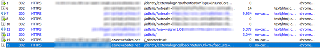
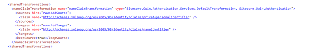

I faced this error quite a few times now and I always forget what the root cause of this error was. To keep me away from debugging and reflecting code _again_ I wrote this blogpost 😉When the claim [http://schemas.xmlsoap.org/ws/2005/05/identity/claims/nameidentifier](http://schemas.xmlsoap.org/ws/2005/05/identity/claims/nameidentifier) is not present, Sitecore will throw this exception, although a successful login may happen! This blogpost explains the root cause and how to solve the issue

# What happens during a federated login?

When someone wants to login using an external identity provider, that person will be redirected to several different places:

- Redirect to the identity/externallogin pipe, which will handle the correct external identity provider, which will set the right wtrealm et cetera
- Redirect to the actual identity provider (in our case it’s a double redirect, but that is totally not relevant for the inner workings, but it explains the two redirects in 8) and 10))
- The identity provider will redirect you to the url specified in your wreply. In our case, we chose to use \_sitecoretrust, as we have several systems running under the same domain, where we wanted to have a Single signon integration. More on that in a later blogpost
- Using that Callbackpath, the actual claimsIdentity is created and all the claim transformations that are specified in your identity provider configuration are applied. The securitytoken will be validated in this step. If this token is _not_ valid, an error will be thrown, otherwise, the user will be redirected to the next step
- The last step is to redirect back to the /identity/externallogincallback, which will actually do the latest administration to make sure that Sitecore will work correctly.

When getting the message “Unsuccessful login with external provider” comes from “HandleLoginLink” pipeline and this error is generated when there is something wrong with the external login info. One code snippet that will be executed is to check if the identity exists (which is, as the middleware has verified this in step 4), the next one is to validate if the claim [http://schemas.xmlsoap.org/ws/2005/05/identity/claims/nameidentifieris](http://schemas.xmlsoap.org/ws/2005/05/identity/claims/nameidentifieris) present. If this is not the case, the error will be thrown, although the external login has been successful.

# How to solve this issue

Sitecore offers the possibility to transform claims using rules. This can be done as a _shared_ transformation or as a specific transformation for the identity provider. Make sure to transform an existing, _unique_ claim into this name claim:

The default transformation has been used. If the source claim _does not_ contain a value, than the transformation will always kick in and create a new claim (as defined in the targets) with that same value. If the _source does_ contain a value, than the rule kicks in when both the name as the value are true.

_Note: a better solution is to add the claim to the identity provider, if possible. But when you just want to test things out or don’t have any access to the IdP, this solution is a very feasible solution_

# Summary

This error leads to a wrong assumption, which might make this error hard to solve. Because of the flexible claim transformation rules in Sitecore, it’s very easy to solve this error.
