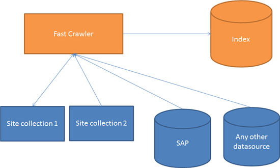

This is the first part of a series of blogposts about GeoSearch with Fast Search for SharePoint. I recently held some presentations about extending the power of Fast (on [DIWUG](http://www.diwug.nl/ "Dutch Information Worker User Group") and the Dutch [TechDays 2012](http://www.techdays.nl/ "Dutch Techdays 2012")) and one of the subjects that I talked about was on how to search for locations, sort on distances etcetera. The recording of my sessions will be made available on [Channel 9](http://channel9.msdn.com/Events/Speakers/bas+lijten "Bas Lijten on Channel 9").

- Part 1: why and how
- [Part 2: the custom pipeline extension to enrich the Fast index with spatial data](http://blog.baslijten.com/geosearch-with-fast-search-for-sharepoint-2010-part-2-custom-pipeline-extensions/ "Part 2: the custom pipeline extension to enrich the Fast index with spatial data")
- Part 3: how to use this metadata in your search queries

## Why using Fast search for SharePoint 2010 for this purpose?

It's possible to compute distances between locations in a lot different ways. For example, address can be queried against SQL Server (if the correct data is available), or those addresses can be used in conjunction with the Bing Geocode services. A custom webpart with logic to query one of those services with the users/objects current location and all list items with location information takes little time, but performance issues can pop up in no time. how is the performance when there are 200 items in a list? and 2000? 20000? maybe 200000? Surely, I can imagine that there are some smart solutions to send 200000 locations to the geocode service and receive them back, but remember: how did you extract that information from a sharepoint list? That takes quite some time. It is even getting harder when data comes from several lists, not even thought about data from several site collections, external data (BCS is an option here btw) or, location information that resides _inside_document.

And this is where Fast comes into play. Fast is a very powerful search engine that can be custimized in various ways. First of all, Fast can index all of the information that lives inside SharePoint, or outside of SharePoint (using, for example, the BCS or a custom connector). Not matter what (besides security ;)), but whenever a query is executed on a certain keyword, all indexed data can be checked against hat keyword. at second comes the ability to enrich the index with extra information. The source for this information can be existing metadata from sitecolumns(address, city), data from inside the document, or data that is already extracted using the entity extractor. These sources can be used to query the geocode service of your choice to retrieve the spatial data for that source and can be added to the fast index.

This metadata can be used to query the index, determine distances to items within the index, or do other, cool things!

## Customizing the pipeline

As told before, Fast can be used to index various sources with information. Think about SharePoint, external websites, lotus notes, oracle using jdbc, external systems like SAP using BCS and DUET Enterprise et cetera. When this data is indexed, a custom pipeline extension can be created that retrieves spatial data for that object and is added to the index. In short: all data from various sources can be indexed. If this data contains location information (address, city, country), this data can be used to retrieve the latitude and longitude of the item. This spatial data can be added to the index and thus, be queried.

## Query the index

When the data has been indexed, this index can be queried using some easy queries. Some examples of queries that easily can be executed:

- Give me all results of items within 5 km of my living area
- Give me all information on cars and sort that information on distance, relative to my current location.

I bet that the speed of results showing up, can't be beaten by custom implementations that continiously need to query external services!
