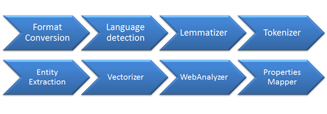
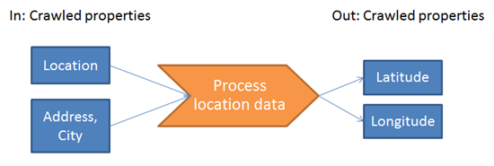

This is the second part of a series of blogposts about GeoSearch with Fast Search for SharePoint. I recently held some presentations about extending the power of Fast (on [DIWUG](http://www.diwug.nl/ "Dutch Information Worker User Group") and the Dutch [TechDays 2012](http://www.techdays.nl/ "Dutch Techdays 2012")) and one of the subjects that I talked about was on how to search for locations, sort on distances etcetera. The recording of my sessions will be made available on [Channel 9](http://channel9.msdn.com/Events/Speakers/bas+lijten "Bas Lijten on Channel 9").

This blogpost describes how to create custom pipeline extensions

- [Part 1: why and how](http://blog.baslijten.com/geosearch-with-fast-search-for-sharepoint-2010-part-1/ "GeoSearch with Fast Search for SharePoint")
- Part 2: the custom pipeline extension to enrich the Fast index with spatial data (this post)
- Part 3: how to use this metadata in your search queries
- EDIT: Sourcode for the custom pipeline extension

## Indexing the data

As previously blogged, Fast crawles data and puts this data into the index.


One of the processes that happens during the indexation process, is processing the content. During this process, this data is traversed through a "pipeline", which consists of several stages:



The stages as shown in the picture above is just a small subset, but basically, it does the following:

1. Normalize the document -> the data of each input is normalized, so that every stage doesn't have problems processing this content
2. Language detection -> determine the language of the document. This metadata is used in other pipelines to, for example, determine what dictionary should be used.
3. Lemmatizer -> based on the language that is detected, lemma and stemma are determined of words.[the definition on wikipedia](http://en.wikipedia.org/wiki/Lemma_(morphology) "lemma wikipedia"):  **canonical form**, **dictionary form**, or **citation form** of a set of words (headword). Think about the following: bank - banks or good - better - best
4. Entity Extraction -> extracts entities, based on a dictionary, from the data that is processed. Out of the box_Locations_, Persons and companies are extracted

The cool thing about this pipeline is: this pipeline can be extended!

## Extending the pipeline

As we want to work with spatial data, a custom pipeline needs to be created, which has any location data as input, and which can output spatial data: latitude and longitude. All these properties need to be crawled properties:



### What can be used as input...

Before the pipeline can be created, it's needed to know _what_ kind of data is available. It's important to know what data is available, where it resides, and how it can be used to be processed. This data must be available through crawled properties. Some data that is often available is:

- locations (Data retrieved using the Location Entity Extractor)
- ows\_WorkAddress (standard sharepoint sitecolumn)
- ows\_City (standard sharepoint sitecolumn)

When other data needs to be processed, make sure to check out what it is named inside the crawled properties overview in the Fast Query Service applications. In this example, I am using the address and city as an input.

### ...and spit it out..

This is an easy one. As we know we want to use latitude and longitude information to do some nice computations with, these ones can be defined as crawled properties. This can be done using the following powershell commands:

```powershell

$guid = \[System.Guid\]::NewGuid().toString()
$propset = New-FASTSearchMetadataCategory -Name "spatial" -Propset $guid
New-FASTSearchMetadataCrawledProperty -Name "latitude" -VariantType 5 -Propset $guid
New-FASTSearchMetadataCrawledProperty -Name "longitude" -VariantType 5 -Propset $guid
```
the command creates a separate category named "spatial" and created two crawled properties of variant type "5", which is, [according to Technet](http://technet.microsoft.com/en-us/library/ff191231.aspx "variant type fast search for sharepoint"), a decimal.

### Between Sheets

a custom pipeline extension can be any type of executable: powershell, .bat, or an .exe. In this example a .exe is build using visual studio. All have in common that they have xml as input and xml as output. For the example, the following xml is used as input:

```xml
<?xml version="1.0" encoding="utf-8"?>
<Document>
  <CrawledProperty propertySet="00130329-0000-0130-c000-000000131346" varType="31" propertyName="ows\_WorkCity">City</CrawledProperty>
  <CrawledProperty propertySet="00130329-0000-0130-c000-000000131346" varType="31" propertyName="ows\_WorkAddress">Address</CrawledProperty>
</Document>
```
and the output that will be created looks the same:

```xml
<?xml version="1.0" encoding="utf-8"?>
<Document>
  <CrawledProperty propertySet="00130329-0000-0130-c000-000000131346" propertyName="latitude" varType="5">99.9999999999999</CrawledProperty>
  <CrawledProperty propertySet="00130329-0000-0130-c000-000000131346" propertyName="longitude" varType="5">99.9999999999999</CrawledProperty>
</Document>
```
Read the input:

```csharp
 

XDocument inputDoc = XDocument.Load(args\[0\]);

//get the Location from the input item: 
// care: 
vartype == "31": ... var cities = from cp in inputDoc.Descendants("CrawledProperty") where new Guid(cp.Attribute("propertySet").Value).Equals(IN\_LOCATION) &amp;&amp; cp.Attribute("propertyName").Value == "ows\_WorkCity" &amp;&amp; cp.Attribute("varType").Value == "31" select cp.Value; 
```

and write back the output:

```csharp
 
// write back results 
var outputElement = new XElement("Document"); if (coordinate!=null) { 
  // Add crawled properties 
  outputElement.Add( new XElement("CrawledProperty", new XAttribute("propertySet", OUT\_GROUP), new XAttribute("propertyName", Propname), new XAttribute("varType", 5), coordinate.Longitude) ); }

outputElement.Save(args\[1\]); 
```

But what happens in between, is more interesting! the input data is simply passed through a geocode service, and the results are simply returned as spatial data. Below is a somewhat simplified overview of the code:

```csharp
 
// create geocode request query (comma separated string: location, address) 
geocodeRequest.Query = query; 
//instantiate geocode service 
var geocodeService = new GeocodeServiceClient("BasicHttpBinding\_IGeocodeService"); 
// and query the service. Do whatever you want with the response! 
var response = geocodeService.Geocode(geocodeRequest); 
```

And that is all that is needed to create the custom pipeline extension.

## How to insert it in the pipeline

now the pipeline is ready, all that is needed, is to hook it up to the pipeline. _As of service pack 1_, this is done as follows:

1. Go to the bin-directory of your Fast installation (default: C:\\FASTSearch\\bin)
2. copy extractor together with it's required files (filename.xmlserializer.dll, filename.app,config)
3. Open the file "pipelineextensibility.xml" in the etc directory (C:\\FASTSearch\\etc)
4. Insert the following xml:

```xml
<Run command="C:\\FASTSearch\\bin\\LocationExtractor.exe %(input)s %(output)s"> <Input> <CrawledProperty propertySet="00130329-0000-0130-c000-000000131346" varType="31" propertyName="ows\_WorkAddress" /> <CrawledProperty propertySet="00130329-0000-0130-c000-000000131346" varType="31" propertyName="ows\_WorkCity" /> </Input> <Output> <CrawledProperty propertySet="00130329-0000-0130-c000-000000131346" varType="5" propertyName="latitude" /> <CrawledProperty propertySet="00130329-0000-0130-c000-000000131346" varType="5" propertyName="longitude" /> </Output> </Run>
```

all you need to do is: map the crawled properties to a managed property, execute psctrl reset to restart the processer servers and do a full recrawl. Your data is then ready to be queried..

## Summary

In this blogpost, we learned that it is easy to extend the fast pipeline, and how to do it. In the next blogpost I'll show how to query this data.
