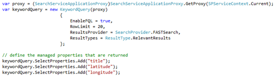
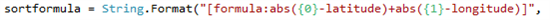
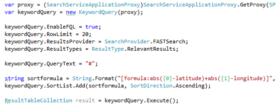
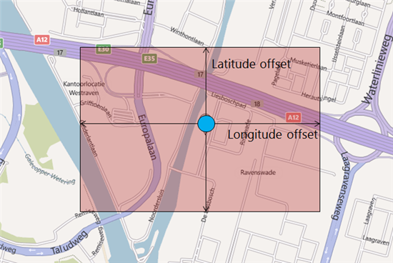
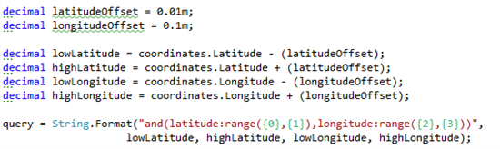
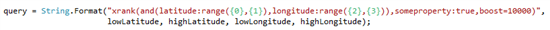
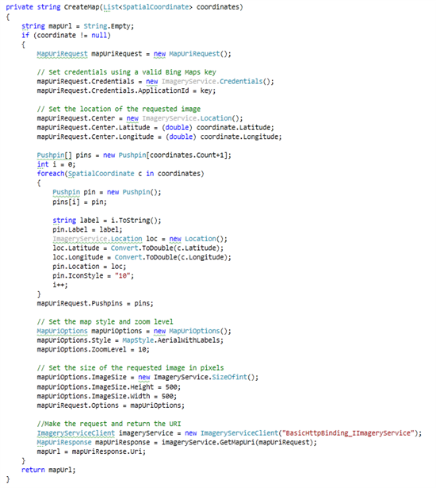
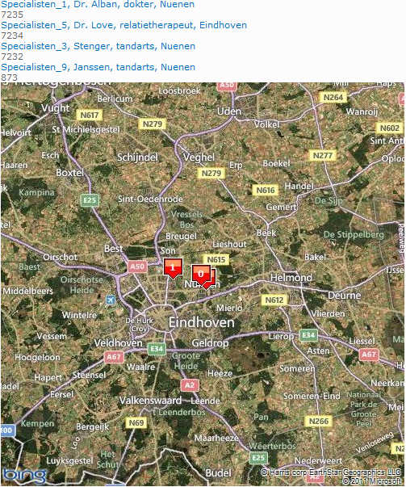

This is the third and last part of a series of blogposts about GeoSearch with Fast Search for SharePoint. I recently held some presentations about extending the power of Fast (on [DIWUG](http://www.diwug.nl/ "Dutch Information Worker User Group") and the Dutch [TechDays 2012](http://www.techdays.nl/ "Dutch Techdays 2012")) and one of the subjects that I talked about was on how to search for locations, sort on distances etcetera. The recording of my sessions are available on [Channel 9](http://channel9.msdn.com/Events/Speakers/bas+lijten "Bas Lijten on Channel 9") in dutch.

- [Part 1: why and how](http://blog.baslijten.com/geosearch-with-fast-search-for-sharepoint-2010-part-1/)
- [Part 2: the custom pipeline extension to enrich the Fast index with spatial data](http://blog.baslijten.com/geosearch-with-fast-search-for-sharepoint-2010-part-2-custom-pipeline-extensions/)
- Part 3: how to use this metadata in your search queries (this post)

Please make sure that this code (and the code that is included) is not "production ready" at all, doesn't implement the [geographic coordinate system](http://en.wikipedia.org/wiki/Geographic_coordinate_system) correctly, as it has a range of \[-180,180\]\[-90,90\] and that the computations don't take care of the fact that we live on a globe either.

## Creating the queries

After implementing the custom pipeline extension and all the data has been re-indexed, the index isenriched with the latitude and longitude information. This information can be used for some interesting queries and some interesting sorting algorithms. When working with spatial data, there are some different approaches that can be used to retrieve the nearest locations and sort them. There is however one caveat to take care of, when a custom sorting formula is used. For this blogpost, I query directly against the Fast query service application using the code below. I also return a set of 3 managed properties: title, latitude and longitude.

The code gets the proxy that will be used, and instantiates a new keywordQuery object. On this object, I explicitly enable FQL, select my resultsprovider and I set the rowlimit to 20, as this set contains enough results to be displayed

### Retrieve all results and sort them by distance to a certain point

This query is easy to execute, as the query "#" will retrieve all items. but when the managed properties are used in a sorting formula, things change. As the managed properties are of type decimal, these properties are handled differently, as described in [this blogpost](http://bloggingabout.net/blogs/bas/archive/2011/11/05/fast-search-for-sharepoint-caveat-apply-a-sortformula-with-managed-properties-of-type-decimals.aspx). For the sort formula, different algorithms can be used. Two populair sorting algorithms are the following:

- [Euclidean distance](http://en.wikipedia.org/wiki/Euclidean_distance): the shortest, unique distance between two points.
- [Taxicab distance](http://en.wikipedia.org/wiki/Taxicab_geometry): the distance between two points is the absolute difference of their coordinates. The path between the two points doesn't have to be unique.

the next image shows the difference between the two different algorithms. The green line represents the euclidean algorithm and is the unique, shortest path between two points. The red, blue and yellow paths represent variations on the taxicab geometry and are indeed, not unique.

\[caption id="" align="alignnone" width="283"\] manhattan distance - wikipedia\[/caption\]

For this blogpost, I use the taxicab algorithm, as it is, by far, the most easy to implement ;). Basically, this algorithm is as follows:

distance = abs(queriedLocation.latitude - result.latitude) + abs(queriedLocation.longitude-result.longitude). In code, I implemented this with the following snippet:

this snippet creates the string that is used as sortformula. {0} and {1} are replaced by the latitude and longitude of the location that I need to find the nearest results for. The latitude and longitude in the formula, are the names of the managed properties that are retrieved from the index. For every result that is returned from the query, this formula is executed, and the resultset will be ordered based on the outcome of this formula. This sortformula needs to be added to the Sortlist, and the last step that is needed, is to execute the query. This is shown in the following snippet.

When using this technique of getting a resultset and sort using a sortformula, the rank that is returned is zero. Relevance models can't be used to sort within this resultset, and, for example, operators like xrank can't be used either.

### Get all results within a certain area

Another method of getting results, which gives a bit more flexibility, is to retrieve all results within a certain area:

the cool thing about using this technique, is that a sorfformula to get all the nearest results, isn't needed, because that is already managed that in the query itself. Within the returned resultset, relevance models can be applied to rank results based on other properties!

a formula like this looks like the following:

1. set the latitude and longitude offsets
2. compute the borders of the bounding box
3. create the query: return all results with the latitude and the longitude in the respective ranges
4. execute the query

the fun starts when a xrank operator is thrown in:

the possibilities are almost limitless, when this technique is used! Queries like "return all restaurants in the neighbourhoud, but push all restaurants that pay for advertisements to the top". other possibilities are executing queries to retrieve items within an area, and rank them based on the keywords in the query. Think about using the Entity extractor "Location" that extracts all locations from a document, get all spatial data for that document, and execute a query like "give me all documents on burglaries near my current location".

the query has to be passed to the keywordquery object and thereafter be executed, just like in the other example.

#### Even more coolness!!

When all the results are returned, we can show the results in a boring list. But there is another option. Because we do have all latitude and longitude information, it's easy to plot them on a map. On a BING-map :D. Documentation on the API can be found here: [http://www.microsoft.com/maps/developers/web.aspx](http://www.microsoft.com/maps/developers/web.aspx). An example can be found as well in the code that is attached to this post.

Basically, all you have to do is the following:

1. Set the Bing-credentials and the applicationID (a free key that is available via the [bing maps developer center](http://www.microsoft.com/maps/developers/web.aspx))
2. set the center of the map
3. for each result to plot, add a pushpin
4. set the image size
5. get the map uri from the imageryservice
6. include the image in your webpart

I dont explain much of the code, because it isn't to hard and self-explanatory

this results in ultimately in the following webpart. Imagine what can be done. Add some nice javascripts to the pins to plot a route to the target or give extra information.

## summary

we saw in this blogpost that there are several techniques to query for and sort on geo-locations. using these techniques in combination with some existing services, for example BING-Maps, can result in some really cool webparts. Code will be posted soon!
