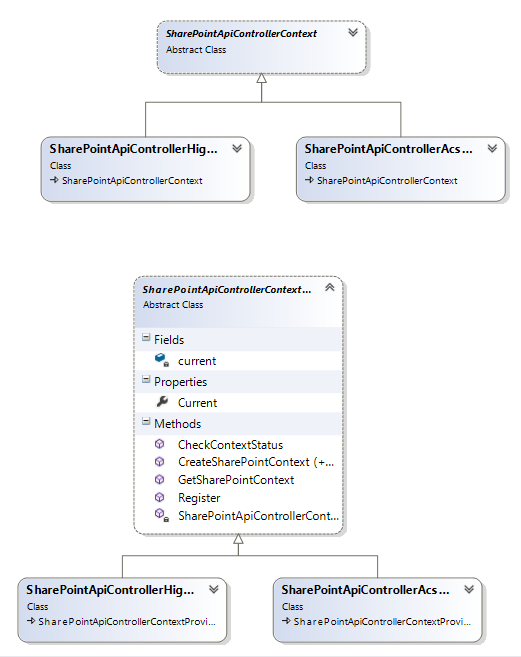
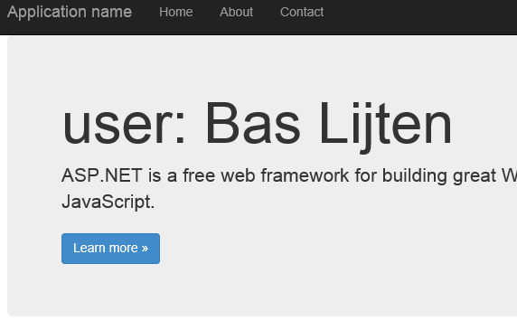
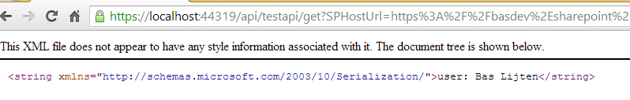
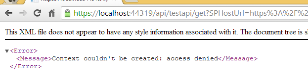

With the release of Visual Studio 2013, Microsoft also added a very nice MVC template for remote SharePoint Apps. This is a slightly modifed version of the default MVC5 template, which doesn't, for example, contain an own authentication provider, but does contain all the stuff like bootstrap and the latest jquery version. Some extra helper files have been added (via a nuget package) to assist in the communication with SharePoint 2013. This does work perfectly with the Actions defined in MVC controllers, but the code doesn't work together with ApiControllers. Yet ;) This blogpost shows us how (roughly) the same functionality can be implemented for use with the WebApi controller! At the end, the full source code is provided, it works in azure, as well as with high trust solutions. A good read on the basics of the SharePointContextProvider can be found [here](http://blogs.msdn.com/b/kaevans/archive/2013/09/24/introducing-sharepointcontext-for-provider-hosted-sharepoint-apps.aspx "Introducing SharePointContext for Provider-Hosted SharePoint Apps!") and [here](http://www.looselytyped.net/2013/06/26/sharepoint-app-tools-in-visual-studio-2013-preview-the-new-sharepointcontext-helper/ "SharePoint app tools in Visual Studio 2013 preview, the new SharePointContext helper!")

_Note: the provided code is by no means production ready! I didn't test it thoroughly, but the basic scenario's do work!_

## Different concepts

At first, the concepts of MVC and WebAPI are different. Basically, MVC is optimized to return views as HTML, whereas the WebAPI is optimized to return structured data. Dave Ward wrote a [good post](http://encosia.com/asp-net-web-api-vs-asp-net-mvc-apis/ "Web API vs MVC api") on this subject. When looking at the technical aspects of MVC and WebAPI, there are some more differences, which causes the code not to work with WebAPI controllers.

### MVC, APIControllers and the SharePointContextProvider

The MVC Controllers inherit from "[System.Web.MVC.Controller](http://msdn.microsoft.com/en-us/library/system.web.mvc.controller(v=vs.118).aspx "System.Web.MVC.Controller")" and provides properties like HTTP Context and the Request property, which is a [HttpRequestBase](http://msdn.microsoft.com/en-us/library/system.web.httprequestbase(v=vs.118).aspx "HttpRequestBase"). Those two properties are heavily used in the SharePoint helper classes that help creating and ensuring the SharePoint contexts. Whenever an action is being executed, the SharePointContextProviderAttribute tries to enforce a SharePoint context, which can return 3 different results:

- The context is OK
- The context cannot be created yet: redirect back to the portal to gather the right information. This is mostly the case when the remoteweb has been bookmarked and the page is requested via that bookmark. The user will be redirected to SharePoint to login, and after the login, the user is redirected back to SharePoint. The check will return "OK" then.
- The context is not available and can't be created: redirect to the error view.

\[code language="csharp"\] switch (SharePointContextProvider.CheckRedirectionStatus(filterContext.HttpContext, out redirectUrl)) { case RedirectionStatus.Ok: return; case RedirectionStatus.ShouldRedirect: filterContext.Result = new RedirectResult(redirectUrl.AbsoluteUri); break; case RedirectionStatus.CanNotRedirect: filterContext.Result = new ViewResult { ViewName = "Error" }; break; }

\[/code\]

The function on line 1, "SharePointContextProvider.CheckRedirectionStatus" not only checks wether or not the user should be redirected, but also creates the SharePointContext, whenever this is possible. The first condition for a succesful return status (return OK or ShouldRedirect) is the presence of a SPHostUrl in the querystringparameters. Using a function called GetSPHostUrl, this parameter is retrieved from the RequestUri:

\[code language="csharp"\] public static Uri GetSPHostUrl(HttpRequestBase httpRequest) public static Uri GetSPHostUrl(HttpRequest httpRequest) \[/code\]

Whenever the context can be created, this context is stored in the HttpContext.Session. Below the HighTrustContext is listed, the implementation of the Acs variant of SaveSharePointContext is slightly different, but uses the HttpContext.Session as well.

\[code language="csharp"\] protected override void SaveSharePointContext(SharePointContext spContext, HttpContextBase httpContext) { httpContext.Session\[SPContextKey\] = spContext as SharePointHighTrustContext; } \[/code\]

#### ApiController

The ApiController however, inherits from "[System.Web.Http.ApiController](http://msdn.microsoft.com/en-us/library/system.web.http.apicontroller(v=vs.118).aspx "System.Web.Http.Controller")". This is a quite different class compared to the System.Web.MVC.Controller. It doesn't contain a HttpContext, but a HttpControllerContext, which doesn't, for example, contain a Session. This isn't a surprise: ApiControllers are, by default, stateless. The Request and RequestContext properties are respectively of type HttpRequestMessage and HttpRequestMessageContext. It doesn't take much to see that Controller and ApiController are complete different classes and due to the fact that the ApiController doesn't have a httpContext and thus, no session, there is no way to use the provided helper classes with the ApiController.

## The Solutions

To be able to use the WebAPI easily within SharePoint 2013 apps, and keeping in mind that there was no way to map the ApiController properties in such a way that they would fit into the Controller properties, two solutions came accross

- Adding a session to the API Controller and add some code to the helper classes
- Keep the API "pure" and add a helper class

### Adding a session to the API Controller

Adding a session to the API Controller is a solution and can provide some interesting possibilities, for example when the WebAPI is supportive to the MVC application and needs to share a Session with the MVC part of your solution. In situations like Single Page Applications, this is not always a viable solution. Information on how to add a session to a ApiController, can be found [here](http://www.strathweb.com/2012/11/adding-session-support-to-asp-net-web-api/ "using session in an ApiController"). As this solution doesn't work with the default behaviour of ApiControllers, this wasn't a solution for me.

### Keeping the WebAPI "pure" and add a helper class

Another solution was to "copy" the SharePoint provider logic, and modify this logic in such a way, that it would fit the ApiController. An additional benefit is that is runs in conjunction with the helperclasses: there is one downside: the helperclasses provided by microsoft (via nuget), need to be altered a bit.

#### SharePointContextFilterAttribute to use with the WebAPI

At first, a new SharePointContextFilterAttribute needs to be created, I chose "SharePointApiControllerContextFilter". It inherits from "System.Web.Http.Filters.ActionFilterAttribute", which is designed to work with ApiControllers:

\[code language="csharp" highlight="11,13,15"\] public class SharePointApiControllerContextFilterAttribute : ActionFilterAttribute { public override void OnActionExecuting(System.Web.Http.Controllers.HttpActionContext actionContext) { if (actionContext == null) { throw new ArgumentNullException("actionContext"); }

Uri redirectUrl; switch (SharePointApiControllerContextProvider.CheckContextStatus(actionContext.ControllerContext, out redirectUrl)) { case ContextStatus.Ok: return; case ContextStatus.NotOk: actionContext.Response = actionContext.Request.CreateErrorResponse(HttpStatusCode.MethodNotAllowed, "Context couldn't be created: access denied"); break; } } } \[/code\]

On lines "13 and 15" we see that 2 results are handled: Ok and NotOK. As the controller just provides data (or no data), it shouldn't take care of redirects. The app that makes use of the ApiController needs to handle possible errors and take action on that event. In case of the MVC application, it already is an application, so it makes sense to handle the redirect logic in the MVCFilterAttribute.

On Line "11", the redirection logic has been substituted with "CheckContextStatus", to reflect the action it executes.

#### Altering the SharePointContextProvider to support ApiControllers

The next step, was a bit harder, although it wasn't too hard. The SharePointContext and SharePointContextProvider needed to be migrated to support the WebAPI. This basically came down to:

- Remove session related code
- Replace the use HttpRequestBase with another class
- Replace the use of the HttpContext with HttpControllerContext
- Make sure that the AppContextToken can be retrieved by the ApiController

I choose to put the logic into a new class, because the signature of some methods needed to be changed. I didn't want to change the code too much: when microsoft updates the nugetpackages, it's easier to add the modifications again.

The original class diagram is as follows:

After copying and modifying the code, my class diagram still preserves the same structure. Please take notice of absence of several methods in the SharePointApiControllerContentextProvider:

As the ApiController is stateless by default, I decided to remove the Load, Save and validation methods, the context is created over and over again, on each request. This process could be optimized, but hey, it's just a proof of concept ;). Eventually, all came down to Creating the SharePoint context.

As the High Trust solution was the easiest to implement, I will start with that one ;)

#### High Trust Solutions

The Creation of the SharePoint context for full trust solutions was quite easy: As this form of remote apps works on a Server to Server trust (with certificates), all that is needed is an identity. I used the code provided by Microsoft as the basis to start with:

\[code language="csharp"\] protected override SharePointContext CreateSharePointContext(Uri spHostUrl, Uri spAppWebUrl, string spLanguage, string spClientTag, string spProductNumber, HttpRequestBase httpRequest) { WindowsIdentity logonUserIdentity = httpRequest.LogonUserIdentity; if (logonUserIdentity == null || !logonUserIdentity.IsAuthenticated || logonUserIdentity.IsGuest || logonUserIdentity.User == null) { return null; }

return new SharePointHighTrustContext(spHostUrl, spAppWebUrl, spLanguage, spClientTag, spProductNumber, logonUserIdentity); } \[/code\]

In this case, it all came down to replace the HttpRequestBase by an available property in the ControllerContext, in which the WindowsIdentity property was available. I ended up using the RequestContext, which was available in the ControllerContext:

\[code language="csharp"\] protected override SharePointApiControllerContext CreateSharePointContext(Uri spHostUrl, Uri spAppWebUrl, string spLanguage, string spClientTag, string spProductNumber, HttpControllerContext httpControllerContext) { WindowsIdentity logonUserIdentity = (WindowsIdentity)httpControllerContext.RequestContext.Principal.Identity; if (logonUserIdentity == null || !logonUserIdentity.IsAuthenticated || logonUserIdentity.IsGuest || logonUserIdentity.User == null) { return null; }

return new SharePointApiControllerHighTrustContext(spHostUrl, spAppWebUrl, spLanguage, spClientTag, spProductNumber, logonUserIdentity);

} \[/code\]

That was all that was needed for the High Trust apps!

#### Creating the ACS Context Provider

Creating the SharePoint context in a application that makes use of the Azure Access Control Services, is a total different story.

The CreateSharePointContext is implemented as follows:

\[code language="csharp"\] protected override SharePointContext CreateSharePointContext(Uri spHostUrl, Uri spAppWebUrl, string spLanguage, string spClientTag, string spProductNumber, HttpRequestBase httpRequest) { string contextTokenString = TokenHelper.GetContextTokenFromRequest(httpRequest);

if (string.IsNullOrEmpty(contextTokenString)) { return null; }

//…

return new SharePointAcsContext(spHostUrl, spAppWebUrl, spLanguage, spClientTag, spProductNumber, contextTokenString, contextToken); } \[/code\]

The problem is in the method GetContextTokenFromRequest in the TokenHelper class:

\[code language="csharp"\] public static string GetContextTokenFromRequest(HttpRequestBase request) { string\[\] paramNames = { "AppContext", "AppContextToken", "AccessToken", "SPAppToken" }; foreach (string paramName in paramNames) { if (!string.IsNullOrEmpty(request.Form\[paramName\])) { return request.Form\[paramName\]; } if (!string.IsNullOrEmpty(request.QueryString\[paramName\])) { return request.QueryString\[paramName\]; } } return null; } \[/code\]

Within this method, the application context token is retrieved, from the request form parameters or from the querystring . After some fiddling around (or however it is called when using fiddler), It came out that after startup of an application, the app context token is send as a form parameter of the request. [According to MSDN](http://msdn.microsoft.com/en-us/library/office/jj163816.aspx "URL strings and tokens in apps for SharePoint"), it's not possible to provide the AppContextToken as a startup parameter in the querystring. As its not possible to get the original post parameters via javascript, I had to find another solution.

It turned out that using cookies to provide the app context token is allowed, regarding this quote on MSDN, within the "[Tips and FAQ: Oauth and remote apps for SharePoint](http://msdn.microsoft.com/library/office/fp179932.aspx "Tips and FAQ: OAuth and remote apps for SharePoint")" article:

**Is it okay to keep AppContext (obtained from a SharePoint POST request) as a hidden input field on the page?** _Putting the AppContext value in a hidden field or in a cookie is fine. If you have a server-side cache, you can also consider extracting the "CacheKey" from the context token, putting that in the cookie or hidden input field, and keeping the refresh token (and even the access token) and other information in a server-side cache (that way you can make this cache durable between sessions)._

This is the point where the SharePointContextProvider needed a slight modification: at the moment that a SharePoint context has been created, I insert a cookie, which can be used by the ApiController:

\[code language="csharp"\] if (spContext != null) { string contextTokenString = TokenHelper.GetContextTokenFromRequest(httpContext.Request); System.Web.HttpCookie cookie = new HttpCookie("appContextToken") { Value = contextTokenString, Secure = true, HttpOnly = true }; httpContext.Response.AppendCookie(cookie); SaveSharePointContext(spContext, httpContext); }

\[/code\]

_//Note: this could be solved in various ways, I just choose the "fastest" one._

I added a helper method for use within the SharePointApiControllerContextProvider to retrieve the appContextToken from the cookie that has been set in initial request. All the other effort I had, was to rewrite the CreateSharePointContext, to be able to send the HttpControllerContext as a parameter, that was all.

## When a plan comes together

Due to the modification to the existing helper classes, the app context token is now stored in a cookie. Whenever a user starts the remote webapplication and he hits an action that is decorated with the SharePointContextFilterAttribute, a cookie is created with this token in it.

Whenever a webAPI call is executed, which is decorated with the SharePointApiControllerContextFilterAttribute, the code tries to create the SharePoint context: that specific cookie is needed to create this context. When the token is not available, a "MethodNotAllowed" response is created, otherwise, there is no problem to go on with the execution of the logic.

In my TestApiController, I copied the "default" logic that normally comes with the SharePoint MVC app, decorated the Action with our new filterattribute.

\[code language="csharp"\] public class TestApiController : ApiController { \[SharePointApiControllerContextFilter\] \[System.Web.Http.HttpGet\] public string Get() { var spContext = SharePointApiControllerContextProvider.Current.GetSharePointContext(ControllerContext);

Microsoft.SharePoint.Client.User spUser = null; using (var clientContext = spContext.CreateUserClientContextForSPHost()) { if (clientContext != null) { spUser = clientContext.Web.CurrentUser;

clientContext.Load(spUser, user => user.Title);

clientContext.ExecuteQuery(); } } return "user: " + spUser.Title; } } \[/code\]

Within my MVC view, I added a 

and some javascript code:

\[code\]</pre> <h1></h1> <pre> @section scripts {  } \[/code\]

After running the code my username eventually shows up!

From  the same session, it's possible to call the WebAPI on it's own too:

Whenever I call the TestApiController directly from a browser that didn't authenticate against SharePoint and didn't create SharePointContext yet, I get a "nice" error message:

## Summary

The helper classes provided by microsoft don't work together with the WebAPI. As this is a very interesting piece of technology that can be used within Single Page Apps, I added a helper class to be able to use those ApiControllers within your application. It wasn’t too hard, just a bit of work to find out how this stuf works. My implementation is (very likely) far from perfect, but it does give a smooth start on building your own logic.

The sourcecode can be downloaded [here](http://blog.baslijten.com/wp-content/uploads/2013/12/apicontroller.zip "source code sharepoint apps and apicontrollers")

Happy coding!!
