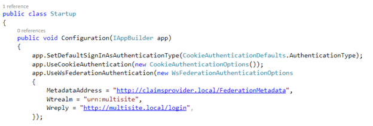
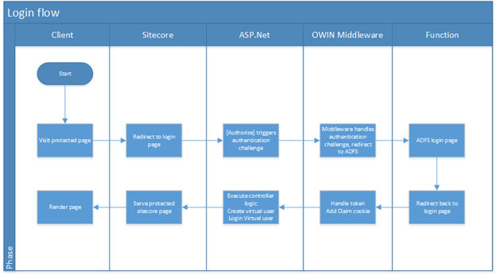
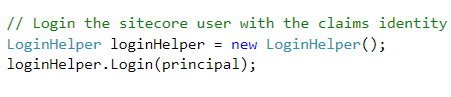

Out of the box, Sitecore only offers their own forms-based authentication provider, which requires to add every user to the Sitecore membership database. At Achmea, we had the requirement to facilitate login via ADFS, as we are using our user accounts amongst different systems, web applications and apps. In addition to the absence of this functionality, it’s not possible to work with claims as well.

This blogpost describes how to add and use the Federated Authentication middleware using OWIN in combination with Sitecore and how to access the claims that are provided using the federated login. The solution supports a multi-site scenario, which can handle different identity providers and multiple realms. This opens up possibilities to use external identity providers, for example via ADFS or Windows Azure Active Directory.

[The source code for federated login component](https://github.com/BasLijten/SitecoreFederatedLogin) can be found on github. Please feel free to contact me via twitter/mail/github if there are any questions! A special thanksto Kern Herskind Nightingale of Sitecore: We discussed a lot on the integration patterns for Federation and Sitecore.

## Why not to use the ADFS Authenticator Marketplace module?

During my quest on integrating Federated Authentication with Sitecore, I found this module. I had some issues to get it to work in Sitecore 8 build 5, (although I managed to get it to work), but there were some drawbacks why I decided not to use this module:

- Microsoft is putting their bets on OWIN. As I expect that Sitecore will go that direction in the future, I want to write software that can be easily migrated to future products. (That’s why we don’t create webforms solutions anymore as well)
- Some extra pipelines were added for User resolving and token requesters.
- I had to add a few extra HttpModules
- It didn’t support multiple sites and multiple realms in a secure way

## The Sitecore architecture

Basically, the default user management implementation for Sitecore, is a custom Forms Authentication Provider, which makes use of the default ASP.Net Forms Authentication implementation. Under the hood, these users are partially managed in a standard Asp.Net Membership database. For example, information like roles, passwords, and user statuses are all managed in this membership database.

The Sitecore implementation lies around the FormsAuthenticationProvider and FormsAuthenticationHelper, which both exist in the Sitecore.Security.Authentication namespace in the Sitecore.Kernel assembly.

Upon login, there is an Authentication manager which has all login and user management logic abstracted away. The FormsAuthentication Manager, which has been registered in the web.config, is injected in the Authentication Manager as an Authentication Provider. Under the hood, the following actions happen:

- Username and password are being validated
- A new Sitecore User object is created
- The Sitecore user object will be assigned to the HttpContext.Current.User and Thread.CurrentPrincipal

## Challenges with OWIN and Sitecore

Adding the OWIN Federated Authentication middleware isn’t too hard (more on that matter later). There are a number of challenges, which can be found in the combination of the federated authentication and Sitecore.

### Authentication Challenge

In Sitecore, the AuthenticationManager.Login(username, password) is being used. As stated before, the used Provider is configurable within the web.config. This requires a custom Authentication Provider implementation _and_ a custom Authentication Helper implementation. As this is a serious job that has to be done, I was a bit reluctant to use this. It replaces some out of the box functionality, something I want to prevent as much as possible.

### Lifecycle challenge

It can be quite complex to determine when the Claims principal is available, complete and how to map it on the Sitecore user objects.

### Claims challenge

Due to the fact that the Thread.CurrentPrincipal _and_ the HttpContext.Current.User object are both being replaced with the Sitecore User object, the provided claims are not available anymore. Solving this in the Sitecore pipeline is not possible, as the claims property is not available on the User class. Replacing the Sitecore User object with another User object would seriously break Sitecore. Writing custom logic to create a custom Sitecore ClaimsUser object would be a serious effort and I don’t know whether or not that would even be possible, due to the internal usage of the Sitecore User object.

### Multiple site challenge

The WsFederation Authentication Middleware does not support multi-tenancy: configuring a single instance of authentication middleware with different hostnames and realms that need to be accepted is not possible.

Luckily, all of these challenges can be encountered! As I wrote in [some of my](http://blog.baslijten.com/configure-claims-based-web-applications-using-owin-wsfederation-middleware/) [previous blogposts](http://blog.baslijten.com/setup-your-development-environment-for-high-trust-saml-claims-based-sharepoint-provider-hosted-applications-using-owin-and-an-easy-to-use-sts-part-3/), adding OWIN Federation middleware is quite easy. But for the sake of completeness in my first serious Sitecore blogpost, I’ll describe this process later on in this blogpost.

## Configuring OWIN in Sitecore

We’ll start with a simple, plain OWIN configuration, which injects the Cookie Authentication module and the WsFederation Authentication Module. The WsFederation Authentication module handles the initial authentication challenge and redirects the user to, in this case, my own STS. When the RST has been returned, the WsFederation Authentication module handles and verifies this token, while the Cookie Authentication module creates a “.AspNet.Cookies” cookie (often referred to the claims cookie), which contains all the user information.

Both middlewares can have several configuration options and events attached: we’ll get into some of those later on.

## Federated login for Sitecore – the login flow

When a page is requiring a login, the pipeline could handle the login challenge. I chose to redirect the user to a login page. On this page, there is a controller rendering, whose action is decorated with the \[Authorize\] Attribute. This attribute does not cause a Sitecore Forms authentication challenge, but a plain ASP.Net authentication challenge, the one that has been configured with OWIN.

The OWIN middleware handles the RST token and sets the claimcookie and sets the current identity on Thread.CurrentPrincipal and HttpContext.Current.User. After handling this token, the Controller logic can be executed and the user will be redirected to the original, requested page.

At this point, there is still no Sitecore user identity. The result: The user gets redirected back to the login page, the authentication challenge will _not_ be triggered, as the claims cookie is available.

Right now we are are missing logic to do an actual “Sitecore user login”. There are bootstrap options to do this:

- On the SecurityTokenValidated event of the WsFederationAuthentication middleware
- In the Sitecore pipeline
- In the login controller action

But _before_ we can do the actual bootstrap, another problem has to be solved.

### Supress Form validation when ADFS posts the RST to Sitecore

The RST that is posted to Sitecore by ADFS, needs to be handled. At the moment of writing, there is a PreProcessRequest processor, which handles form posts to Sitecore, the SuppressFormValidation processor.

This processor throws an exception if an unsafe form post was found, but adds some exceptions to Sitecore: unsafe form posts to “/Sitecore/shell” and “/Sitecore/admin” are allowed. Unfortunately, these paths are not configurable, thus I replaced that processor by this implementation:

\[csharp\] public override void Process(PreprocessRequestArgs args) { Assert.ArgumentNotNull(args, "args"); try { new SuppressFormValidation().Process(args); } catch (HttpRequestValidationException) { string rawUrl = args.Context.Request.RawUrl; if (!rawUrl.Contains("login")) { throw; } } } \[/csharp\]

These solution respects the original processor outcome, catches the exception, but adds a path that should accept an unsafe formpost as well. In any other situation: rethrow the same exception, this causes Sitecore to behave exactly the same as it did before.

### The bootstrap moments

#### SecurityTokenValidated

This event seems the most logic place to login the Sitecore user, but it has a major drawback. At the moment that the RST has been validated, a Claimcookie hasn’t been created yet by the Cookie Authentication middleware. The Authentication Ticket, however, is available. When a virtual user is being created, the actual claims from the ticket can be mapped to this user (for example to map some Sitecore user roles), but at the moment that AuthenticationManager.Login() has been called, the HttpContext.Current.User and Thread.CurrentPrincipal properties are being overwritten with Sitecore user. All of your claims, that weren’t mapped to the Sitecore user, are lost.

If there is no need to use claims in your custom code, or the use of the Sitecore roles is sufficient, this is the best place to do the user login, however, if you are in need of using claims, this moment cannot be used as a bootstrap moment.

#### Sitecore pipeline

As the Sitecore pipeline is highly extensible, this might be a good solution as well. But I wanted to keep the login logic as far away from Sitecore as possible, as it might introduce unwanted complexity, so I didn’t investigate this option further. If anyone has some good reasons to put the logic in a processor, please share these reasons with me!

#### Controller action

I chose the controller action as bootstrap moment: After being returned from ADFS, the Claim cookie has already been generated. In the controller action logic, the claim cookie is accessible, while the user hasn’t been logged in to Sitecore yet. This is the moment do the Sitecore login and execute some additional actions.

#### Logging a Sitecore user and mapping claims to Sitecoreroles

As stated before, at the moment that the controller action is being executed, the user can be logged in to Sitecore. I have reused the code that was written by [Vasiliy Fomichev](https://github.com/vasiliyfomichev/Sitecore-ADFS-Authenticator-Module/blob/master/ADFS.Authenticator/Pipelines/HttpRequest/LoginHelper.cs). He created a login helper as part of the [ADFS Authenticator solution, which is available on github](https://github.com/vasiliyfomichev/Sitecore-ADFS-Authenticator-Module/blob/master/ADFS.Authenticator/Pipelines/HttpRequest/LoginHelper.cs). This loginhelper compares all roleclaims to the Sitecore groups. For every positive result, that Sitecore group is being added to the virtual Sitecore user. After the group assignment has been finished, the virtual user is logged in to Sitecore. The implementation of the loginhelper can be found [here](https://github.com/vasiliyfomichev/Sitecore-ADFS-Authenticator-Module/blob/master/ADFS.Authenticator/Pipelines/HttpRequest/LoginHelper.cs).

## Mutiple sites configuration

With this OWIN configuration, the multi site requirement hasn’t been fulfilled yet. As the WsFederationAuthentication middleware does not support multi-tenancy, another solution was needed. This solution could be achieved by making use of the pipeline-branching options of the OWIN pipeline.

### Pipeline-branching

OWIN supports pipeline branching. app.Map or app.MapWhen can be used to inject some middleware to a specific path or to a specific situation. In my case, I could use the app.MapWhen option:

\[csharp\] app.MapWhen(ctx => ctx.Request.Get("host").Equals("multisite.local"), site => { Console.WriteLine("branch 1"); }); \[/csharp\]

I used this technique to register all my sites together with its specific middleware. This can be hardcoded, but it’s better to provide the configuration in a separate configuration file, as it doesn’t require a redeployment when a Sitecore site has been added. An addition of a new option, however, does require an application pool recycle in IIS

## The claims challenge

The claims challenge was a harder one to tackle. In a normal Asp.Net webapplication, we can retrieve our claims from the Claimsprincipal that is assigned to the HttpContext.User property. But as Sitecore overwrites this property, we can’t retrieve those claims.

Because of the choice I made for the bootstrap moment, I have access to the .AspNet.Cookies cookie, in which the claims identity is stored. On every request, this cookie is being decrypted and deserialized by the OWIN middleware, to provide the identity. And again, _after_ that moment, Sitecore is overwriting that identity with its Sitecore user.

### Retrieving the AuthenticationTicket

The cookie value can easily be retrieved, but it’s encrypted. When adding the CookieAuthenticationOptions to the CookieAuthenticationMiddleware, the TicketDataFormat is being set. This is a property which helps storing the AuthenticationTicket in a cookie. The default implementation even encrypts this data:

\[csharp\] if (base.Options.TicketDataFormat == null) { IDataProtector protector = app.CreateDataProtector(new string\[\] { typeof(CookieAuthenticationMiddleware).FullName, base.Options.AuthenticationType, "v1" }); base.Options.TicketDataFormat = new TicketDataFormat(protector); } \[/csharp\]

As the dataprotector is used internally by the middleware, it was hard for me to decrypt that data in the cookie. By providing an own dataprotector to the TicketDataFormat, it’s easy to decrypt the cookiedata and return the AuthenticationTickets by decrypting the cookies:

\[csharp\] internal class MachineKeyProtector : IDataProtector { private readonly string\[\] \_purpose = { typeof(CookieAuthenticationMiddleware).FullName, CookieAuthenticationDefaults.AuthenticationType, "v1" };

public byte\[\] Protect(byte\[\] userData) { return System.Web.Security.MachineKey.Protect(userData, \_purpose); }

public byte\[\] Unprotect(byte\[\] protectedData) { return System.Web.Security.MachineKey.Unprotect(protectedData, \_purpose); } } \[/csharp\]

This function can be used to get the AuthenticationTicket from the cookie:

\[code languague="csharp"\]\[/code\]

private static AuthenticationTicket GetAuthenticationKeyTicket() { AuthenticationTicket ticket = null;

var ctx = HttpContext.Current.Request; if (ctx.Cookies != null && ctx.Cookies\[".AspNet.Cookies"\] != null) { var cookie = ctx.Cookies\[".AspNet.Cookies"\]; var secureDataFormat = new TicketDataFormat(new MachineKeyProtector()); ticket = secureDataFormat.Unprotect(cookie.Value); } return ticket; }

\[/csharp\]

And within that Ticket, the ClaimsIdentity can be found:

\[csharp\] // Summary: // Contains user identity information as well as additional authentication state. public class AuthenticationTicket { // // Summary: // Initializes a new instance of the Microsoft.Owin.Security.AuthenticationTicket // class // // Parameters: // identity: // // properties: public AuthenticationTicket(ClaimsIdentity identity, AuthenticationProperties properties);

// // Summary: // Gets the authenticated user identity. public ClaimsIdentity Identity { get; } // // Summary: // Additional state values for the authentication session. public AuthenticationProperties Properties { get; } \[/csharp\]

### SessionStore to prevent replay attacks and keep the cookies small

In addition to this TicketDataFormat, I decided to implement the SessionStore property as well. When this property is not null, the OWIN middleware doesn’t store the complete claimsidentity, with all it’s claims, into the cookie, but just a reference to it: this keeps the cookies small. For an explanation see [this blogpost on reference mode](http://www.cloudidentity.com/blog/2014/05/11/owin-protocol-middleware-cookies-and-reference-mode-sessions-we-need-your-feedback/) by Vittorio Bertocci. I also used his code.

A great and safe side effect, is that there is a server side storage which can be used verify if identities are still valid.

In normal FormsAuthentication scenario’s (like Sitecore has), a user can logout. All that happens, is that the cookie gets deleted. When someone intercepts that cookie, for example on a public machine, that person could restart the website, add that cookie and he is logged in again.

When using this SessionStore technique, just the reference to the cookie is being stored and the real AuthenticationTicket can be deleted when a user logs out. When a malicious person is adding the stolen cookie to a new browser session, he won’t be able to steal your identity anymore. I’ll write more on this subject in a future blogpost.

## The lifecycle challenge

Last, but not least, I had to cope with the lifecycle challenge. As we are working with two identities, they have to aligned which each other: The Sitecore identity (represented by the .aspxauth cookie) and the OWIN identity (represented by the .AspNet.Cookies cookie and the session store). I put the OWIN identity as leading Identity; when this identity is not valid, available, expired, or whatsoever, then the Sitecore identity should be invalidated as well. In all other cases, the identities should match or not be available at all, to represent a valid request.

After the user resolver processor in the HttpRequestBegin pipeline, I added a new processor, which checks the authentication status. I created the following table for it:

<table><tbody><tr><td width="48"><strong>&nbsp;</strong></td><td width="39"><strong>fedAuth cookie</strong></td><td width="37"><strong>Claims Principal</strong></td><td width="35"><strong>Sitecore User</strong></td><td width="61"><strong>Status</strong></td><td width="289"><strong>Beschrijving</strong></td><td width="117"><strong>Handled by</strong></td></tr><tr><td width="48"><strong>1</strong></td><td width="39">0</td><td width="37">0</td><td width="35">0</td><td width="61">OK</td><td width="289">No identification options available: anonymous request</td><td width="117">Pipeline</td></tr><tr><td width="48"><strong>2</strong></td><td width="39">1</td><td width="37">0</td><td width="35">0</td><td width="61">NOK</td><td width="289">Cookie not valid: delete and redirect to login page</td><td width="117">Handled by OWIN</td></tr><tr><td width="48"><strong>3</strong></td><td width="39">0</td><td width="37">1</td><td width="35">0</td><td width="61">OK</td><td width="289">No identification possible. Token is automatically deleted by cleanup job. Anonymous request</td><td width="117">Pipeline</td></tr><tr><td width="48"><strong>4</strong></td><td width="39">1</td><td width="37">1</td><td width="35">0</td><td width="61">NOK</td><td width="289">No corresponding Sitecore ID – delete cookie and token. Sitecore handles redirect to login if needed</td><td width="117">Pipeline and Sitecore</td></tr><tr><td width="48"><strong>5</strong></td><td width="39">0</td><td width="37">0</td><td width="35">1</td><td width="61">NOK</td><td width="289">Logout, redirect to login page</td><td width="117">Pipeline</td></tr><tr><td width="48"><strong>6</strong></td><td width="39">1</td><td width="37">0</td><td width="35">1</td><td width="61">NOK</td><td width="289">Cookie not valid: delete, logout and redirect to loginpage</td><td width="117">Pipeline</td></tr><tr><td width="48"><strong>7</strong></td><td width="39">0</td><td width="37">1</td><td width="35">1</td><td width="61">NOK</td><td width="289">No identification possible, same situation as 5: logout Sitecore user and redirect to loginpage</td><td width="117">Pipeline</td></tr><tr><td width="48"><strong>8</strong></td><td width="39">1</td><td width="37">1</td><td width="35">1</td><td width="61">OK</td><td width="289">Valid situation. Validate both identities, if they correspond with each other, valid request. Otherwise: logout and redirect to loginpage</td><td width="117">Pipeline</td></tr></tbody></table>

Basically, it comes down to 3 valid situations, of which 2 reside in valid anonymous request and only the last one leads to a valid authenticated request.

## Summary

Adding Federated authentication to Sitecore using OWIN is possible. In the end, the solution wasn’t too complex and makes use of standard Sitecore where possible, without intervening in it’s core logic. Using ASP.Net for authentication on _top_ of Sitecore as a kind of passthrough authentication layer, keeps us safe and it can easily be removed.
