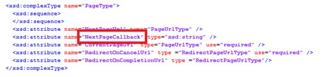
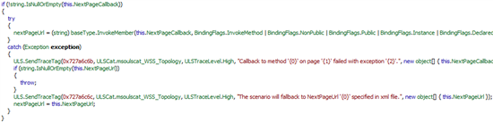
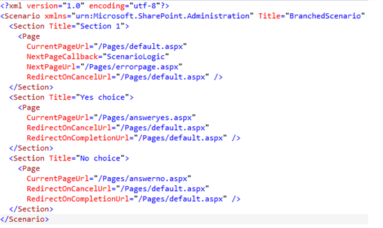
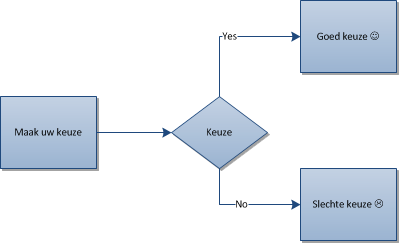
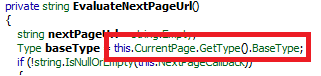
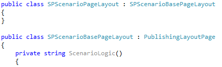
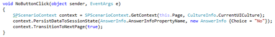
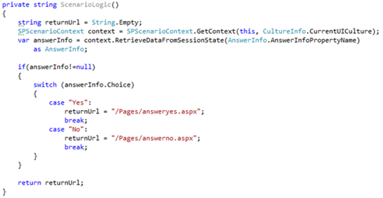

Waldek Mastykarz [posted a superb post](http://blog.mastykarz.nl/multipage-forms-sharepoint-scenario-framework/) about one of those hidden SharePoint gems: the SharePoint scenario framework for multi-page forms. As Waldek showed off, this framework enables us to create some flows, but I was wondering if branched flows (for example, an easy yes/no) were possible. And it seems to be that it is!. This post shows off how to create a branched flow based on webparts and the SharePoint scenario framework.

Disclaimer: some code has been taken from Waldek and has been slightly modified. Shameless copy ;)

## Why do we want it?

As you read the article, you may ask yourself: why all this effort to enable branching using these webparts? Well, the answer is easy. Although some advantages are that you can develop more granulair webparts, it’s possible to place, for each step, other webparts on every page. For example, a Content editor webpart per step with additional information. It becomes even more powerful when you create a connectable webpart, which is able to push data that is entered in previous steps, to other webparts, to show related content. Image what kind of powerful solutions can be created when the webparts interact with several search webparts (Fast, anyone?!), related content, BCS. The possibilities are unlimited!

The downside to this method is, that a custom page layout codebehind is needed whenever you want to make use of this technique. It creates a dependency between the webpart and the pagelayout.

## How does it work?

After checking the scenario definition, it appeared that it is possible to define a NextPageCallback, a function that contains some logic to determine what page is next in flow. I suspected that this definition could be my key to the multi-branch form flow.

Checking out the {SharePointRoot}\\Scenarios learned me that 10 other scenarios where available, all scenarios in the central admin, but none of them made use of the NextPageCallback feature.  That, in combination with the lack of documentation, didn’t make me happy, but after some analyses with reflector, it didn’t seem to be too hard, except for one caveat that we have to take care of.

When looking at the reflected code, it seems that the NextPageCallback has a higher priority than the NextPageUrl, which is used as a fallback scenario when that callback is not defined or does not exist.

Against all odds, I tried to create the following scenario.xml with a NextPageCallback called “ScenarioLogic”. A method with the same name was  defined inside the webpart.

The branched logic that i wanted to create is displayed in the image below:

Of course, this failed miserably.

This log learned us that the PublishingLayoutPage didn’t contain the function “ScenarioLogic”. This led me to believe that creating a custom PageLayout class called “ScenarioLogic PublishingLayoutPage”, create the method “ScenarioLogic” and let it inherit from PublishingLayoutPage was the solution to get this gem to work. But for some reason, this code still didn’t work. With the custom pagelayouyt, I got the same error on the PublishingLayoutPage class. Checking out the reflected code learned me that the base class of the page was used.

The code gets the base type of the current page, not the type itself, which leads to the case that the PublishingLayoutPage is used to search for the callback function “ScenarioLogic”. The solution here is to create a Scenario-specific base-class which contains the callback function with logic to determine the flow and create a ScenarioPageLayout that inherits from that class. That class has to be used as the inherited class from the selected page layout:

It’s not that stupid that a Baseclass is used: all logic can be consolidated into one class, which keeps all scenario logic together. Please note that you are free to use a new page layout per step.

## But what about the logic?

Now the NextPageCallback function works, how can the logic be created to determine what branch has to be taken, as the webpart that is used to enter the data, can’t be referenced directly from the ScenarioLogic. Reflection or traversing the control tree could be an option here, but it’s much, much simpler: Use the SPScenarioContext API.

Whenever data has been entered, or an action took place in the webpart, this can be persisted to the database using the SPC. As an example AnswerInfo is used:

Based on a choice that has been made in the webpart(data entered, a button that has been clicked), this data can be persisted to the session state:

And of course this data can be used to make the decisions!

Whenever choice yes or no has been made, you will be redirected to the page that is returned. Please not that this page has to be declared in the scenario.xml!

## Summary

To be able to make use branches when using the SharePoint scenario framework and webparts, several actions have to be taken:

- Create a ScenarioPageLayoutBase which contains the method that is referenced as NextPageCallback in the scenario.xml.
- Create a class that inherits from ScenarioPageLayoutBase that is used as PageLayout, due to the fact that the baseclass of the current page is used to search for the callback.
- Store the choice/data that is used to make the decision into the session state using the API
- Retrieve the persisted data from the sessionstate using the api. Use that data to make your decisions.
