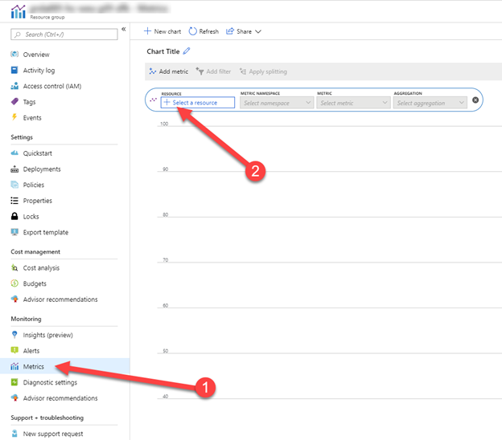
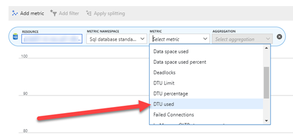
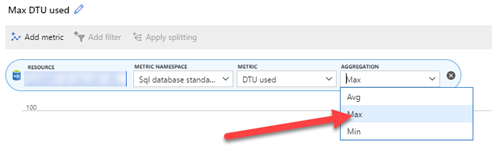
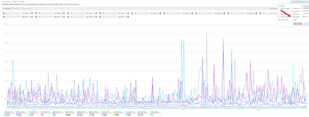
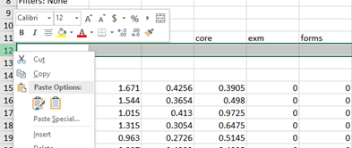
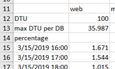
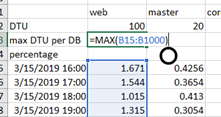
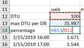
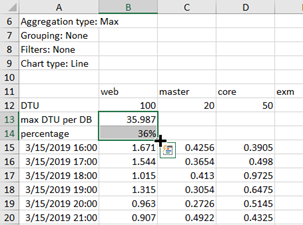
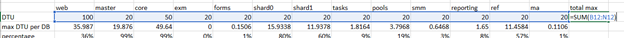

In [a previous blogpost](https://blog.baslijten.com/to-elastic-pool-or-not-to-elastic-pool-for-sitecore-on-azure) I showed a small overview of DTU consumptions of all Sitecore databases and how to use that overview to reduce your costs. This blogpost will explain step by step how to create that overview. An example of the file can be found [here](https://blog.baslijten.com/wp-content/uploads/2019/04/DTU-overview.xlsx)

#### **move to your resource group, select metrics and add a new metric**

#### **Select all databases and select the DTU used metric**

this is a bit inconvenient to do, but hey investing 5 minutes to save hundreds, maybe thousands of euro’s is worth some time, right? Make sure to select the “DTU used” metric, as it gives an absolute overview.

**Make sure to select “Max” under aggregation**

the Max DTU consumption per interval is important in this overview, otherwise, the figures will give a wrong insight

**This will lead to the following graph -** make sure to select the last 30 days, to gain insights over a long period of time

a graphical overview of the total DTU consumption

**Download the data as an excel workbook -** this will give you the possibilities to get extra insights on the actual consumption

Download the data to Excel  
  

**Open the Excel workbook and insert three blank rows under the database row -** These rows will be used to roll up all important information

**Add "DTU, max DTU per DB and percentage" labels in the first column of each row**

**Add the DTU setting for each database on the DTU row**

**Compute the Max usage per database -** inserting the formula =MAX(B15:B1000) should be sufficient for 30 days

  

**Insert the percentage in the percentage column -** this will give an easy overview over the over/undercommitment for each database. Don't forget to change the data format to percentage

**select the max DTU and percentage formula row and pull to the right-** by pulling the black cross to the right, the formula will be duplicated for every database

**Compute the SUM per row -** this will give an overview of the committed resources and consumed resources per hour. Pull down the formula to the end of the worksheet.

  

**Get the max value of each SUM(row) -**This will show the maximum resources which were consumed simultaneously

  

**This will lead to the following overview. -** Conditional formatting could optionally be added to give an easier overview:

