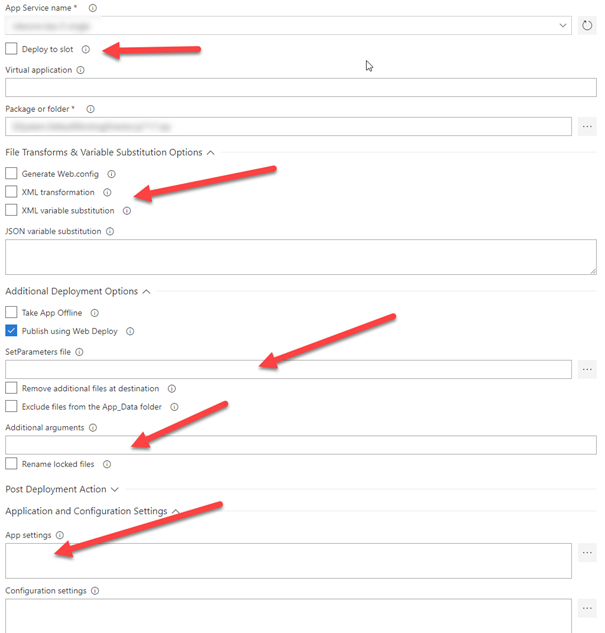
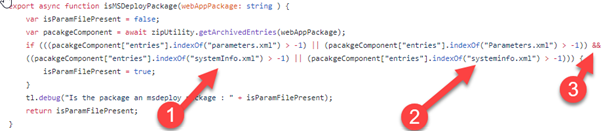
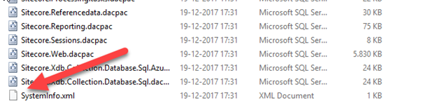

With the introduction of the Sitecore 8.2, Sitecore also introduced some Sitecore web deployment packages (WDP), which are used by the [Sitecore-Azure-Quickstart-Templates](https://github.com/Sitecore/Sitecore-Azure-Quickstart-Templates) for the deployment of Sitecore. When using ARM templates to provision the Sitecore Infrastructure and deploy the Sitecore application, this works fabulously. But when there is a requirement to use the VSTS Azure App Service deployment task, these packages can’t be used, due to two reasons. This blogpost explains why this task can’t be used _and_ how to fix it (and explains why I spend a _lot_ of time on writing a custom deployment script)

# Using the Azure App Service Deploy task

Using the Azure App Service deploy task to deploy the Sitecore baseline has a few benefits: it is maintained by Microsoft and it has a lot of options to configure the (web) deployment of web deploy packages. It offers functionality to deploy to slots, execute xml transformations, use XML variable substitution (which prevents the need for paramameters.xml) and easily set extra arguments, for example to set the parameter values which might be required by the parameters.xml. Lastly, it offers some functions to set App Settings and Configuration Settings on the App Service. All the magic in this task is converted to one beautiful msdeploy command. In other words: it offers a complete set of functions to configure the app service, which should prevent us from writing custom deployment logic.

## The first error: “Error: Source (Manifest) and destination (ContentPath) are not compatible for the given operation”

However, when using the default Sitecore cloud wdp’s (which can be downloaded from dev.sitecore.net), the deployment fails miserably:

**_“Error: Source (Manifest) and destination (ContentPath) are not compatible for the given operation”_**

The vsts task creates a msdeploy task and for some reason, this vsts task can’t handle the Sitecore web deploy package. This task creates the following msdeploy command:

**_“msdeploy -verb:sync -source:package=Sitecore\_package.zip -dest:ContentPath=”azure-site” -…_**

In “normal” situations (custom build web deploy packages), this vsts task does it job. Luckily, all vsts tasks are [open sourced on github](https://github.com/Microsoft/vsts-tasks/), which means that we could take a peak at the code to find out what went wrong.

Some code exists which determines whether or not a web deployment package has been used. This is determined by the following function:

 

This code checks whether or not the parameters.xml file is available _and (3)_ if there is a file called systemInfo.xml. A few weeks back, when I wrote a custom deployment script because I couldn’t get this deployment script to work, I completely missed the _and_ operator && (phun intended) I missed the fact that there is a third way of writing “systemInfo.xml”.

Let’s take a quick look at the contents of the Sitecore web deployment package:

Did you see the capital S? That’s the sole reason that the error appears! As this vsts task isn’t in use by the ARM deployment, the check on systemInfo.xml OR systeminfo.xml isn’t executed; that’s why that method works. Is it a bug by Sitecore? Or is it a bug by Microsoft? I don’t know, but I failed it at both companies 😉. ([Github issue](https://github.com/Microsoft/vsts-tasks/issues/6946). The Sitecore issue is filed under “issue 505891”). The fix is quite simple: rename the file to systemInfo.xml inside the zip. At the end of the article I’ll link to a powershell module which handles this manual action (and which will fix the second error as well).

## The second error: “Source does not support parameter called IIS Web Application Name”

As a problem never comes alone, a second error showed up: “Source does not support parameter called IIS Web Application Name”. When making use of the VSTS task, this IIS Web Application Name is specified as an input parameter during deployment. This can’t omitted in any way, as it is hardcoded in the VSTS task as well:

The only fix is to add this parameter to the parameters.xml.

# The fixes: msdeploy (and Rob Habraken) to the rescue

The fastest and most easy fix is to create a new web deploy package. There is a lot of documentation going on regarding this subject, for example, Rob showed in a [previous blog](https://www.robhabraken.nl/index.php/2740/blue-green-sitecore-deployments-on-azure/) on how to do this and he [provided a script](https://github.com/robhabraken/Sitecore-Azure-Scripts/blob/master/Scripts/99%20Utility%20Scripts/strip-db.ps1) to create a new package from an existing package.

All I did was modify this script slightly, by adding a parameter called “IIS Web Application Name”. By specifying the argument “-declareParam:name…” the parameter will be added to the parameters.xml in the newly generated package. A free bonus that comes with this script, is that the SystemInfo.xml will be renamed to systemInfo.xml, which means that there is no manual action required anymore to rename that file.

# Conclusion

The default Sitecore web deploy package can’t be used with the default vsts Azure App Service task due to two reasons, but the fix is quite easy. This possibility to deploy Sitecore using the Azure App Service task opens up a lot of new possibilities: I will write about these options in a later blogpost.
