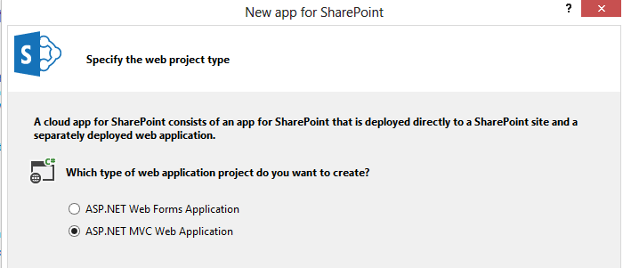
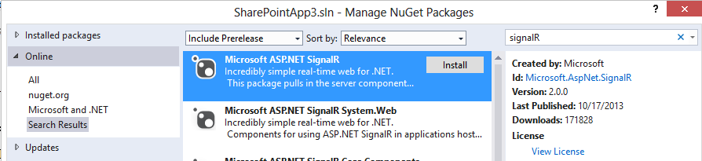
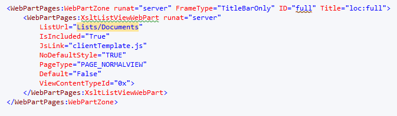
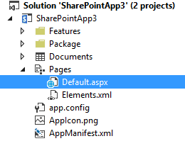
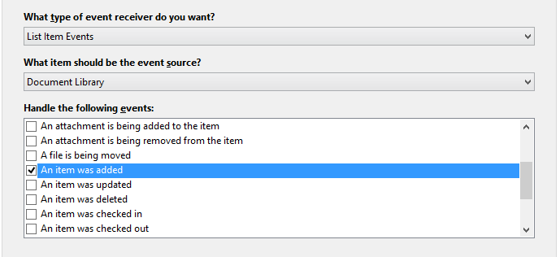
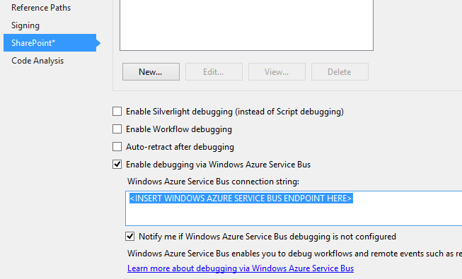

With the introduction of Apps for SharePoint 2013 and the expansion of the SharePoint API, a whole new world opened for us, the SharePoint developers. This blogpost describes on how to integrate SignalR 2.0 into a SharePoint 2013 MVC app, with the possiblity to use [SignalR](http://signalr.net/ "SignalR Website") from your hostweb! We will end up with a nifty SharePoint application that makes use of signalR and a remote  event receiver, which uses the signalR hub to push through new items to every registred client. An example solution is provided at the end of the document, but imagine what you could do with this. I personally always include signalR solutions when building apps, to monitor all events that I am interested in when debugging/fixing apps.

edit: all steps required to get signalR to work, are included, however, not _every_ step to create a working solution, is described. [A complete working example with sourcecode can be downloaded here](http://blog.baslijten.com/SharedContent/SignalREventReceiver.zip "SignalR and Remote event receiver for SharePoint 2013 apps source code").

## Integrate SignalR in your webapplication

The first step is, of course, to create a new solution for an autohosted or providerhosted SharePoint app. With Visual Studio 2013, a new template has been introduced: The MVC5 template!



Make sure to choose "provider hosted application" in the next step, for debugging purposes. After the creation of the solution, it's time to use the nuget magic to retrieve the SignalR binaries. Only install the binaries to your MVC project, not to the SharePoint hosted solution.



## Creating the Hub

Create a new folder in your solution with the name "Hub", and create a new class in it, called "DocumentUpdateHub". This class should contain the following code:

```csharp
 using Microsoft.AspNet.SignalR;

namespace SignalREventReceiverWeb.Hubs { public class DocumentUpdateHub:Hub { } } ```

As you see, it's just an empty class, which derives from "Hubs". Whenever updates from a client are needed, this method should contain a function which updates all Clients. In this case, we won't need to provide functionality from within other clients. The only reason to create this empty class, is to create an "endpoint" that can be used to setup DocumentUpdate specific connections.

### Registering SignalR

The next step, is to bind SignalR to the path "signalR" in your application. As we want to be able to use the Monitor from within our hostweb, crossdomain calls need to be enabled. **The Microsoft.Owin.Cors library needs to be installed via Nuget**, before this can be enabled (this is disabled by default).

After the installation of this binary, a Startup class needs to be created and marked, to be able to start SignalR. In addition to that, we need to enable to [cors](http://en.wikipedia.org/wiki/Cross-origin_resource_sharing "Cross Origin Resource Sharing") and _map_ the path "/signalr" to _run_ SignalR, with a configuration to enable JSONP. This is required as a fallback scenario.

_SignalR uses websockets to push notifications to the client (and vice versa), but this is only supported by modern browsers. In  case of older browsers, fallback scenario's such as [JSONP](http://en.wikipedia.org/wiki/JSONP "JSON with Padding") are used._

```csharp
 using Microsoft.AspNet.SignalR; using Microsoft.Owin; using Microsoft.Owin.Cors; using Owin;

\[assembly: OwinStartup(typeof(SignalREventReceiverWeb.Startup))\] namespace SignalREventReceiverWeb { public class Startup { public void Configuration(IAppBuilder app) { app.Map("/signalr", map => { map.UseCors(CorsOptions.AllowAll); var config = new HubConfiguration { EnableDetailedErrors = true, EnableJSONP = true, EnableJavaScriptProxies = true

}; map.RunSignalR(config); }); } } } ```

Compile the code and start the webserver: SignalR is running!

## Integration with SharePoint apps

Now signalR has been configured, it's possible to update the UI using SignalR. For this realtime monitoring solution to watch new documents, do the following:

- Add jquery via Nuget
- Add a new List to your SharePoint App and call it "Documents". Make sure to base your document library on the existing template "Document Library"
- Add a module called "Pages", and add a Page called "default.aspx" to that module.
- Edit your default.aspx with the following actions:

**_1) Right click, insert snippet - or - press ctrl-x, k_** **_2) select SharePoint and select splistview._** 

It's possible that you'll get a message to update your Webpartzone tag: DON'T do that. Your webpart should look like this (make sure that the listUrl points to your document library!):

\[caption id="" align="alignnone" width="673"\] Document webpart\[/caption\]

Eventually, you should end up with the following structure:

\[caption id="attachment\_1431" align="alignnone" width="260"\] Pages Module\[/caption\]

The next step is to update your AppManifest.xml. The start page of the app should be set to the newly created page and the querystring section should be updated with "&RemoteUrl={RemoteAppUrl}". This inserts the remoteApp Url (duh ;)) and will be used to create the navigation node to the remote web.

\[caption id="attachment\_1801" align="alignnone" width="952"\] AppManifest\[/caption\]

## Add a remote event receiver

To add the remote event receiver, add a new item to the SharePoint App solution and select "Remote Event Receiver". Select "List Item Events", "Document Library", and "An item was added" (make sure not to choose the option "An item is being added").

\[caption id="attachment\_1811" align="alignnone" width="689"\] Add Event Receiver\[/caption\]

### Configure the azure service bus

In order to be able to run a _remote_ event receiver on localhost, and make it accessible to the office 365 that tries to connect to "localhost", the windows azure service bus needs to be configured. An endpoint can be request via de windows azure management portal and that endpoint should be inserted under the "SharePoint" properties tab of the SharePoint hosted app:

\[caption id="attachment\_1861" align="alignnone" width="653"\] configure windows azure service bus\[/caption\]

### Broadcast a message using SignalR and the Event Receiver

We're only a few steps away from the final result. This next step is needed to broadcast a message, to be able to update all registred clients. First, a Model should be created. For the demo it's enough to provide the Author and Url:

```csharp
 public class Document { public string Author { get; set; } public string Url { get; set; } } ```

Now the model has been created, its possible to use this model within the eventreceiver.

Line 3 and 12 provides the last part of the magic: first, a documentUpdateHub instance is retrieved (line 3), after that action, a message can be broadcasted to all clients, using the code in line 12.

```csharp
{3,12} public void ProcessOneWayEvent(SPRemoteEventProperties properties) { var documentUpdateHub = GlobalHost.ConnectionManager.GetHubContext<DocumentUpdateHub>(); var itemProperties = properties.ItemEventProperties.AfterProperties;

var document = new Document { Author = itemProperties\["\_Author"\].ToString(), Url = properties.ItemEventProperties.AfterUrl };

documentUpdateHub.Clients.All.broadcastMessage(document); } ```

## Displaying all documents in the MVC app

We're almost there! To display all items in your MVC app, we need to do a few things:

- add an Action to Get all documents for the initial call (this could be done with signalR, either)
- add some javascript to register your page to receive the document updates.

### Get All Products

to be able to return all documents as with JSON, the JSON library needs to be installed. We will make use of knockoutjs as well, so install these packages once again, via Nuget: just search for Newtonsoft.JSON and knockoutjs. Next, add the following code to your HomeController. This code simply loops through all the documents and eventually returns the documents as JSON. Note that this method is decorated with the "SharePointContextFilter" attribute (line 1), as the SharePoint context is, of course, needed to retrieve all documents.

```csharp
 \[SharePointContextFilter\] public ActionResult GetAllDocuments() { var spContext = SharePointContextProvider.Current.GetSharePointContext(HttpContext); var camlQuery = new CamlQuery {ViewXml = @"<View><ViewFields><FieldRef Name='Author'/> <FieldRef Name='Amount'/></ViewFields></View>"}; var documentsList = new List<Document>(); using (var clientContext = spContext.CreateUserClientContextForSPAppWeb()) { if (clientContext != null) { List lstDocuments = clientContext.Web.Lists.GetByTitle("Documents"); ListItemCollection documentItemCollection = lstDocuments.GetItems(camlQuery); clientContext.Load(documentItemCollection); clientContext.ExecuteQuery();

if (documentItemCollection != null) { foreach (var document in documentItemCollection) { var user = document\["Author"\] as FieldUserValue; documentsList.Add(new Document { Author = user.LookupValue, Url = document\["FileRef"\].ToString(), }); } } } }

return Json(documentsList, JsonRequestBehavior.AllowGet); } } ```

The last, final step is to update the Index view, to list all products and register it to listen to the messages that are broadcasted.

```html @{ ViewBag.Title = "Home Page"; } @Scripts.Render("~/bundles/signalr") @Scripts.Render("~/bundles/knockoutjs") <div class="jumbotron"> <h2>Welcome @ViewBag.UserName!</h2> <p class="lead"><b>Apps for SharePoint - </b>Embracing web standards, the new cloud app model gives you maximum choice and flexibility to build a new class of apps for SharePoint using familiar languages, tools, and hosting services.</p> <p><a href="http://dev.office.com" class="btn btn-primary btn-large">Learn more &raquo;</a></p> </div>

<div class="row">

<div class="col-lg-12"> <div class="span8">

<p class="lead"><u>Document List</u></p>

<table class="table table-striped"> <thead> <tr> <th>Url</th> <th>Author</th> </tr> </thead> <tbody data-bind="foreach:viewModel.documents"> <tr> <td data-bind="text: Url"></td> <td data-bind="text: Author"></td> </tr> </tbody> </table> </div> </div> </div> ```

Below you'll see the JavaScript to register for updates _and_ to push through the notifications, Note that the "SPHostUrl" querystring is appended to the request (line 3). On line 23 the 3 (!!) lines of code are shown to register to the DocumentUpdateHub.

```javascript <script src="/signalr/hubs"></script> <script> jQuery(document).ready(function ($) { var spHostUrl = getParameterByName("SPHostUrl"); var requestUrl = "/Home/GetAllDocuments" + "?SPHostUrl=" + spHostUrl;

$.get(requestUrl, function (returnedData) { viewModel.documents(returnedData); ko.applyBindings(viewModel); registerHubs(); });

});

function getParameterByName(name) { name = name.replace(/\[\\\[\]/, "\\\\\\\[").replace(/\[\\\]\]/, "\\\\\\\]"); var regex = new RegExp("\[\\\\?&\]" + name + "=(\[^&#\]\*)"), results = regex.exec(location.search); return results == null ? "" : decodeURIComponent(results\[1\].replace(/\\+/g, " ")); }

function registerHubs() { var documentUpdateHub = $.connection.documentUpdateHub; documentUpdateHub.client.broadcastMessage = function (document) { // Html encode display name and message. viewModel.documents.push(document); };

$.connection.hub.start(); }

var viewModel = { documents: ko.observableArray() };

</script> ```

And this should do the trick! The source code is provided to get you up and running right away!

## Summary

I explained in a few steps, how to create a SharePoint app that makes use of the signalR functionality. It requires just a few lines of code:

- setup a Hub
- map and configure signalR
- observe the Hub for messages that are broadcasted
- done.

In addition to this configuration, we saw that making use of remote event receivers (using the azure service bus), can provide great functionality. Happy SharePointing!
