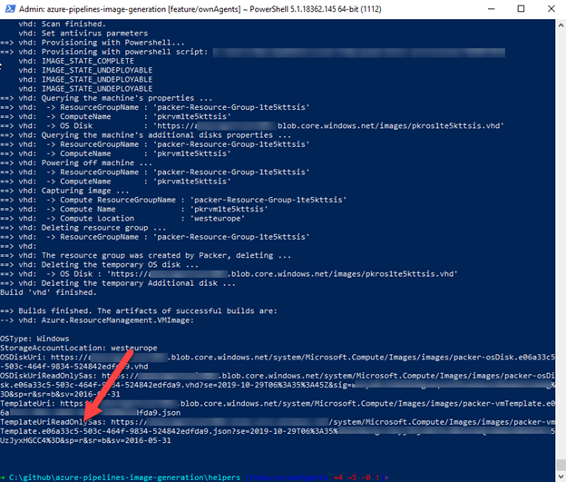
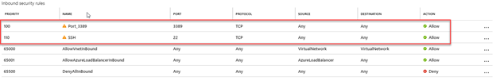
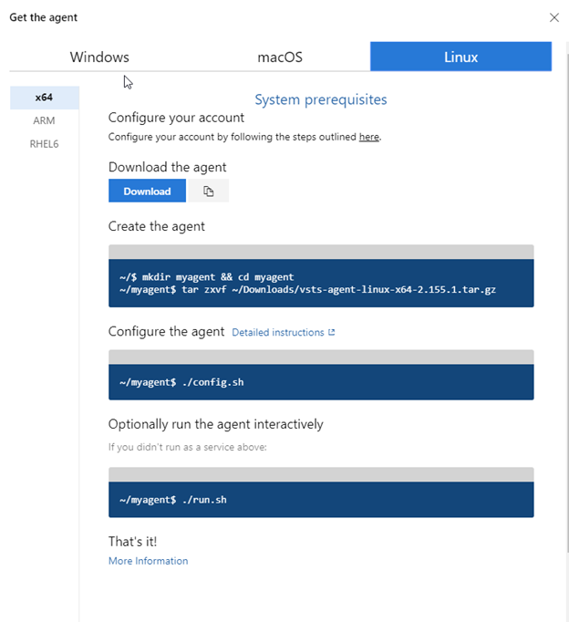

Lately, I was preparing for a talk on Azure DevOps for the Sitecore community. For this talk I wanted to talk about scaling up and scaling out of build agents and compare the performance of different sized build agents on larger projects. Due to some limitations on the hosted Azure DevOps build agents, I had to create my own build agents. This blogpost will explain _why_ I had to create my own agents and _how_ I did this without too much effort. TLDR: just run a packer script to create your own private build agents

# Why were private build agents required?

I wanted to have a representative real-world example with quite some (legacy) frontend code and a lot of backend projects. It isn’t a very different scenario from regular Asp.Net applications with a heavy clientside oriented frontend, apart from the fact that a lot of persons are using a single powershell/cakescript/gulp script to build all the clientside assets _and_ backend code. There are three reasons why I couldn’t use the hosted build agents and had create those agents with the same software them myself:

1. To show the possibilities to scale out agents, the hosted Azure DevOps build agents could have been used, as they are free to use for up to 10 processes, _but only_ for open source projects. The codebase that was used is _not_ public, so parallelism wasn’t possible.
2. Scaling up hosted Azure DevOps Build Agents is not possible. All agents are based on the DS2\_V3 VM, which has 2 vCPU’s and 7Gb op memory. Scaling up _may_ have a positive effect on some workloads
3. The hosted build agents are sufficient in terms of tooling. Why create our own agents when the blueprints are already available?

# How to create private build agents with the configuration of the Hosted agents

My first approach was to run those agents as a docker container. Microsoft published their linux containers to [hub.docker.com](https://hub.docker.com/_/microsoft-azure-pipelines-vsts-agent), but they are deprecated and haven’t been updated since the 22th of January.

## Building the images

After a bit of research, I found out that Microsoft open sourced the scripts to build the images. They are created using packer and can be found [here](https://github.com/microsoft/azure-pipelines-image-generation). The MSDN documentation helps a bit on creating those images [using packer and the azure CLI](https://docs.microsoft.com/en-us/azure/devops/pipelines/agents/hosted?view=azure-devops).

I turned out that it was even more easy to create those images with some PowerShell scripts that are available within the github repository. They can be found within the [helpers](https://github.com/microsoft/azure-pipelines-image-generation/tree/master/helpers) directory. With the command “GenerateResourcesAndImage -SubscriptionId "<subid>" -ResourceGroupName "resourcegroup" -ImageGenerationRepositoryRoot "C:\\github\\azure-pipelines-image-generation" -ImageType 1 -AzureLocation "westeurope" the VM’s can be generated. Choose 0 for VS2017, 1 VS2019 or 2 for the Ubuntu VM. Building of these images take a looooong time.

When the script has run successfully, you’ll eventually see the following output:

The last templateUri has to be selected, including the query string parameters, and open it in your browser. Download the json and store it somewhere on your filesystem. This file contains information about your generated VHD.

## Running the image

The next step is to actually instantiate the VM and update it! The first step is to Create a VM based on the previously created image. Within the helpers directory, there is another script: CreateAzureVMFromPackerTemplate. A few parameters, like name, username, password and TemplateFilePath have to be specified.

After the script has been finished, the last actions can be taken to finalize the configuration.

## Add the Azure Devops agent

Please note: I am doing this manually Mikael Krief wrote an article on [how to automate this](https://www.mikaelkrief.com/private-azure-devops-agent/)! When using that approach, the steps below aren’t needed.

Before the agent can be added, the firewall has to allow connections over SSH (or RDP when using windows). I created a new Network Security Group and added the rule to this NSG. This NSG is added to the Network Interface:

The next step is to connect over SSH to the linux image. I prefer to use the tool ‘putty’ for this, when working on windows. Azure DevOps tells us what to do:

The agent can be downloaded using the ‘wget’ command. ‘wget [https://vstsagentpackage.azureedge.net/agent/2.155.1/vsts-agent-linux-x64-2.155.1.tar.gz](https://vstsagentpackage.azureedge.net/agent/2.155.1/vsts-agent-linux-x64-2.155.1.tar.gz)’ downloads the client to the current directory.

After extracting the client, the agent can be configured following [this guide](https://docs.microsoft.com/en-us/azure/devops/pipelines/agents/v2-linux?view=azure-devops),

## Automatically start the client

When the client has been configured, it will be shown as ‘offline’ in the agent overview. Run the command

‘sudo ./svc.sh install’ && ‘sudo ./svc.sh start’ and your client is configured to start after startup of the VM _and_ it will be started for now.

# Conclusion

Creating one or more private build agents is not hard, especially when using the packer scripts provided by Microsoft. It just takes some time go generate the VM’s.
