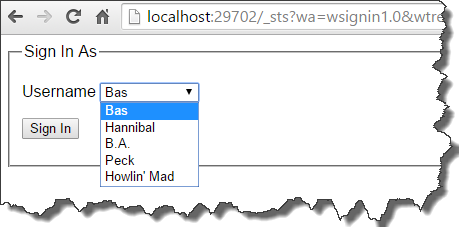
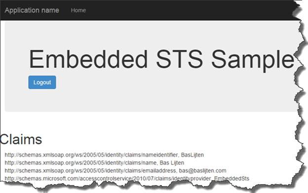
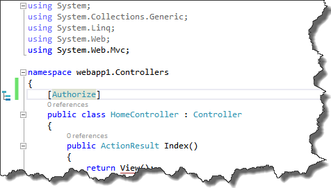
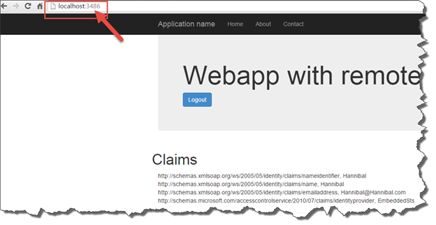

When developing claims based web applications which need to connect to ADFS, Azure or any other STS, it’s not always possible to connect to an existing environment, for example, due to security, the absence of a test environment or an unwilling admin ;). To solve this, a lot of people _try_ to setup a local AD, ADFS, which can cause a lot of trouble, especially in an Enterprise environment. This setup is not very convenient, especially when you _just_ want to create a claims based application. Whenever SharePoint and Claims based hight trust provider hosted apps are thrown into the game, the inconvenient setup turns into a very complex situation.

Luckily, there is a very easy solution for this! In the next two blogposts I will show to solve this:

1. How to setup a simple STS for web application development (this blogpost) – how to create a simple STS using Thinktecture embedded STS and configure the web application using the classic web.config
2. How to setup claims based authentication via OWIN
3. How to mix in SharePoint 2013 and hight trust claims based provider hosted apps using OWIN and the thinktecture Embedded STS

## Thinktecture EmbeddedSTS

In the past, a tool called “SelfSTS” existed. It was created by Microsoft DPE and it did is job. (Well, most of the time ;). It got deprecated and it seems to be “disappeared” from the web. Luckily, Thinktecture created a replacement for it.

_The Thinktecture.IdentityModel.EmbeddedSts (or just EmbeddedSts) is meant to be a simple, local test STS for use in ASP.NET applications. It provides a replacement for the test STS feature from deprecated "Identity and Access Control" Visual Studio extension._

[This EmbeddedSTS](https://www.nuget.org/packages/Thinktecture.IdentityModel.EmbeddedSts/) can be installed via nuget, and can easily be attached to your web application. How it works is shown in [this sample](https://github.com/IdentityModel/Thinktecture.IdentityModel/tree/master/samples/EmbeddedSts) on GitHub.

When authentication and authorization is needed on a resource, you’ll be redirected to the STS endpoint where the authentication challenge (normally) takes place. Afterwards, a claims set is provided and the user is returned to the application. Based on the provided claims, the application determines if the user is allowed to see its resources.

In case of the Thinktecture EmbeddedSTS, different identities with its claims can be easily configured in a json file. This file is created with two sample identities when this file is not present. The login page will show all the identities that are available:

After logging in on the sample application and signing in as “Bas”, the following claims are shown:

However, two functionalities that are required for our setup don’t work:

- The EmbeddedSTS can only be run in a project’s own context: it can’t be used as a identity provider for other applications.
- OWIN configuration can't be used, as there is no federation metadata enpoint defined.

I fixed both problems in [this fork](https://github.com/BasLijten/Thinktecture.IdentityModel/tree/FederationMetadata) and created a [pull request](https://github.com/IdentityModel/Thinktecture.IdentityModel/pull/134) for it. With those fixes, we can use the STS to provide identities to any application, including applications as SharePoint, Sitecore and Provider hosted applications. Bye bye AD and ADFS! It all comes down on a) downloading the source code and b) running that project. Or, even better, spam the Thinktecture guys that they should include my pull request ;)

## Create a new webapplication with this STS as Identity Provider

Now that the STS is running, our custom webapplication can be created: Create a new application and choose “No Authentication”. It doesn’t matter whether or not this is a Webforms or a MVC web application. Next, add the following references to the project:

- System.IdentityModel
- System.IdentityModel.Services

The Microsoft.IdentityModel assemblies do exist as well, but they are deprecated, don't use them when you don't have to.

After adding those references, add the following nuget packages:

- Install-package Microsoft.AspNet.Identity.Core
- Install-package System.IdentityModel.Tokens.ValidatingIssuerNameRegistry

The following action should be to mark the HomeController or Landing page with the Authorize attribute - this will force an authentication challenge when needed. This Authorization attribute tells us: whoever has been logged in, is allowed to access this controller:

_Make sure to use the System.Web.Mvc namespace for MVC and the System.Web.Http for WebForms, otherwise this will not work._

From this moment, the application has been baselined and it can be configured to login via the STS.

There are two possibilities here:

1. Hard, manual configuration via the web.config (this blogpost)
2. Configure WSFederation with OWIN (a LOT easier)

Before the application will be configured, two assumptions have been made:

1. The Thinktecture Embedded STS (which is not so embedded anymore) runs on [http://localhost:29702](http://localhost:29702) (the projects default)
2. Our custom application runs on URL “http://localhost:3486”

## Hard, manual, classic configuration in the web.config (better known as self-flagellation)

First, backup your web.config, as the changes we made, have to be reversed when we are going to configure everything via the OWIN way.

_This part contains some duplicate content of the post by Wictor Wilen that I mentioned earlier. As I don’t expect that everyone has read that post, I add this content, as it’s needed to get this stuff up-and-running. This information has been stripped a bit, so more information can be found on his blog!_

Add the following sections in the web.config (all under the configuration node)

### Add new configsections

These configuration sections that are defined, will be added later:

\[xml\] <configSections> <section name="system.identityModel" type="System.IdentityModel.Configuration.SystemIdentityModelSection, System.IdentityModel, Version=4.0.0.0, Culture=neutral, PublicKeyToken=B77A5C561934E089" /> <section name="system.identityModel.services" type="System.IdentityModel.Services.Configuration.SystemIdentityModelServicesSection, System.IdentityModel.Services, Version=4.0.0.0, Culture=neutral, PublicKeyToken=B77A5C561934E089" /> </configSections> \[/xml\]

### Disable asp.net authentication

Add this rule to the <system.web> node.

\[xml\] <authentication mode="None" /> \[/xml\]

It disables the asp.net build-in authentication. This will be handled by the two modules that will be added next.

### Enable the login and session management module

The WSFederationAuthentication Module handles the login and logout processes. The SessionAuthenticationModule handles the cookie session management.

\[xml\] <system.webServer> <modules> <add name="WSFederationAuthenticationModule" type="System.IdentityModel.Services.WSFederationAuthenticationModule, System.IdentityModel.Services, Version=4.0.0.0, Culture=neutral, PublicKeyToken=b77a5c561934e089" preCondition="managedHandler" /> <add name="SessionAuthenticationModule" type="System.IdentityModel.Services.SessionAuthenticationModule, System.IdentityModel.Services, Version=4.0.0.0, Culture=neutral, PublicKeyToken=b77a5c561934e089" preCondition="managedHandler" /> </modules> </system.webServer> \[/xml\]

### System.IdentityModel

The System.IdentityModel element add configuration for the STS:

The audience URI at rule 4 contains the identifier. It can be a URN, URI or URL. In our case, we use the URL of our application, as the STS always returns the URL as the Audience.

At rule 12, the authority name has been added. This can be anyname, so we call it EmbeddedSTS.

Rule 14 refers to the thumbprint that the token certificate. This is 8aabdce722268e4654b51b66094fa1a483870f83 in our case. More information on the certificate installation later.

Rule 17 contains the issuer of the token and is “urn:Thinktecture:EmbeddedSTS” in our case as the EmbeddedSTS is configured that way.

\[xml\] <system.identityModel> <identityConfiguration> <audienceUris> <add value="http://localhost:3486/" /> </audienceUris> <securityTokenHandlers> <add type="System.IdentityModel.Services.Tokens.MachineKeySessionSecurityTokenHandler, System.IdentityModel.Services, Version=4.0.0.0, Culture=neutral, PublicKeyToken=b77a5c561934e089" /> <remove type="System.IdentityModel.Tokens.SessionSecurityTokenHandler, System.IdentityModel, Version=4.0.0.0, Culture=neutral, PublicKeyToken=b77a5c561934e089" /> </securityTokenHandlers> <certificateValidation certificateValidationMode="None" /> <issuerNameRegistry type="System.IdentityModel.Tokens.ValidatingIssuerNameRegistry, System.IdentityModel.Tokens.ValidatingIssuerNameRegistry"> <authority name="EmbeddedSTS"> <keys> <add thumbprint="8aabdce722268e4654b51b66094fa1a483870f83" /> </keys> <validIssuers> <add name=" urn:Thinktecture:EmbeddedSTS" /> </validIssuers> </authority> </issuerNameRegistry> </identityConfiguration> </system.identityModel> \[/xml\]

### System.IdentityModel.Services

Last part of the configuration process, is adding the federation configuration. This element configures the endpoint of the STS (the issuer), the requested realm (same as the audience uri)  and the return address.

\[xml\] <system.identityModel.services> <federationConfiguration> <cookieHandler requireSsl="true" /> <wsFederation passiveRedirectEnabled="true" issuer="http://localhost:29702/\_sts/" realm="http://localhost:29702/" requireHttps="true" reply=”http://localhost:3486/\_trust/” /> </federationConfiguration> </system.identityModel.services> \[/xml\]

## Install the certificate

In my solution, I included a certificate that needs to be installed. When you want to directly download it, its located [here](https://github.com/BasLijten/EmbeddedStsSample/blob/master/webapp1/Assets/thinktectureEmbeddedSTSPublic.cer). To install it:

double click on the certificate -> choose Local Machine -> Place all certificates in the following store -> Trusted Root Certification Authorities -> next -> finish -> Ok.

When all these actions have been executed, your application should be ready to be run. When the application is being executed, a redirect to the STS takes place and you can select your identity to work with:

And after signing in, your application can use the claims of your selected identity. Please take note of the different ports in the url: One portal that hosts the STS, one portal that consumes the SAML claims:

**Conclusion**

Configuration a separate AD and ADFS instance costs a lot of (precious time), especially when you _don't_ want to set this up (for example, on a regular develoment environment). When creating claims based applications, this takes a lot of configuration. Think what happens when the application will be deployed to a DTAP environment with all those parameters that can go wrong (assuming that the AD and ADFS environments are configured correctly). This post explained what product can be used to get rid of AD and ADFS and how to configure your development environment, to get rid of a bit of the pain. My next blogpost describes on how to get rid of the configuration effort, using OWIN!

The Embedded STS sources can be [downloaded here](https://github.com/BasLijten/Thinktecture.IdentityModel/tree/FederationMetadata) (own fork of the [Thinktecture.IdentityModel](https://github.com/IdentityModel/Thinktecture.IdentityModel/pull/134)).

The example project for configuring claims based web applications [can be found here.](https://github.com/BasLijten/EmbeddedStsSample/blob/master/webapp1/Assets/thinktectureEmbeddedSTSPublic.cer)
