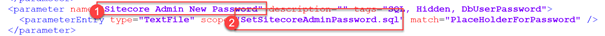
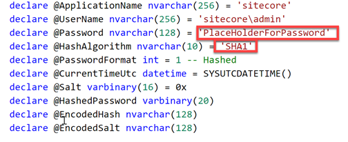
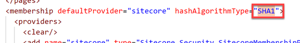
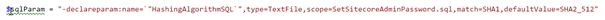
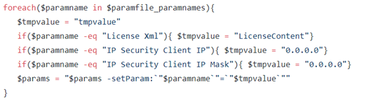
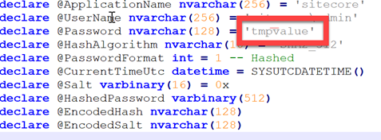
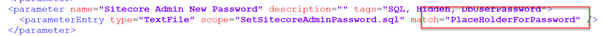
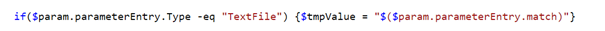

A few years ago I already blogged on [updating the default hashing algorithm](http://blog.baslijten.com/sitecore-security-1-how-to-replace-the-password-hashing-algorithm/) that Sitecore used. It’s ancient, unsafe and it’s for a change! Luckily, with the introduction of msdeploy packages and the Sitecore on Azure templates, this becomes easy, without having to (manually) change the password after the hashing upgrade and manually changing the hashAlgorithm in the web.config. This can be done by using msdeploy the tool to install _and_ create msdeploy packages.In [my previous blogpost](http://blog.baslijten.com/how-to-deploy-sitecore-web-deploy-packages-using-the-vsts-azure-app-service-task/) I already showed how to add parameters to the web deploy packages, in this approach I am going to show how contents can be changed using this technique. The benefit of this approach is that it can be used with the out of the box Sitecore packages, and, when used as a source for the initial deployment, the right algorithm will be used deploy time _and_ everything will be automated. This method might look a little bit cumbersome, because a manual change might work, but with tens to hundreds of environments, you just want to have everything automated as much as possible.

Source can be found [here](https://github.com/BasLijten/sitecore-create-packages):

# How does the provisioning to Azure work?

The provisioning to Azure works a bit different as opposed to the on-premise deployment. During the initial provisioning, the administrator password can be set. The Sitecore arm templates forces a certain policy and when it’s has been accepted, it is used as parameter for the initial setup. This parameter is specified in the “parameters.xml” within the web deploy package:

In this case the parameter (1) Sitecore Admin New Password will replace the “PlaceHolderForPassword” in the file “SetSitecoreAdminPassword.sql”

When taking a closer look at this sql file, the PlaceHolderForPassword is being used as password. Due to the parameters.xml, this value will be replaced by the parametervalue that is specified during deploymenttime. Another observation is the default Hashing algorithm: “SHA1” is used. This isn’t strange, as the hashing Algorithm that Sitecore uses for years, is SHA1 as well.

This SHA1 value also appears in the web.config

# The required changes

As seen in the paragraph above, two changes are needed:

- The hashing algorithm in the sql script
- The hashing algorithm in the web.config

As explained in the previous blogpost, the declareparam parameter can be used, to specify a new variable. Depending on the parameter “type” a match is done based on a regexp or XPatch expression.

## Modify the sql script

The first change is quite easy: replace SHA1 by SHA2\_512.

This is _not_ the only change that is needed for the SQL change: when looking taking a closer look at the sql script, it turned out that the fieldlength for the hashed password was just 20. While this is long enough for a SHA1 password, this isn’t the case for a SHA512 password. Many thanks to Marshall Sorenson for [pointing this out on his blog](https://blogs.perficient.com/sitecore/2018/06/20/upgrading-the-password-hashing-algorithm-for-sitecore-9-installs/).

This change can be applied in the same way as changing the hashing algorithm:

Please take not of the default value. When using the default value, this value is applied when no parameter value has been provisioned. This comes in handy, as this new package doesn’t break existing provisioning pipelines, as the parameter becomes optional. In other words: when using in conjunction with the existing arm templates, this package will still work and apply the SHA512 changes.

## Modify the web.config

The second change isn’t to hard as well, but requires a little bit of XPath magic. The textfile approach could have been used, but as this web.config is an XML-file, the XPath approach is a little bit more appropriate in this case:

## Default values

You will probably have taken notice of the “defaultvalue” in these parameters. I specified them for one important reason: your existing ARM or msdeploy scripts will not break. With the defaultvalue being set, this value will be used when the parameter hasn’t been specified. This is definitely the case with the out of the box Sitecore quickstart ARM templates, which means that a change to your existing deployment scripts won’t be needed as well.

 

# One big fat “gotcha”

After creating this package, one thing went wrong miserably. At some point in time, the script places temporary values in the new package:

This isn’t a problem for a package that will be re-deployed (this was the general purpose of the script, creating a package that wouldn’t install the existing databases anymore), but for a package that will be used for the initial provisioning of a website, this is killing. The parameters.xml contains some logic to replace, for example, the “PlaceHolderForPassword” strings in the sqlfiles. When the package gets re-created with the value “tmpvalue”, this logic will replace the string “PlaceHolderForPassword” in all sql-files:

This means, that the parameters.xml in the _new_ package, doesn’t work anymore, as the “match” doesn’t exist anymore:

This could easily be solved by adding the following line in the foreach-loop:

It basically checks if there is an exact match (which happens in the TextFile) and uses the original “match” value as the new input value. This will lead to the result where the “match”-value will be replaced by it’s original “match”-value: nothing will change.

 

# Summary

Changing the out of the box hashing algorithm is something you should do immediately, but in conjunction with Sitecore on Azure this isn’t the most trivial thing to do, as the password will be set during the provisioning of the environment. While a manual change to the packages looks as the most easy approach, it isn’t the most structural approach. Using a script to do this (and preferably in a separate build in vsts) will lead to a nice reusable package which can be tailored to your own needs.
