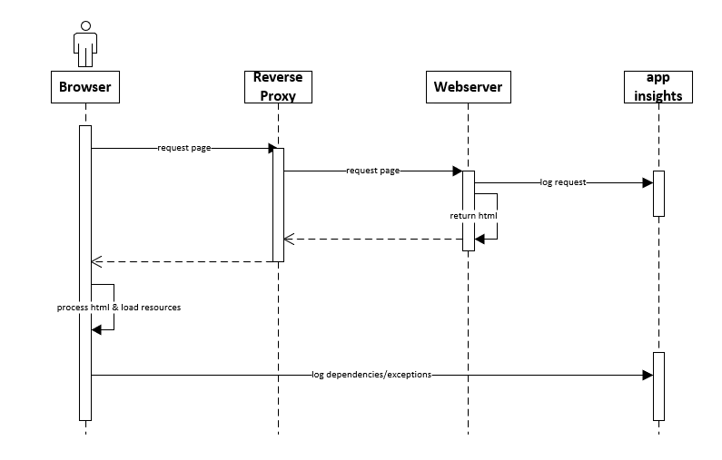
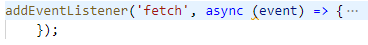
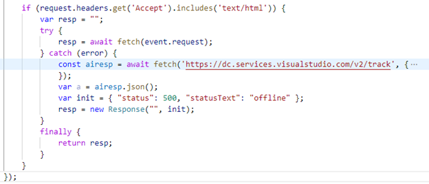
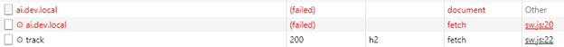
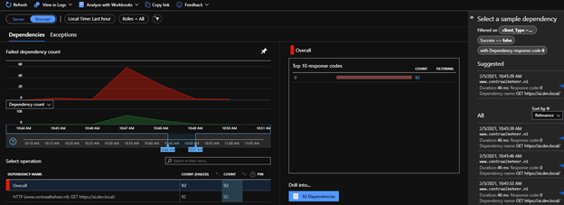

When hosting high traffic websites, it’s important to keep them up and running at all times. At the moment one of them goes down, it might lead to a conversion loss or decrease in NPS. Detection of unplanned downtime is very important in these cases. In some cases, there isn’t even downtime, but \*something\* in the infrastructure prevents the website from loading (I’ll explain a few cases after the break). This blogpost will teach you how to use your visitors as a continuous monitoring beacon. Code can be found here. Also a small shoutout to my colleague Marten Bonnema who created an [AI-plugin](https://github.com/Pkiri/pwa-ai) which \*does\* work with serviceworkers.

## The case: multiple complaints that the site didn’t load, while our monitoring software “proved” different

The sole reason I started to investigate this way of monitoring, was that our monitoring software didn’t see any outage, why our internal call center users, testers and external customers were randomly, but often, mentioning that the website wasn’t able to load. The hard part: we weren’t able to find any notable events in our logging and monitoring software, while the were numerous complaints. It was also very hard to reproduce. Something about a needle and a haystack.

By accident, the issue became much easier to reproduce. After injecting new (corporate) monitoring software, we found out that the issue started to occur _almost_ all of the time. Whenever the issue occurred, only after explicitly clearing the cookies, the issue was temporarily solved. When accessing the website directly on an internal url, the issue was not reproduceable. The application insights availability tests didn’t show anything about outage, while other monitoring software didn’t register any error. It almost _had_ something to do with a combination of clientside code (javascript), in conjunction with a piece of the infrastructure. In the end, it turned out that we were exceeding a header limit (which was set on a reverse proxy). This blogpost will not go any deeper on whether or not this setting was or wasn’t, a good idea, but this blogpost will explain why we weren’t able to monitor this and how we are going to change this.

## How to monitor this random behaviour

As the request from the client did not arrive at our website (the reverse proxy had issues) _and_ this issue caused connection resets/http2 compression errors, it was \*very\* hard to monitor this behaviour and take the appropriate actions. We weren’t able to tell how many users were affected, as nothing was registered. So how is monitoring possible, if even the initial connection fails? The solutions is, in fact, quite simple _and_ elegant!

## The challenge

The challenge lies within the fact how “the web” works. When loading a webpage, the very first thing which happens, is requesting an html-document. Within this document resides html, which tells us what additional dependencies (such as css, fonts) should be loaded and what and when javascript code should be executed. At some point, there is a cue to load application insights, which automatically takes care of logging. _IF_ the document load _and_ the loading of the application insights SDK succeeds, the magic starts.

basic working of "the web" - only after an initial download of the html markup, it _might_ be possible to log to application insights

Unfortunately, in our case, this application insights execution comes to late in the lifecycle: as the initial document load failed, there is no cue to load the application insights SDK and start logging. Something was needed that could log to application insights, even when the website was down. Installing a logging client on a clients machine wasn’t an option. Or was it?

## Serviceworkers to the rescue!

A service worker is a script in the browser that runs within the background of the browser. It can, for example, handle push notifications, sync data, or handle (intercept) network requests. This worker must be installed (and updated) by the website within your browser before it can be executed, but after that installation, it can be used to do whatever you want.

Let’s assume that the service worker has been installed. Within the following code, all network events (the fetch event) are intercepted and can be manipulated/enriched/whatsoever.

 A common scenario is to lookup resources in a local cache and return them directly, even before an http request could be made. When this request bugs out (in other words: there is a network error, protocol error, network reset, you name it), an exception will be thrown. Just catch the exception and start logging. _Note:_ Although there is very convenient use of promises, I didn’t make use of these promises in this example. As most readers of my blog are .Net (Sitecore) developers, this notation will be a bit more accessible to read.

The first line of code makes sure that only document requests are handled. All other requests (resources, api calls), are handled via the regular application insights SDK. We _only_ want to sent and extra event at the moment that the webpage is not accessible.

The 4th line re-fetches exactly the same request, with the difference that we can catch any exception. When no exception happens, the request returns and will be returned to the browser. This can be seen in the image below: the actual document request is intercepted and handled by the serviceworker. The initiator is sw.js (my service worker) and preceded by a small gear icon.

_please note: an HTTP error code is a \*succesful\* **request**_. _Something went 'just' wrong on the other side. Whenever the 'other side' does not respond, there is no there is network connectivity, or something else happens, the http request is not succesful and an exception will be thrown._

Whenever an error occurs, the actual document request and the intercepted fetch fail. An custom request to application insights will be made to log a _dependency error._ The network tab of the developer toolbar shows us that the initial request fails (as expected) and that a successful request to application insights has been made.

These errors show up in the failure blade of application insights, when selecting the browser-view:

## Caveats and drawbacks

### First time visitors

Of course, this is solution as a few flaws/drawbacks. When a visitor visits the site for the very first time, the service worker hasn’t been installed yet: IF that visitor faces a problem, there is no way that this issue can be logged.

### Explicit call to the AI rest endpoint: the SDK cannot be used.

1. There are two main reasons for this: Service workers do have a problem with importing modules, the AI SDK module cannot be used
2. The application insights script has references to the window object. As this is unavailable in the serviceworker, this code fails.

This is just a caveat, not a major problem, as there is just a single event that needs to be logged.

### The logged event is not really a dependency

This event is not really a Remote dependency, but an exception. But for convenience issues, we made the choice to mark it as a remote dependency. This way, it shows up in the browser view, which makes it very convenient to scope down issues whenever this is required

# Conclusion

Adding “offline” logging to a website is not hard. By making use of a service worker, intercepting events and logging these events to application insights whenever a page cannot be requested, an interesting extra layer of monitoring/logging can be added to your toolkit.
