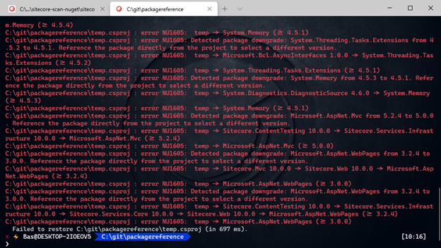
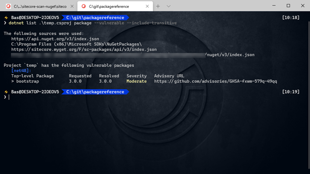

A few days ago, Microsoft [explained](https://devblogs.microsoft.com/nuget/how-to-scan-nuget-packages-for-security-vulnerabilities/) on their devblog how to scan nuget packages for security vulnerabilities. This is a feature which was recently released, but has been on the [github issue list](https://github.com/NuGet/Home/issues/8087) for quite some time. Microsoft uses the Github Adivsory Database to identify vulnerabilities in nuget packages, [click here](https://docs.github.com/en/github/managing-security-vulnerabilities/about-github-security-advisories) for more information. Microsoft added the vulnerability check to their dotnet tooling. Just run a **_dotnet list package –vulnerable_**, (make sure to update visual studio or .net 5.0!!) and a nice overview of vulnerable packages is shown. However, this only works with the PackageReference format. In our situation, we are still using the old packages.config format in hundreds of projects, as we cannot migrate to the PackageReference format yet. This old format can’t benefit from this lovely gem; That’s why I decided to create a little script in order to get an overview of (possible) vulnerabilities in our code bases. The script can be found [here](https://github.com/BasLijten/scan-vulnerabilities-packages-config).

The solution is quite simple:

- Run the powershell script as provided:
    - find all packages.config
    - get all packages and the version and framework information
    - create a new (temporary) project and insert all the packages using the package reference format
    - _note: I used [this script](https://stackoverflow.com/questions/41467988/how-to-get-list-of-packages-of-a-particular-visual-studio-solution-with-nuget-ex) as inspiration_
- run ‘dotnet restore’
- run ‘dotnet list package –vulnerable’

## dotnet restore

the  ‘dotnet restore’ command could give some errors and warnings (in our case, it is), as every unique nuget package (determined by id, version and framework) is collected and inserted as a package reference. Errors as shown in the screenshot below are not uncommon, but this is not relevant for the objective that needs to be achieved.

## dotnet list <projectname> package –vulnerable

This command will query the github advisory database and report any direct reference that has an issue. When using ‘dotnet list <projectname> package –vulnerable –include-transitive, even the indirectly used packages will be displayed.

## **Summary**

Getting information about security vulnerabilities has become very convenient using the new dotnet list package --vulnerable addon. However, this doesn't work with the classic packages.config format. A solution is to provide a small temporary projectfile which includes all the packages as a PackageReference
