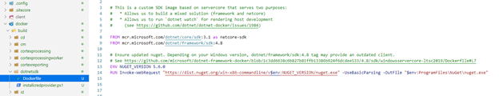
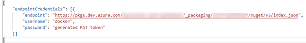
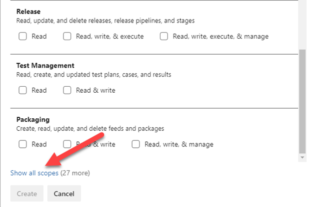
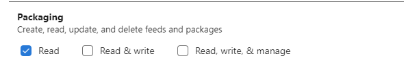
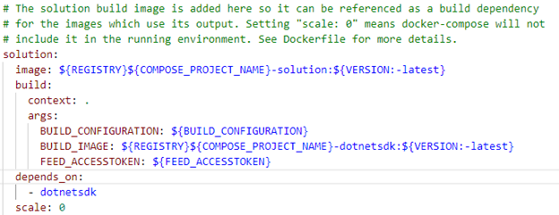
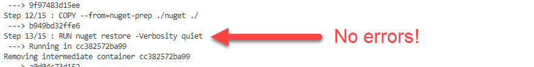

This blogpost describes how to add the Azure Artifact nuget credential provider to a windows based docker container for building .Net (full framework) solutions, using authenticated Azure DevOps artifacts feeds. As I couldn’t find a feasible solution, I decided to write a quick guide on how to set this up. This blogpost makes use of the provided Dockerfile structure that Sitecore provides, but the learnings can be applied in any solution. In other words: this post is not tied to the Sitecore ecosystem. To skip immediately to the instructions, click [this link](#install "#install")

_Note: It has been a while that I was really, really, really enthusiastic about a new release of Sitecore, but this Sitecore 10 release, it’s just: WOW. Sitecore has finally put an enormous effort into making new(ish) technology, such as containers, .net core, real CI/CD, command line automation available to their developers. That, together with the new, supported, serialization solution, Sitecore made a giant leap towards a complete, modern developer experience. This blogpost describes how a private Azure Devops Artififact nuget feed can be used in conjunction with the Sitecore Docker setup._

Within our organization, we only use private nuget feeds which are hosted on Azure DevOps, as I previously explained [here](http://blog.baslijten.com/private-sitecore-nuget-feeds-using-vsts-why-we-dont-use-sitecore-myget-and-how-we-work-with-package-management/). Not only contain these feeds open source packages which are approved to use by our team, but specific packages which are widely used within the organization as well. Think about generic (organization specific) crosscuttings for logging, abstractions, configuration, and from a Sitecore perspective generic packages such as (Security) baselines, identity management, security, serialization, ORM and other reusable stuff. We add the Sitecore packages to this feed as well. Instructions on how to download these packages really quick, can be found on [this blog](https://www.alexvanwolferen.nl/download-all-485-nuget-packages-for-sitecore-10-0-0-with-this-one-line-command-in-under-3-minutes/), written by my colleague Alex van Wolferen

### A very, very short story on the Sitecore docker setup

Sitecore delivered quite a lot of Dockerfile, one of them being a container which is used to actually build the .net solution. in this image all required build tools are installed. One of these tools is nuget, as can be seen in image below:

## What is the problem with non-public Azure DevOps Artifacts?

When a feed needs authantication, it is very likely that you'll see the following error:

\[CredentialProvider\]Device flow authentication failed. User was presented with device flow, but didn't react within 90 seconds.

It's clear that this feed needs credentials, and in this case, nuget tries to open up a window to enter your credentials, which is, in docker, not possible. These required credentials can be provided in various ways. One options is to provide user credentials right away into the nuget.config, which is not a recommended approach, as the credentials would a) be stored into git and b) would be available on the filesystem of your container. A recommended solution is to make use of the [Azure Artifacts Nuget Credential Provider](https://github.com/microsoft/artifacts-credprovider#azure-artifacts-credential-provider) – this provider automates the acquisition of credentials needed to restore Nuget packages as part of the .Net development flow.

## How to use the Nuget / Azure Artifact Credential Provider

First of all, the Azure Artifact Credential Provider needs to be installed. It will be installed in a plugin directory and will automatically be detected by Nuget. In order to use this credential provider, for an unattended use of an azure artifacts feed, the VSS\_NUGET\_EXTERNAL\_FEED\_ENDPOINTS environment variable needs to be set to contain the following data:

The endpointCredentials contains an array with a structure of “endpoint, username and password”. If the endpoint matches a source in the nuget.config, the _password_ will be used as access token to authenticate against that source. The username can be anything and will not be used.

## How to obtain an accesstoken

This [piece of documentation](https://docs.microsoft.com/en-us/azure/devops/organizations/accounts/use-personal-access-tokens-to-authenticate?view=azure-devops&tabs=preview-page) describes how to obtain a Personal Access token. Make sure not to select Full Access and to select the correct custom defined scope:

First, make sure to show all scopes:

After this action, select “Read” under packaging: Read & write could be selected if you’d like to push packages as well, but that is not in scope of this post.

# How to configure your Docker files in order to get this all to work in a secure way

The following actions need to be taken:

- Download and Install the Azure Artifacts Credential Provider
    - Make sure it works with .Net full framework!
- Configure your solution to work with the environment variable
- Make the access token configurable

## Install the Azure Artifacts Credential Provider

_Note: this step can be skipped if you are using the mcr.microsoft.com/dotnet/framework/sdk:4.8 Image as your build tool. For Sitecore users: this image is used within the Sitecore dotnetsdk. The plugin can be found at 'C:\\Program Files (x86)\\Microsoft Visual Studio\\2019\\BuildTools\\Common7\\IDE\\CommonExtensions\\Microsoft\\NuGet\\Plugins\\' Please continue [here](#configure "#configure")_

Open up the dockerfile for the dotnetsdk (under docker/build/dotnetsdk). Add the following lines after the installation of nuget:

_PLEASE make sure that the -AddNetfx switch is NOT omitted. It costed me 4 hours of my valuable life. When this switch is omitted, the provider will be installed for core, and your nuget restore will ask for a device login over and over again._

## Configure your solution to work with the environment variable and make it configurable

The dockerfile for your solution is probably in the root of your project. Add the following two lines after `“FROM ${BUILD_IMAGE} AS builder`”:

These two lines accept an argument from the docker-compose file (FEED\_ACCESSTOKEN) and adds that argument into the environment variable. please take not of the backticks as escape character. If the line was placed between single quotes, the environment variable wouldn't be replaced. As this is just and intermediate layer, the environment variable will not end up in the actual image

In order to finalize all actions, just two more modifications are needed:

1- In the docker-compose.override.yml, the FEED\_ACCESSTOKEN needs to be added for the solution:

2- add the FEED\_ACCESSTOKEN (your PAT) to the .env file.

After executing these steps, execute the following command:

`docker-compose build`

If your builder image was changed, that one would be rebuilded, this should not be the case for the Sitecore users. Your solution image _will_ be rebuilded, as changes were made to supply the FEED\_ACCESSTOKEN and the VSS\_NUGET\_EXTERNAL\_FEED\_ENDPOINTS.

After the rebuild, your solution should have retrieved the nuget packages from your private azure artifacts repository!

## Conclusion

When downloading nuget packages from an authenticated Azure Devops Artifacts feed, you need to supply credentials. When making use of the default Micrososft .net SDK image, the Azure Artifacts Credential Provider has already been installed, otherwhise this package can easily be installed using two lines of code. All you need to do is providing an environment variable with the feed and the credentials, and you're good to go! happy dockering!
