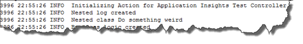
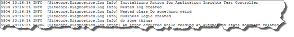
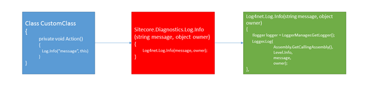
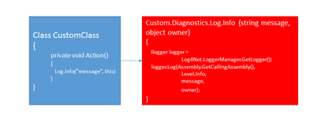
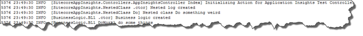
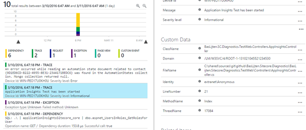

Lately, I have been working on improving he Sitecore Logging Experience™. Sitecore uses the log4net framework to handle all kinds of logs, but, with the standard configuration _and_ implementation, we’re not making the most out of it.  Where [Alex Shyba](http://sitecoreblog.alexshyba.com/) wrote some excellent posts on [writing your logs to SQL](http://sitecoreblog.alexshyba.com/sitecore_logging_write_it_to_sql/) to make the logs easier accessible, I am going to take the logging capabilities to the next level! In this blogpost I will describe why the out of the box Sitecore logging implementation should be improved, how to do this and eventually I’ll show how to modify the appenders to show some extra trace information. This is all a step-up to my next blogpost, I will explain how all the Sitecore logs can be send to [application insights](https://azure.microsoft.com/en-us/services/application-insights/) on azure to get even better insights in your application usage!

# The out of the box logging experience with Log4Net

The Sitecore logging mechanism is based on an old version of [Apache’s Log4Net](https://logging.apache.org/log4net/), which is a very flexible and pluggable logging provider. The log4net library has been included _in_ Sitecore as in, delivered in an own assembly, called Sitecore.Logging. While there is a default log4net logging façade (in the Sitecore.Logging assembly, namespace log4net.spi.LogImpl), Sitecore provided a specific Sitecore logging façade as well. It’s available via the Sitecore.Kernel assembly, in the Sitecore.Diagnostics namespace. When referencing this library, a log can be written by simply entering the line “_Log.Info(“message”, this)_”. This rule logs the “message” to the specified logger, _if_ available. The specified logger is being specified by “this”, and represents the type of the current class. [This page](https://logging.apache.org/log4net/release/manual/introduction.html) has an explanation on how the log4net can be configured.

Because the log4net implementation is a) outdated and b) being hosted in a Sitecore assembly, it’s not possible to easily use 3rd party solutions for log4net with Sitecore. The 3rd party solutions generally use the newer implementations of the LogEventInformation class (which has been altered over time) and they can’t find the log4net assembly, because it isn’t there.

## Log4Net Loggers

A logger is a piece of configuration in which the name of the logger is specified and contains some configuration options:

- Name: name of the logger. When logging, by specifying the name of the logger _or_ specifiying the type (remember, this?), Log4net checks out if this logger is available. (more info on the documentation page ;))
- Level- What is the minimum Logging Level that should be handled. For example, if the Level INFO has been specified, all messages of level DEBUG are ignored
- Appender: target where the logs should be stored. This can be anything, appenders are separately configured

## Appenders

In the /Sitecore/log4net/ configuration section, these “appenders” can be found, this is a target to which log4net can write its information. The Sitecore out of the box appender is the SitecoreLogFileAppender, which writes its logs to the /data/logs/log-{date}.txt files. Other examples of appenders are:

- ADONetAppender
- ASPNetTraceAppender
- EventlogAppender

Custom Appenders can be created as well , but that's not part of this blogpost. More on that in part II – Sending logs to Microsoft Application Insights on Azure. As part of the configuration, Log4net conversion patterns can be used to determine which data will be logged, the out of the box setting is as follows,

“%4t %d{ABSOLUTE} %-5p %m%n”

which results in writing the following logs:

According to the [documentation](https://logging.apache.org/log4net/log4net-1.2.13/release/sdk/log4net.Layout.PatternLayout.html) these conversion pattern names mean “ThreadID”, “date”, “Level” and “Message”. This message can be useful for hunting and solving bugs.. As shown in the picture above, I included information about the controller, the classes that were instantiated and the methods that have been used, but this can cause a lot of rework, especially when refactoring your application. It can even be confusing when the logging information is not being updated when the code is being refactored, or when the logging information has some typo’s. According to the documentation, this shouldn’t be needed, as there are a lot more conversion patterns can be used for diagnostics. A lot of people use classnames and methods in their logs, but this information is already part of the log information: “%M and %C” can be used to include this information in the logging message. When changing the config to use this pattern, the following logging will be written:

For every logentry, the type “Sitecore.Diagnostics.Log” and Method “Info” are logged, while I expected that my custom controller and classes would appear in these logs. Something is wrong, but what? And more important: how can this be fixed?

## How can this be fixed?

The fix to include the right information can be fairly easy. The Sitecore logging implementation for log4net is a façade that is encapsulating the default log4net façade. Basically, it comes down to the following pattern:

The above example is very, very simplified, but it gets to the point: Our custom class is calling the Sitecore logging implementation, which, on it’s turn, is calling the Log4Net façade. This Log4Net façade executes the function “Assembly.GetCallingAssembly()” method, which returns “Sitecore.Diagnostics.Log”.

The trick is to write an implementation which looks like the Log4Net façade: a Sitecore.Diagnostics.Log which calls the “Assembly.GetCallingAssembly()” and passes that information into the Log method of the ILogger:

When using this implementation, together with the proposed conversion patterns, the logs look like as follows:

Now the correct calling assembly _and_ the correct calling method are being logged, which enables the developers to use shorter, meaningful messages in their code _and_ the logs give much more insights on the the code that was executed. The good thing is: Sitecore can fix this and this fix can be backwards compatible with the current logging experience, while the exposed logging can greatly be improved! It would even be possible to upgrade to the current version of log4net!

On my [github page](https://github.com/BasLijten/) I created a new [SitecoreDiagnostics repository](https://github.com/BasLijten/SitecoreDiagnostics) with a new Logging implementation. I didn't test this on production, but it's an example on how easy this stuff can be fixed. This repository includes a log4net implementation which is able to write the correct information, as well the [application insights appender](https://github.com/BasLijten/SitecoreDiagnostics/tree/master/BasLijten.Sitecore.Diagnostics.ApplicationInsights) to submit those logs to the Azure Service.

# Summary

The default Sitecore implementation of log4net is not optimal, the implementation is outdated and doesn’t support 3rd party add-ons. It’s not hard to improve the current implementation and building a custom logger façade to use the Sitecore log4net implementation _and_ to be able to write into the standard sitecore logs, is quite easy and opens up possibilities. One of these possibilities is append the information to application insights and take the insights to the next level, as every logged item, your custom logs, as well as the Sitecore logs, would can be correlated and be traced See below for a sneak preview. In this overview, we see custom logging, the calling class, method, line number and all other events that have been logged for this request. Even some of the stored procedures for this request are visible in this image, how cool is that?

