[In my previous blogpost](http://blog.baslijten.com/improving-the-sitecore-logging-and-diagnostics-experience-part-1-expose-more-information-using-a-new-logger/) I wrote on improving the Sitecore logs, which was a prerequisite for this blogpost, to send all that logging information to Application Insights. This blogpost will explain the steps on how to do this. Application Insights is a tool, hosted on Azure, which helps to get a 360-view on your application. It tracks application health, adoption metrics and crash data. With several interactive tools it’s possible to filter out, segment data and drill down into event instances for details. With a few clicks, it’s possible to view the whole logged call-stack of your application. In this blogpost, I will explain how to send your logs to Application Insights. The great thing is: The is _not_ limited to your custom logs, but the full stack of logs, thus custom _and_ Sitecore logs, will show up in this tool. This platform is _not_ limited to Microsoft, there [are a lot of SDK’s available for other technologies](https://github.com/Microsoft?utf8=%E2%9C%93&query=application).

All source code can be found on my [SitecoreDiagnostics repository on github](https://github.com/BasLijten/SitecoreDiagnostics/tree/master/BasLijten.Sitecore.Diagnostics.ApplicationInsights).

# How can Application Insights help?

When sending all the data to Application Insights, the service can help to get insights in page requests, views, exceptions and other metrics. What is happening, which dependencies are there, what kind of SQL statements are executed, et cetera. Not only your custom logging is shown, but the Sitecore dependencies as well. In the paragraphs below, I will explain one usecase extensively and will show others by just displaying some cool graphs. In the end, all data can be used in Microsoft Power BI as well! I will explain one use case on narrowing down to some server side events. Other overviews that can be created are overviews of all exceptions, failed requests, page views, user sessions, active users. When set up correctly, the performance counters of a server can be send to Application Insights as well.

## Manual tracing

Open up Application Insights, the default view is looking as follows:

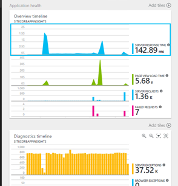

Selecting each of the graphs will result in a different follow up-screen. I selected the first graph, as I was interested in the server response times. I added the diagnostic timeline myself, it shows a lot of exceptions: this is due to mongoDB that crashed at my local machine, which is generating a _lot_ of exceptions.

The next screen that opens up after selecting the server response time, is the Server responses page. This is a preconfigured page with diagnostic information on Server response times, the dependency durations and the amount of server requests completed. It’s possible to easy filter a smaller timezone on these graphs, by selecting a timerange and press on the magnifier glass:

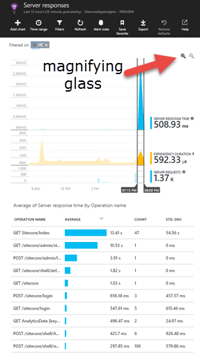

After pressing the buttom, all events are filtered. Every row can be selected to drill down to even more information. In my case, I want to know why the Sitecore/Index request is taking a lot of time to execute. The average call takes 2.3 seconds, with a standard deviation of 4.64 seconds!

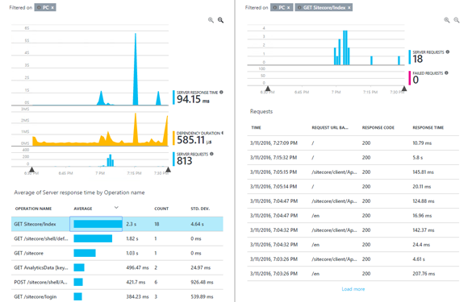

Some requests take 4 seconds or more to load, while others are being executed in 100-200 milliseconds.  Let’s narrow down to the request that takes 5.8 seconds. A lot of information is being shown. I removed a lot of remote dependencies (all SQL calls), those are automatically measured, and if there is a stored procedure, this one is logged as well. WebAPI dependencies and WCF calls are measured automatically as well!

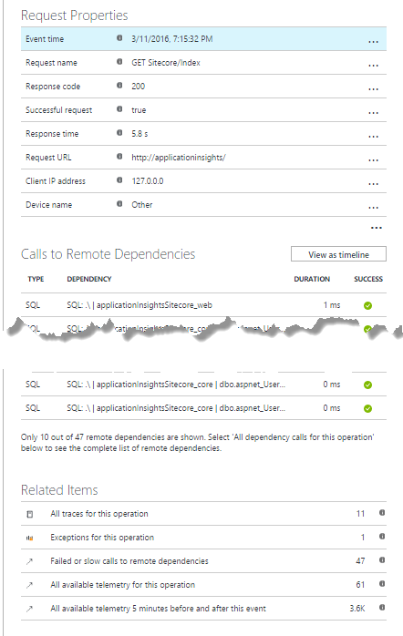

This overview gives the ability to drill down even further. When selecting “All available telemetry”, all related events, traces, dependencies and exceptions are being shown. And when I say all, I really mean “all”. All related Sitecore generated logs are appearing as well in this overview:

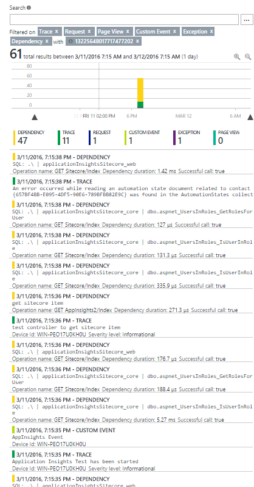

This telemetry can be narrowed down even further, to get all meta information that is available for this log. Remember my previous blogpost, where I explained on how to log the calling class and method to the Sitecore logs? The reason is below, this information (and even more) appears in the meta overview of this call! Classnames, methods, identities, linenumbers, even the sourcecode files is showing up in this overview! And with just a bit of extra work, calling Site, environment or other data can be exposed. In the case below, I selected a custom log, that was created by my own code.

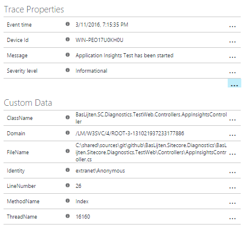

When selecting a Sitecore generated log event, other information is showing up:

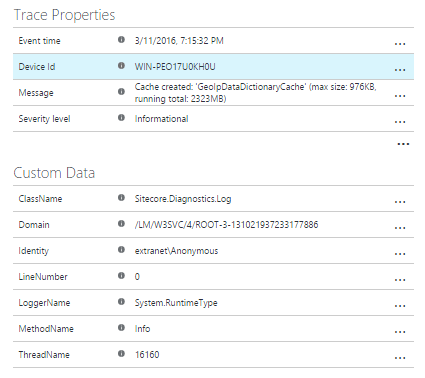

Notice the Classname and methodname? They are always defaulting to the Sitecore.Diagnostics.Log. If another telemetry event is selected, for example a telemetry dependency, other information is showing up. In this case, even the SQL command (in this case the stored procedure on the core database).

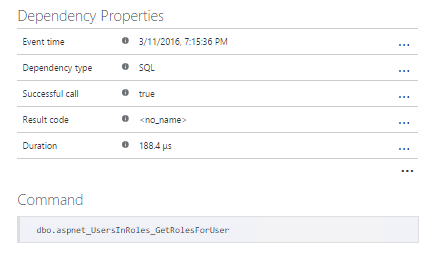

## Application Insights search in visual studio

From the visual studio interface, it’s possible to search through the logging as well:

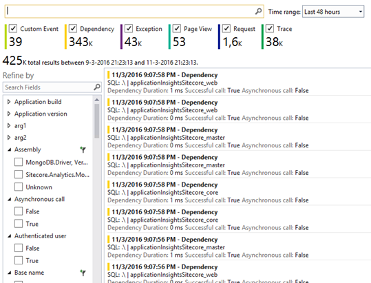

# Using and Configuring Application Insights

In a normal scenario, application insights can be configured when creating a new web application, it’s part of the new project modal dialog. This will create a new project, add a new Application Insights resource to azure, configure the instrumentationkey, will configure the web.config _and_ add some javascript to the \_Layout.cshtml to make sure that every pageview will be tracked. These actions will be correlated to the events that are executed serverside. The Trace API can be used directly to write to Application Insights, but the logging framework of choice can be used as well.

## Configuring Application Insights for Sitecore

In our case, the Sitecore case, configuring Application Insights is a _bit_ harder. You can follow above practice and just throw away anything that you don’t need, or start off with an empty web application, without the Application Insights instrumentation. In this case, you need to do the following:

- Create a new application insights resource
- Add the following nuget package to your solution:
    - ApplicationInsights.Web

This will add some javascript files, make sure that your layout page references these javascriptfiles and make sure to execute the javascript that is provided by application insights on every single page. The custom javascript that needs to be run on your page can be found here:

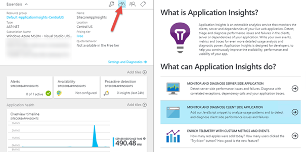

The web.config has to be modified as well, as some http modules have to be added. I chose to use Xml document transformations for it, to be able to do this in a repetitive way on different environments:

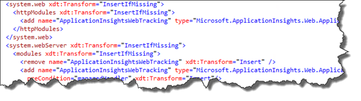

The InstrumentationKey is a key to identify the application and is generated by Application Insights. In normal scenarios, this key can be found in the applicationinsights.config, but I decided to make this one configurable in the Sitecore settings. The patchfile has to be altered for this one.

The last part is adding the Application Insights appender for log4net nuget package. And that’s the part where things go wrong: this package doesn’t work, because of two reasons:

1. The Sitecore log4net implementation is an outdated implementation. The logEventInformation class, for example, isn’t compatible anymore with the AI-Appender.
2. The appender looks for the log4net assembly. As Sitecore decided to host it’s own version, this one cannot be found. Adding this log4net assembly will not work, as it won’t pick up configuration and it wouldn’t be possible to send Sitecore data to Application Insights.

That's why I added a custom ApplicationInsightsAppender in the project on github, which can handle the outdated implementation. A downside is, that I had to use some reflection to be able to send Exceptions to the service.

Last, but not least, the custom appender has to be added to the log4net configuration. I decided to only add the appender to the root-logger, all the others will not log to Application Insights. Changes can be made in the patch-file.

I created a Sitecore specific variant and placed it [in this repository](https://github.com/BasLijten/SitecoreDiagnostics/tree/master/BasLijten.Sitecore.Diagnostics.ApplicationInsights). Compile it and deploy the .Web project to the environment and you would be good to go (apart from the web.config changes). The test project contains a layout page and a controller rendering with both the javascript and some logging on it, which can be used to generate some test-data.

# Summary

Application Insights can be a really good addition to your toolset to analyze your Sitecore webapplication. Not only gives it insights in your own application, but it’s possible to trace down to the Sitecore logs as well!
