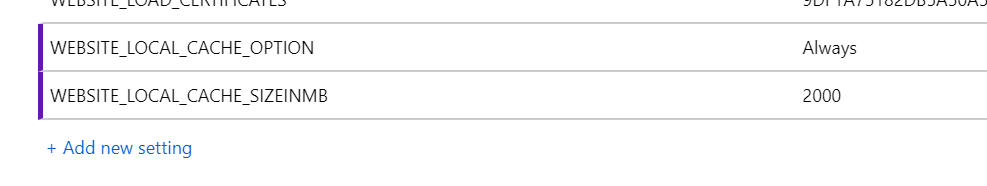

_Although this blog focuses primarily on Sitecore, this blogpost is applicable for any application which is hosted on an Windows Azure App Service._

The file system,which is used by Azure App Services, always points to D:\\home, but it is in fact a link to a (slow) performing share. Sitecore can greatly benefit from enabling a local cache, this blogpost describes how to enable this cache.

Important to know, is that the app service _can_ write to it's cached folder, but after an application restart, or after a new deployment, all these changes are discarded.

The first step is to set the following application setting:

``` WEBSITE\_LOCAL\_CACHE\_OPTION = "Always" ```

this will enable the local cache. It copies the shared wwwroot to the D:\\home\\wwwroot folder, but it has a limitation: by default, only 300MB will be transferred locally. As Sitecore surpasses this amount easily (a fresh Sitecore 9.1 installation takes over 1Gb of storage), this amount has to be increased. This amount can be altered by adding the following setting:

``` WEBSITE\_LOCAL\_CACHE\_SIZEINMB = "2000" ```

The amount of 2000 is the current maximum, but is enough for a Sitecore installation.



When working with a local cache, problems may arise with local stored media items: They are not shared anymore, but there is an excellent solution by Per Osbeck, which can be found [over here](https://medium.com/@osbeck.per/sitecore-azure-blob-cache-media-provider-45bd6aa533bf).

## Don't configure this on your staging slot

A second important note is not to configure this on your staging slot: as you want to test clean deployments, this local cache shouldn't be enabled on the staging slots, but only on your production slot; this means that you need to create a slot specific setting, which ties to your production environment. The problem in here is that slot specific settings cause an application recycle, but there is a solution for that in my next blogpost - How to warmup your application before swapping slots in blue-green scenarios.

More information regarding this subject can be found on [this MSDN page](https://docs.microsoft.com/nl-nl/azure/app-service/app-service-local-cache-overview)
