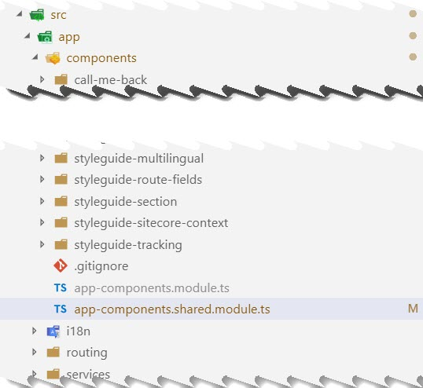
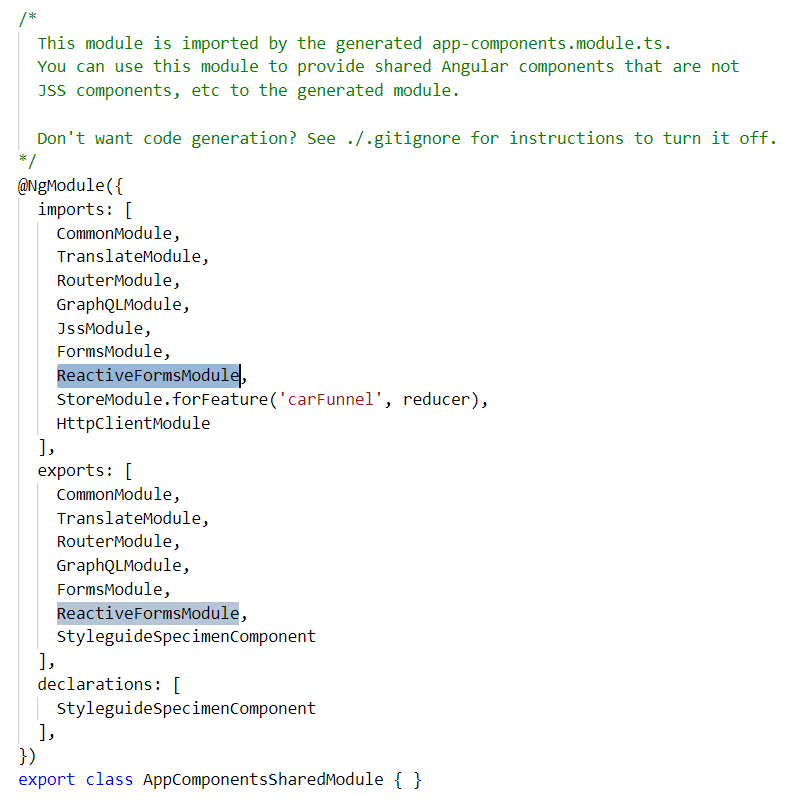

although being a total JSS _and_ angular newbie, I wanted to create some nice forms, use an API and use some state in my application. The internet is full of solutions, but none of them fixed my issue. Read more after the break.

Just to have a quickstart, the default angular solution, provided by the JSS framework, was used. When using the ReactiveFormsModule, most solutions suggest that the ReactiveFormsModule should be added to your @NgModule. And while they are totally right, most of them suggest that it should be added to the App Module, which did not solve the issue in this case.

After some thorough research it appeared that a SharedModule was added, directly under the "components" directory:  

When using the default template, all required modules can be added to this shared module. It's even described in the contents of this file!

Because it is at the end of the complete component list, the file may be overlooked and you could end in a loooong journey to solve this n00b issue ;)

Happy coding!
