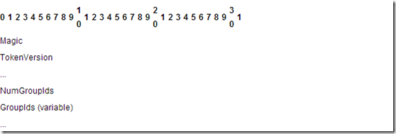

Some time ago, the company that I work for, merged with another company and one of the issues that we still have, is that the users of both companies till reside in different domains.

At the moment, we have a SharePoint  Intranet which is accessible for both domains, lets say domain domA and domB. Since the merge of the two companies, about 1000 users aqcuired accounts in both domains, for some reason. At the moment, some project is going on which is going to merge all the users of domA to domB, which is, in my opinion, a good case. The downside is the fact that the users with multiple accounts in the different domains MIGHT have different ownerships on documents and different permissions to some parts of the intranet.

We know that it is possible to migrate SharePoint userProfiles using the STSADM command: "STSADM -o migrateuser -oldLogin domA/sAMAccountName -newLogin domB/sAMAccountName (-ignoresidhistory), or using the object model. FYI, we are going to use the object model to migrate the users without multiple accounts, because we have about 35000 users ;)

What does this command do?  
1) if the newLogin already has permissions, delete the newLogin (it still exists in the database, but is marked as deleted)  
2) if the oldUser already exists and has permissions, replace the oldUser entries with newUser

So, if a user already has two accounts, the "new account (the account that will be migrated to)", will be overwritten by the old account. But what is the impact. Do all users really USE their account? and did they use it a lot, or do they just surf with it. I used the following way to investigate this:

We could use the objectmodel to find out:

- Does the user have specific permissions to a site?
- Does the user have specific permissions to a list?
- Does the user have specific permissions to a listItem?
- If not, does the user have specific permissions to any of the above via SPGroups? Keep in mind that we can ignore AD groups, because the migration of accounts itself takes care of that.

But with the amount of sites, lists and items we have, this method is way to slow. So I decided to query the database to find out wether or not a user has any permissions to a site, list or listItem. As I didn't know much of the SharePoint Content Databases, I tried to analyze a bit of it. Below is the schematic I came up with. It doesnt cover the complete database and don't shoot me if it's (totally wrong), but for me it was usable to gather the information I needed:

Due to this schema, I came up with the following queries to decide if a user has some specific permissions on a list, item or site:

1) Decide if a user is in a sharepoint group that has a roleassignment: the U.tp\_Deleted = 0 decides that this entry is used for the user, if it's not 0, the entry isn't used anymore.  
SELECT     \*  
FROM         GroupMembership AS GM INNER JOIN  
                      RoleAssignment AS R ON GM.GroupId = R.PrincipalId INNER JOIN  
                      UserInfo AS U ON GM.MemberId = U.tp\_ID  
WHERE     (U.tp\_Login = '<USERLOGIN>') AND (U.tp\_Deleted = 0)

2) Decde if a user has a RoleAssignment:  
SELECT     \*  
FROM         RoleAssignment AS R INNER JOIN  
                      UserInfo AS U ON R.PrincipalId = U.tp\_ID  
WHERE     (U.tp\_Deleted = 0) AND (U.tp\_Login LIKE '<USERLOGIN')

Every result has a different ScopeId, which can be assigned to the AllList, All Docs or the Webs table. So by creating a new query, there can exactly be decided to what group, item. list and site a user has access to.

_Note: a role assignment is deleted if it isn't used anymore, I believe, though I didn't test this thoroughly._

**_UPDATE:_**

I just found out that I can verify if a user has any permissions somewhere on a site much, much easier:  
According to [http://msdn.microsoft.com/en-us/library/cc704453%28PROT.10%29.aspx](http://msdn.microsoft.com/en-us/library/cc704453%28PROT.10%29.aspx), the tp\_Token can be used to decide whether or not a user has permissions to a site or specific document.  if it's null, there is no group that a member is user of, so he or she doesn't have any permissions. It stores information of the site groups that it is member of. The method can still be used to decide the amount of items it affects.

_Quote from msdn:_  
\---------------------------------------------------------------------------------------------------------------------------------------- 
The WSS User Token structure contains an array of [Site Group Identifiers](http://msdn.microsoft.com/en-us/library/cc704403%28PROT.10%29.aspx).

Magic (4 bytes): A 4-byte, unsigned integer specifying the [**version**](http://msdn.microsoft.com/en-us/library/cc704372%28PROT.10%29.aspx) of the token format. This version of the protocol MUST always use the value 0xdcd3.

TokenVersion (8 bytes): An 8-byte, signed integer specifying the [**site collection's**](http://msdn.microsoft.com/en-us/library/cc704372%28PROT.10%29.aspx) security version value, which was used to compute the token. This value is not currently used and MUST be ignored.

NumGroupIds (4 bytes): A 4-byte, unsigned integer specifying the count of Site Group Identifiers within this token.

GroupIds (variable): An array of 4-byte integers for each of the [**site groups**](http://msdn.microsoft.com/en-us/library/cc704372%28PROT.10%29.aspx) the corresponding [**user**](http://msdn.microsoft.com/en-us/library/cc704372%28PROT.10%29.aspx) belongs to. The number of elements in the array is specified by the NumGroupIds [**field**](http://msdn.microsoft.com/en-us/library/cc704372%28PROT.10%29.aspx).
