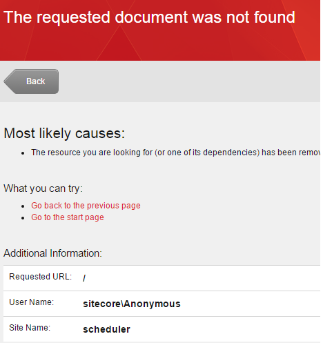
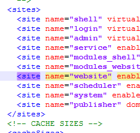
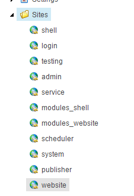

Recently our admins faced an error in one of our Sitecore environments that we couldn’t explain. Sitecore tried to serve a site that it shouldn't serve, which caused a nasty error. Digging through the logs didn’t help us and due to the fact that the logs didn’t tell us anything, our admins had problems pinpointing the problem.

## Our Sitecore installation

Our Sitecore installation was a vanilla Sitecore 8.0 release 5 installation with just _one_ site active, This site was created under the default “website” site node in Sitecore configuration and is used for our initial performance baseline. On a set interval, we measure its performance and compare it with the initial performance figures: this way, we can see how our Sitecore environment behaves. Aside from the vanilla Sitecore 8.0 installation, we only had the [multiple sites manager](https://marketplace.sitecore.net/en/Modules/Multiple_Sites_Manager.aspx) module installed, as we are (normally) hosting multiple sites in a single Sitecore instance.

## Sitecore trying to serve the wrong website

The first thing I noticed, was that Sitecore was trying to serve the wrong website. As it was a vanilla installation, the hostname should be tied to the “website” node, but watching closely to the error message, I saw that Sitecore was trying to serve the rootnode of the “scheduler” site, a default site that is provisioned by Sitecore:

## Multiple site manager caused the problem

As the only customization on the Sitecore instance was the Multiple Sites manager module, I decided to disable this module, which fixed the problem immediately. I haven't experienced any problems with the Multiple site manager before, this had to be a configuration issue. Knowing that the default “website” node resides above the "scheduler" node, I suspected some issue with ordering in the module.

When comparing it to the actual order of the Multiple Sites manager configuration, I saw a discrepancy:

The website node in the Multiple sites manager configuration didn't have the same position as the website node in the sitecore.config file.

Only moving the website node above the scheduler node, however, didn’t fix the problem. The configuration is kept in memory and moving nodes around doesn’t trigger a flush, I tried an applicationpool recycle. Et voilá: problem solved.

# Why is this a nasty problem?

Although a small hint on the order of site nodes is given in the documentation, it’s not clear why this causes trouble and definitely not everyone knows about the importance of the order. (Quote from the documentation: _“The order in which the sites stand under the Sites folder is important for the SiteResolver method. “_)

Why is this a nasty bug or problem? When working in a company where multiple people are managing multiple Sitecore environments, everyone has their own way of working and not everyone knows every in and out of every module that has been installed. Some people order information on purpose (to get a clear overview), other people accidentally move an item to another position, not knowing that it can break the environment. Because a flush or application pool recycle is needed to trigger the problem, somebody making the wrong change will not necessarily suspect that the caused the problem.

## Conclusion

From my point of view, there are two key lessons to be learned:

1. Be very careful when making changes at system level: Problems may be revealed at a later point in time.
2. Modules, especially modules that heavily intercept in the regular Sitecore lifecycle, should be monkey proof. You may exactly know how all the modules work, but don't expect this from _others -> **Assumption is the root of all evil** ;)_
