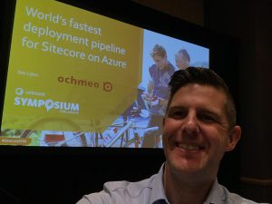
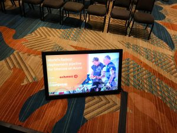
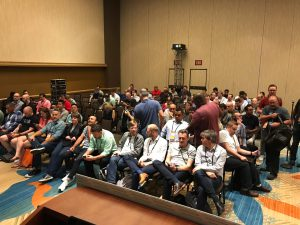
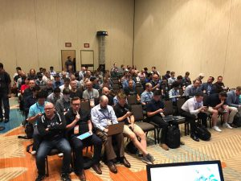

On October 9th I presented for the 3rd time at the Sitecore Symposium. After a [security session](https://blog.baslijten.com/presenting-at-sitecore-symposium-2016-keeping-hackers-out/), our session with [Robbie the Robot](https://blog.baslijten.com/revealing-robbie-at-the-sitecore-sugcon-2017-windows-iot-raspberry-pi-cognitive-services/), I chose to give some insights into our delivery pipeline for Sitecore on Azure. In this session, I will share my road to this presentation.

This time, I had to hold my presentation on the very first day of the Symposium, which meant that afterwards, I could enjoy all the other presentations. Although I speak quite often and I am pretty confident that I know what I am talking about, I have to admit that I still get a little bit nervous before I have to go on stage and I continue to work on my presentation until the last hour before that presentation, just to be sure that it is perfect.

## Getting ready for the presentation

When working on the presentation, I always start with a goal: what do I want to share with the audience? What should the audience know, when I finished my presentation? Based on that goal, I try to setup a story around that goal.

This time, it was very, very hard. Although I was thinking that I was having a hard time with the security and Robbie session, it turned out that this was really the hardest presentation to create, ever. There was so much content that I wanted (and had to) share upon reaching my goal, that I really didn't know anymore what was relevant and what not. And the hardest part: The structure, the order of the subjects. And it had to fit in 45 minutes.

When working on a presentation, the content that you are going to create is always way too much. The trick in here is to reduce it to a few important parts and try to explain those steps as easy as possible.

I am also a great fan of giving a live demo, but for this presentation, I decided to only use slides with screenshots. Why?

- Live demo's take up a lof of time - screenshots are much quicker
- My demo was very dependent on internet and Azure DevOps (which was down the day before)
- Screenshots are a great reference when handing out slides
- Presenter nodes could be added to the screenshots - they help with the story during the presentation

And that that is exactly the part where I get a bit uncertain about the presentation. Altough the content is great, the goal is great and the outcome is great, there always is a feeling of discomfort, because of the reduced steps and complexity and the lack of a live demo, it feels like a mediocre story, where people don't learn anything new, as it _sounds_ that simple. This is due to all the time spend on this presentation; Every time you spend time on a subject, it gets a little bit more "normal", until you reach the point where you think that the subject is so basic which let's you think that everyone is already doing that.

## Going on stage

The moment is there; there is a little bit of tension and I head to the room. In this room, there are already 10 people waiting for my presentation. The AV-guys are still away, because they had a break, so I decided to plugin my laptop myself. I am lucky: no hassle with the video, as the large screens and the confidence monitors are working immediately!

Those confidence monitors are GREAT! As I have a lot of slides, without a live demo, I don't feel comfortable to just stand behind a small desk. This sounds strange, as a lot of people feel safer behind a desk, but I always like to use the complete stage; it allows me to walk the tension out of my body. As the podium was large and there were confidence monitors at both sides of the stage, I was able to freely walk around. A big plus!

## People walking in

More and more people are entering the room. As the room is quite far from the partner pavilion, it takes some time before everyone entered the room. I decided to wait a few minutes before I really start. The room is packed, people had to stand and afterwards I heard that some people were not allowed to enter the room anymore, as it was too full.

## Ready for Action!

it's 2:47pm and I decided it's time to start. Al the tension and nerves that were there, were suddenly gone! A lot of known faces amongst the audience, and just a few people playing around with their phone. On every new slide, people take pictures. This is a good thing; they are interested, listening, which gives me even more energy! At 3:30pm exactly I finished my presentation. Just one person who left the room (and I really don't care; people should be able to leave a talk when it is not in line with their interest), which means that I probably did a good job!

## Summary

During preparations and just before the presentation, I always (and I think a lot of other speakers as well) get nervous, uncertain, but in the end, it's always fun to talk about the things that you did, discovered and want to share with the community. Remember that you know what you are talking about, that there are always people who know things better, but the majority is there to learn something from you.

The presentation can be downloaded [here](https://www.slideshare.net/baslijten/worlds-fastest-delivery-pipeline-for-sitecore-on-azure)

<iframe src="//www.slideshare.net/slideshow/embed_code/key/5pkrk73hO5Qza7" width="595" height="485" frameborder="0" marginwidth="0" marginheight="0" scrolling="no" style="border:1px solid #CCC; border-width:1px; margin-bottom:5px; max-width: 100%;" allowfullscreen></iframe>

**[world's fastest delivery pipeline for Sitecore on Azure](//www.slideshare.net/baslijten/worlds-fastest-delivery-pipeline-for-sitecore-on-azure "world's fastest delivery pipeline for Sitecore on Azure")** from **[Bas Lijten](https://www.slideshare.net/baslijten)**
