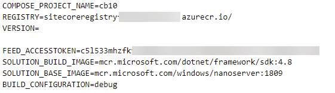
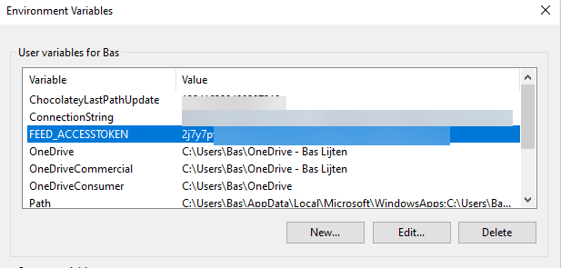

In a previous blogpost I explained how to [setup a docker build which allows to connect to an authorized Azure Devops Artifacts feed](https://blog.baslijten.com/how-to-use-the-nuget-azure-artifact-credential-provider-with-a-net-docker-build-container-to-connect-to-authenticated-azure-devops-feeds/). I often use this feed, as it contains packages which we don't want to share in public. However, almost _every single time_ when I start fiddling around with my private feed, things break. Badly:

> Response status code does not indicate success: 401 (Unauthorized).

Although I was pretty sure that the FEED\_ACCESSTOKEN, which is required for correct authentication, was correctly set in my environment file, the docker-build still falled back to an old value.

Emptying the cache, deleting images: nothing helped. It appeared that I had set the environment variable for this same FEED\_ACCESSTOKEN on system-level as well. Apparently, the global environment variable takes precedence over the locally set variable.

Two solutions are possible here:

- run $env:FEED\_ACCESSTOKEN ="" before you run your actual build
- simply delete the FEED\_ACCESSTOKEN from your environment variables.

Thanks for reading another episode of "_Once bitten_, _twice shy_."
