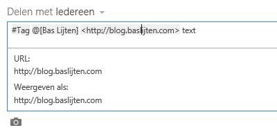

SharePoint 2013 brought great things: great new social features, the API got a major extension and of course, the new introduced app model. A feature that I really missed though, was the ability to post documents to your newsfeed from the context menu. This blogpost describes how to do this.

## Newsfeed options

When posting messages to your newsfeed, there are a few options: Adding text, tags, links or media:



However, I didn't find an integrated feature to post a document to my newsfeed from the ribbon or the context menu. Although it's possible to copy the document URL, navigate to the newsfeed and insert the document over there, SharePoint didn't ship with this specific feature. Because of the greatly improved API and the app model, it's a small piece of cake to integrate this functionality.

## Adding a custom menu action item

The first thing to add to your SharePoint hosted app, is a Menu Item Custom Action. This Custom Action will add a new node to the Context menu. This can be done by adding a new item and selecting the "Menu Item Custom Action".

This custom action needs to be slightly modified:

```xml{9,10,11,17} <?xml version="1.0" encoding="utf-8"?> <Elements xmlns="http://schemas.microsoft.com/sharepoint/"> <CustomAction Id="16718687-e3a7-47dd-9bf6-485810e3d5b2.PostToNewsfeedDialog" RegistrationType="List" RegistrationId="101" Location="EditControlBlock" Sequence="10001" Title="Post To Newsfeed Dialog" HostWebDialog="true" HostWebDialogHeight="420" HostWebDialogWidth="510"> <!-- Update the Url below to the page you want the custom action to use. Start the URL with the token ~remoteAppUrl if the page is in the associated web project, use ~appWebUrl if page is in the app project. --> <UrlAction Url="~appWebUrl/Pages/PostToNewsfeed.aspx?{StandardTokens}&amp;SPListItemId={ItemId}&amp;SPListId={ListId}&amp;SPApp={AppWebUrl}" /> </CustomAction> </Elements> ```

add the lines 9-11: these are not recognized by intellisense, but they do work, somehow. All they do is to make sure that the referenced page (on line 17), will open in a popup, this prevents the action from navigating away to the app itself.

On line 17, a querystring parameter is added, "SPApp={AppWebUrl}", as it is needed to make the post to the newsfeed.

## Creating the message dialog

Now the action itself is ready, it's time to create the message dialog. The default.aspx can be used for this action. It's important to include the control on line 2: it allows the page to be rendered inside a dialog using an iFrame.

```html{2} <asp:Content ContentPlaceHolderID="PlaceHolderMain" runat="server"> <WebPartPages:AllowFraming runat="server" ID="AllowIFraming1" />

<asp:TextBox runat="server" ID="tb\_01" Rows="5"></asp:TextBox> <asp:Button runat="server" OnClientClick="PostToNewsfeed();" Text="Share This!"/> </asp:Content> ```

## Making it all work

At last, some javascript is needed. Please note that the [parseUri](https://code.google.com/p/youtube-direct-lite/source/browse/static/js/third-party/parseUri.js?r=a21281d903785631cdb3b2a0ad5bc283764070b6 "parse Uri - Steven Levithan") function is handy little function, written by Steven Levithan. It's not included in the overview, but included in  the sourcecode. It basically creates the document url from the query string parameters that were passed (line 41), and uses that document url to be posted to the timeline, along with a nice message (line 55, 79). The javascript uses the Rest API (line 54) to post the message (line 85).

```javascript{41,55,79,85}
'use strict';

var context = SP.ClientContext.get\_current(); var documentPath; var documentName; var hostwebUrl;

// This code runs when the DOM is ready and creates a context object which is needed to use the SharePoint object model $(document).ready(function () { getQueryStringParameters(); });

// Helperfunction, should be moved ;) function getParameterByName(name) { name = name.replace(/\[\\\[\]/, "\\\\\\\[").replace(/\[\\\]\]/, "\\\\\\\]"); var regex = new RegExp("\[\\\\?&\]" + name + "=(\[^&#\]\*)"), results = regex.exec(location.search); return results == null ? "" : decodeURIComponent(results\[1\].replace(/\\+/g, " ")); }

// retrieves the url of the document that is attached to the listitem function GetDocumentUrl() { var dfd = $.Deferred( function() { hostwebUrl = getParameterByName("SPHostUrl"); var listId = getParameterByName("SPListId"); var itemId = getParameterByName("SPListItemId");

var hostContext = new SP.AppContextSite(context, hostwebUrl); var list = hostContext.get\_web().get\_lists().getById(listId); var listItem = list.getItemById(itemId);

context.load(listItem); context.executeQueryAsync(function () {

// relative url. When concatenating with hostweburls, take care of the managed path. Just the local domain var serverRelativeDocumentUrl = listItem.get\_item("FileRef"); // not a best practice, best its safe, as we are var dom = parseUri(hostwebUrl); documentPath = dom.protocol + "://" + dom.host + serverRelativeDocumentUrl + "?Web=1"; dfd.resolve(documentPath); }, function (sender, args) { dfd.reject(args.get\_message()); }); } ); return dfd.promise(); }

// Posts a message to the users newsfeed using the Rest API function CreateNewPost(documentPath) { var appweburl = getParameterByName("SPApp"); var myurl = appweburl + "/\_api/social.feed/my/Feed/Post"; var message = $("#ctl00\_PlaceHolderMain\_tb\_01").val();

var d = JSON.stringify({ 'restCreationData': { '\_\_metadata': { 'type': 'SP.Social.SocialRestPostCreationData' }, 'ID': null, 'creationData': { '\_\_metadata': { 'type': 'SP.Social.SocialPostCreationData' }, 'ContentItems': { 'results': \[ { '\_\_metadata': { 'type': 'SP.Social.SocialDataItem' }, 'Text': 'Nieuw document', 'Uri': documentPath, 'ItemType': 1//0 - user; 1 - document; 2 - site; 3 - tag; 4 - link } \] }, 'ContentText': message + ' {0}', 'UpdateStatusText': true } } });

$.ajax({ url: myurl, type: "POST", data: d, headers: { "accept": "application/json;odata=verbose", "content-type": "application/json;odata=verbose", "X-RequestDigest": $("#\_\_REQUESTDIGEST").val()

}, error: function (xhr, ajaxOptions, thrownError) { alert( "post error: " + xhr.status + ";" + thrownError); } }); }

// called from the "Share This!" onclientclick event function PostToNewsfeed() { GetDocumentUrl().then(CreateNewPost); } ```

## Deferreds

When looking at line 106, GetDocumentUrl().then(CreateNewPost), a [deferred pattern](http://api.jquery.com/deferred.then/ "deferred then") has been used. This means that after an action, another action can be chained, based on the outcome of the previous function. The outcomes of the function are defined on lines 23, 41 and 44: first the deferred object is created, on 41 and 44 it's **_[resolved](http://api.jquery.com/deferred.resolve/ "jquery deferred resolve")_** _or_ [**_rejected_**](http://api.jquery.com/deferred.reject/ "jquery deferred reject")

## Summary

In three steps, it's possible to add a menu item to the contextmenu of a document library. Using the new Rest API for social feeds, some javascript and a SharePoint hosted app, it's possible to extend the SharePoint OOTB User Interface with custom actions and provide some extra productivity to your users

\* Download the [sourcecode here](http://blog.baslijten.com/SharedContent/ShareDocument.zip "ShareDocument sourcecode")
