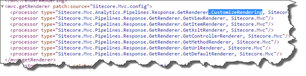
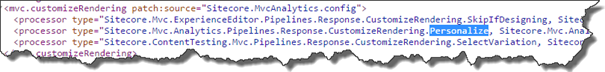
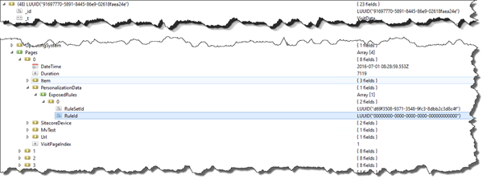
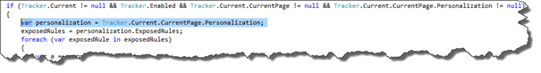
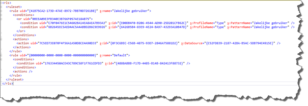
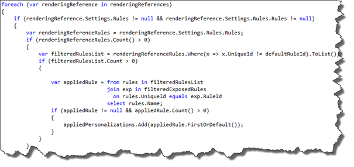
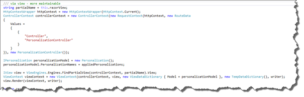
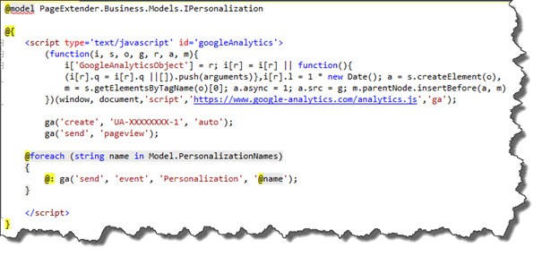

Some of our bigger sites, which don’t run on Sitecore yet, use google analytics to realtime monitor events that happen on a website, think about forms that are submitted and personalizations that are shown to a specific user. Most of the time, external (javascript) tooling is used to inject those personalizations and an event needs to be implemented which will be send to google analytics to register that event. In Sitecore, we can implement those google analytics events by including a javascript in our razor views, but, how can we tell whether or not the component that was shown was part of a personalization flow? Was a custom datasource selected, was the completed component rendered as a personalization? This blogpost series learns you on how to determine what kind of personalizations where exposed to a user and how to tell external systems about those events. It turned out that a (beautiful) pattern can be used that Sitecore itself already introduced themselves a while ago.

All sourcecode can be found [_here_](https://github.com/BasLijten/PageExtender) on github

# The use case – sending real-time events to google

A user visits a site for the first and sees a few blocks of information on the site. As it’s the users first time, no profile has been built yet and all the default renderings are shown to the user. One of these blocks is a call out for a travel insurance. The user appears to be the owner of a small company and navigates through the “business” area of the site. Due to his behavior, the user gets the “Business user” profile applied. At the moment that he returns to the front page, the “travel insurance” callout gets replaced by a “Business travel insurance” call out, nothing special so far. Our marketers expect that for every _personalization_, a custom event will be send to google analytics with the name of that personalization, that tells google analytics (or any other analytics tool) that a personalization event has been taken place. And this is exactly the part where things become harder.

<iframe class="youtube-player" title="YouTube video player" src="https://www.youtube.com/embed/T1q8jp-lKHI?vq=hd1080" width="640" height="385" frameborder="0" allowfullscreen="allowfullscreen"></iframe>

## The Challenge

What’s so hard then? The requirement to _only_ send an event when a personalization has taken place is the hard part. A developer could include for every view that he creates the JavaScript to send an event to google analytics:

ga(‘send’, ‘event’, ‘Personalization’, ‘Name of personalization’);

But _how_ could you possibly know if a component was injected as a conditional rendering? Or that only the datasource was personalized? What was the name of the Rule that was applied? What if the developer forgot to inject the JavaScript? Or what if the rendering wasn’t a personalized rendering? The short answer is: This is _not_ possible (although, not in an easy, scalable way) and chances are big that if it was an easy solution, every razor view would contain logic to a) determine if the JavaScript should be injected and b) inject the JavaScript if this was the case.

## Analysis of the challenge

As stated before, there are two major issues:

- _When_ and _how_ do we know what personalizations have been applied for each component?
- _How_ can we automatically notify google analytics with the personalization events?

Aside from those two questions, there were a few additional requirements:

- The solution has to be easily maintainable by a developer
- The solution has to work in a multi-site setup
- The solution may not mess up the HTML – we have to come as close to the html as the designers deliver to us.
- No overhead for our content-editors or marketers – a new personalization should cause any effort

## What personalization is applied?

The most important part of the solution, is to find out what personalization are applied and there are a few ways to find out how this is done.

### The rendering pipeline

The first solution that I came up, was to intercept the rendering pipeline. Sitecore runs a pipeline for _each_ rendering, which executes a few different steps:

The first part of this getRenderer pipeline is clear: this the part where the customizations are determined. Under the hood, it runs the mvc.customizeRenderingPipeline:

The Personalize processor is where the magic happens: the rules are determined and executed, to find out what rendering should be rendered. A great place to find out what rule was applied. But _how_ could we insert JavaScript to the response, to send the events to google analytics?

As the personalize processor only applies possible the actions that are tied to the rules, for example setting a different datasource or setting a completely different rendering, it does _not_ set any information on what rule was applied. After the Personalize processor, the customization pipeline directly falls back to the GetRenderer Pipeline and tries to render the rendering that was set by the personalization step.

This means, that we cannot directly find out what personalization was applied from the rendering step. Introducing a new processor in this stage, run all the personalization rules again, selecting the name of the applied rule _and_ inject some JavaScript before or after the rendering would get complex _and_ it would mess up the clean HTML structures that we wanted to use.

It became clear that this wasn’t the most beautiful solution to solve the challenge.

### Using Analytics

Browsing around in the interactions section of the Xdb set me into the right direction. It appeared that all personalizations are stored into the Xdb!

For every interaction is stored what page was visited and what rules were exposed to the visitor. It appears that the RuleId is the ID of the that was applied on the rendering. Too bad it doesn’t have any information on the rulename or rendering stored as well. This information is also available via the API (late in the pipeline lifecycle, that is! This means that this information is not yet available during the getRenderer pipeline which sounds, logical to me. It sounds a bit like the Chicken Egg paradox), via the following code:

The personalization property contains information on both RuleSet and RuleId. But the meaningful rulename (the information that our marketers are interested in) is not accessible directly via the API.

## Getting the meaningful rule names

As you probably saw in the picture above, the RuleId is stored as a Guid. As “Sitecore is build on Sitecore”, the expectation was that the personalizations were stored somewhere in the Sitecore databases, but it turned out that was not the case. A deep dive into the personalization pipeline learned me that those rulesets are stored on the item itself. Below is a snippet with an example of it.

Parsing the xml directly was a consideration, but, this format can change over time _and_ it’s unsure whether or not this xml contains all the information? And what about global rules? Will Sitecore introduce them again? A gut feeling that this wasn’t the most stable solution for the near future. All that was left to do, was to iterate through all the renderings, find the rules on these renderings and correlate them to the correct name of the personalization rule. I also introduced some logic to ignore the default renderings, as they aren't really real personalizations.

The information on what RuleId was exposed to the visitor is not yet available during the insertRenderings or GetRenderer pipeline, so another moment in time has to be found to use this information.

#### Create a new processor in the mvc.requestEnd pipeline

This kind of modification belongs in the mvc.requestEnd pipeline. At this moment, all renderings have been customized, inserted, all personalization data is available and it’s the point to before the HTML is being returned to the browser. The perfect place to inject some HTML. But how could the HTML be injected into the Response of the current context?

The answer lies in the HttpContext.Response.Filter. The output of the response is piped through this Filter (if any available) which allows the output to be modified. Sitecore itself uses this pattern to inject, for example, the Experience Explorer Control and the DeviceSimulation controls. A small look at the code put me into the right direction: Sitecore already created a neat PageExtenderResponseFilter class which allows to manipulate the page output. I copied that one and modified it to run a new pipeline, the RenderPageExtender pipeline, in which I put a processor to render the personalization processor (in this case, the google analytics variant). In this processor, the logic is stored to find the personalization names and to render this to the HTML that will be returned to the client. This mechanism can be used to inject other kinds of HTML as well!

## Making it usable for developers

The most parts of the puzzle are on its place now, the last part is to make this available in a multi-site solution _and_ to create a solution that causes the least amount of work for developers to inject HTML into the page. For the multi-site solution, I chose to make the pipeline configurable by Site parameters: if the site name of the current context is not specified as a filter, the processor won’t run at all.

The solution to inject HTML was a bit more complex. The first solution was to create a processor per site and insert the JavaScript via .Net code, but that one is quite error prone, with all the escaping characters. I decided that I wanted to make use of razor views and dynamically load them and render the output to the response filter. This solution has a few advantages: it's easier to make reuse of the processor and customizations can be added very fast, without to much of a hasle. And this solution was _also_ already available in Sitecore: Ever wondered why the ExperienceExplorerView.cshtml was in the /Views/Shared folder? Exactly for this reason, as it's dynamically inserted as well.

The Experience Explorer view has some information on what rule was applied for the 
current user as well. This solution executes all rules for a 2nd time after the 
page was rendered, I choose not to do this for performance reasons.

The code below shows how a Controller dynamically can be created, inserted and rendered. The partialName at line 1 comes from the processor parameters as well: this makes it possible to specify a separate razor view per site.

This is the razor view, that easily can be maintained and created by _any_ developer:

## Summary

Sending real-time personalization events is possible with Sitecore, although it wasn’t easy to find out how this could be done. No information of personalization is stored on the rendered objects itself and injecting HTML into the Response wasn’t as easy as expected as well. It turned out that there is quite a nice pattern that Sitecore uses internally to inject renderings _after_ the rendering pipeline, which can be for rendering normal pages as well.
