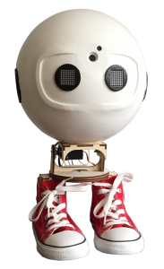

Today, [Rob Habraken,](https://www.robhabraken.nl/) andI have launched our newly and secretly built project at [SUGCON Europ 2017](http://www.sugcon.eu/). Something that never has been done before: a real robot that moves, interacts, communicates and executes tasks, fully driven by Sitecore XP, using additional techniques like Artificial Intelligence, Machine Learning, Natural Language Processing, Face Recognition and Emotion Detection.

It is a robot whose behaviour is fully controlled by Sitecore xDB! Why? To show the power of Sitecore’s marketing suite. To prove that Sitecore’s omni-channel capabilities go beyond existing channels. And to discover the boundaries of this technology. Experiment with the new Microsoft Cognitive Services. And just because it’s awesome!

Besides the cool appearance of the robot, Robbie, there’s something in the software Rob and Bas built that is ground breaking and a useful innovation: Robbie can detect and recognize multiple persons within its field of vision, and run multiple xDB sessions simultaneously, being able to interact with multiple individuals at the same time, while personalizing behaviour towards all of them individually. From one device. In the upcoming months, Rob and Bas will release multiple blog posts going deeper into the technology behind this project. They will demo Robbie on other events as well, and eventually release all code that drives this awesome project! Want to see more? Keep an eye out on the #sugcon Twitter channel or our website, as soon the recordings of this session will be shared!
