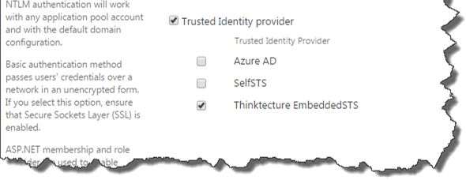
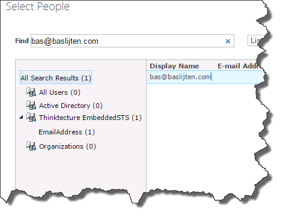
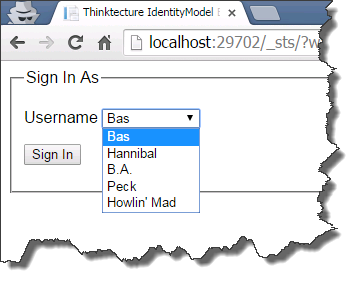
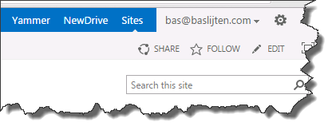
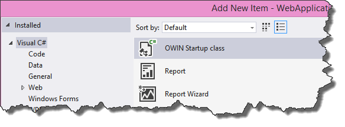
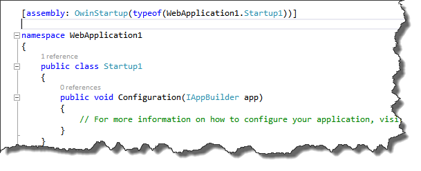
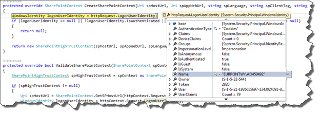
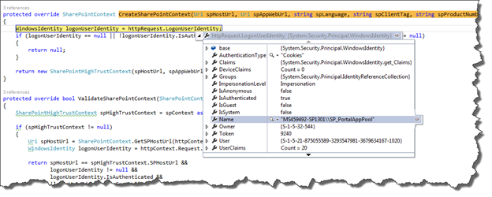
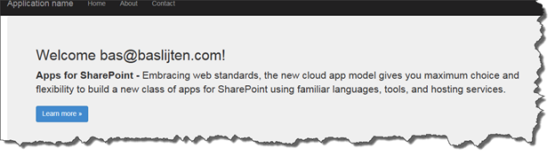

Since SharePoint 2013, web applications are created with claims based authentication by default. This works with together with High trust provider hosted apps, based on windows authentication as well. Whenever ADFS with its SAML claims pops in, it gets complicated: SharePoint needs to be configured, High trust provider apps need to configured and the app needs to communicate with SharePoint – using saml claims. Mix in a development environment, where, very likely, no ADFS is available and it gets complicated. Until now ;).

This blogpost describes how to setup an identity provider STS for development environments, how to configure SharePoint to use this STS and how to develop a web application that uses SAML claims and can communicate with SharePoint. All using OWIN, as it easens up development. More information on the STS and the OWIN configuration can be found in my previous blogpost in this series:

- [How to setup a simple STS for web application development](http://blog.baslijten.com/how-to-setup-a-simple-sts-for-web-application-development/) – part 1
- [Configure claims based web application using OWIN](http://blog.baslijten.com/configure-claims-based-web-applications-using-owin-wsfederation-middleware/) – part 2
- Setup your development environment for High trust Saml Claims based SharePoint provider hosted applications using OWIN – part 3 (this post)

## Steps to take

The following steps need to be taken to setup a simple development environment to configure a development STS together with SharePoint, SAML claims, provider hosted application and OWIN:

- Get and Deploy Thinktecture embedded STS
- Configure your sharepoint environment to use the STS
- Setup a new provider hosted web application
- Run ;)

## Get and Deploy embedded STS

As a development Identity Provider, the Thinkthecture EmbeddedSTS is an excellent choice. As it was meant as an embedded STS for single web applications, it didn’t have functionality in it to serve as a standalone identity provider, so I fixed this and added this [pull request](https://github.com/IdentityModel/Thinktecture.IdentityModel/pull/134). (As long it hasn’t been pulled, it can be found in [this branch](https://github.com/BasLijten/Thinktecture.IdentityModel/tree/FederationMetadata)). Just open it in Visual Studio and run the project. (Of course, it can be run as a standalone web application as well, but that’s not part of this post right now).

_As the EmbeddedStsSample doesn’t have a project reference to the Embedded STS, but a binary reference, and the fact that the binary reference is not up to date, you have to clean your solution and rebuild it before the STS can be started._ 

_When rebuilding the STS, it might even be possible that you can’t rebuild the solution. That might be possible to the fact that MVC 4.0 hasn’t been installed on your system. Feel free to add the MVC 5 nuget package to your solution, copy and reference the System.Web.Mvc assembly from the samples project or do it in any other way._ 

The default URL for the STS is: [http://localhost:29702/](http://localhost:29702/). When visiting the sample application for the first time, make sure to “login”: a list with preconfigured identities will be created on application startup, with the following identities: Alice and Bob.  This file can be found in the _“\\Thinktecture.IdentityModel\\samples\\EmbeddedSts\\EmbeddedStsSample\\App\_Data”_ directory and may be modified to your own needs. It _should_ even be done to gain the most benefit from this solution.

## Configure your sharepoint environment to use the STS

In this section, I’ll show how to add a custom account, configure SharePoint with the new STS and how to sign in to SharePoint using the custom account.

### Configure SharePoint to use the STS

To register the Token service with SharePoint, the following steps are needed:

- Add claim mappings
- Map the identifying claim
- Register the STS with SharePoint

On this [github repository](https://github.com/BasLijten/Configure-Thinktecture-EmbeddedSts-With-SharePoint.git) I put the required certificate and the script to configure SharePoint. The only thing that needs to be done, is to enter the correct realm, I used my web application url in this case. The email claim is used as identifying claim. This is import to know, as this claim will later be used for identification in the provider hosted app _and_ for use of user rehydration!

After registering the STS, it’s time to add the trusted identity provider to our web application. Go to central administration -> Application management -> Manage web applications and select the web application that you want to configure. Click on the “Authentication Provider” button in the ribbon and select the correct zone. Select the Embedded STS and press Save. This can take some time, as some internal configuration take place. No indicator will be shown! 

_Note: The Identity provider will be used by all the sites in the whole web application!_ 

Next, it’s time to add some identities. I created an example file on gist.github.com, with my identity and the _other_ members of the A-team. Place [this](https://gist.github.com/BasLijten/f1a892304754e3349274) file in the App\_data folder.

Now it’s time to add one of these identities as a sitecollection administrator to one of our sites. From the central administration, add a new site collection administrator to your site collection. Whatever value you enter: it will always return a “resolved” value. This is due to the fact that the claims resolver always return true for every value in the people picker.

### Test your configuration

Now your identity has been added, it’s time to test this out! Open up a new browser (for example an incognito window) and navigate to your sitecollection. This can take a while, as the web application has had a Application pool recycle due to the previous configuration changes.

After selecting the Embedded STS as authentication provider, you’ll get a dropdown menu with all the preconfigured identities:

After selecting “Bas”, you’ll be redirected to your SharePoint site, with [bas@baslijten.com](mailto:bas@baslijten.com) visible as logged on identity.

## Setup a new provider hosted web application

Now the prerequisites have been satisfied, it’s time to fire up a new visual studio instance! Assuming that this is _not_ the first time that you created a Provider hosted web application, I skip to the point that the application has been registered.

_Wictor Wilen wrote a very good post on High trust SAML Claims based web applications. Some of the steps are from his post, as well as the Saml claims SharePoint context provider. My work was in reducing the development effort by adding OWIN._

I disabled SSL, as it requires some configuration overhead. When deploying to production _don’t disable SSL_!

When the application has been created, press F5 to start it. Guess what? It worked: You are seeing your windows identity, instead of the identity you configured in the Embedded STS: you logged in using Windows Authentication, what should have been prevented.

The next step is to totally get rid of the ASP.Net authentication and authorization. In the project properties, disable windows authentication. Make sure that only anonymous authentication is allowed (This is a separate setting in local IIS!). The anonymous authentication allows us to inject other authentication and authorization modules than the default IIS ones. Next time you start your application, you’ll get an error, because of the disabled windows authentication:

Because of the Controller not being protected by authorization, anyone could login to the application. By adding an Authorize attribute to the controller, an authentication challenge will be triggered. By the lack of an authentication mechanism, we are going to add one. The WsFederation middleware!

### WsFederation using OWIN

All of the following steps are also described in my [previous blogpost](http://blog.baslijten.com/configure-claims-based-web-applications-using-owin-wsfederation-middleware/), but for completeness, I am repeating the steps briefly:

#### some nuget packages need to be added:

- install-package Microsoft.OWIN – this installs OWIN and the Microsoft.OWIN modules in your web application
- install-package Microsoft.OWIN.Host.SystemWeb – this one injects the Microsoft OWIN infrastructure
- install-package Microsoft.Owin.Security.WsFederation – installs the WsFederation middleware and all prerequisites
- install-package Microsoft.Owin.Security.Cookies

#### Configure the application to run the middleware

First, the application needs to be configured to run the OWIN middleware. To do this, add a new class. This class is initialized on startup when marked with the OWIN startup attribute. A template has been provided: Make sure to choose the OWIN startup template when creating the new class:

The template looks as follows:

The namespace has been marked with the OwinStartUp attribute. This means for this assembly that the Startup1 class will be used to configure the application. The Configuration class will always be used to configure the application and accepts an IAppBuilder parameter as input. This is the generic interface to configure OWIN middleware.

#### Set the authentication options

The next, and last step, is to configure the application to use the WsFederation middleware.

##### Set default authentication type to Cookies:

This is the general, recommended options. It sets the default login type to “Cookies” and uses Federation when there is no Cookie yet. The drawback is that “HttpContext.Current.User.Identity.AuthenticationType” is set to “Cookies” as well and that the code provided by Wictor Wilen, won’t work anymore (more on that later).

\[csharp\] public void Configuration(IAppBuilder app) { app.SetDefaultSignInAsAuthenticationType(CookieAuthenticationDefaults.AuthenticationType); app.UseCookieAuthentication(new CookieAuthenticationOptions()); app.UseWsFederationAuthentication( new WsFederationAuthenticationOptions { MetadataAddress = "http://localhost:29702/FederationMetadata", Wtrealm = "urn:MySamlClaimsSharePointApp", Wreply = "http://localhost:16635/" }); } \[/csharp\]

_Note: I configured my SharePoint provider hosted app to run in local IIS instead of IIS Express. When debugging in local IIS, Visual Studio will **not** break on breakpoints in the startupclass, however, it will in IIS Express._

### Run the provider hosted application

Hit F5 and see what happens. First, you are prompted to choose an identity -> that’s good! But after logging in, something strange happens. Based on whether or not you are using IIS express or Local IIS, two things can happen:

#### IIS Express: a result with the wrong displayname

IIS Express is running with the credentials of the user with whom you started Visual Studio. Big chance that this is an authorized user that’s authorized for your SharePoint site. I’ll show in a minute why that matters

#### Local IIS: The remote server returned an error: (401) Unauthorized

Your IIS site _probably_ runs an application pool with the low privileges, probably not a windows identity and hopefully not your own windows account; more likely it will be a build in account, like network service or a special prepared account with almost no privileges. That user should not be known by SharePoint.

### Challenges with the SharePoint context

The default SharePointContext class that Microsoft has provided has two implementations:

- SharePointAcsContextProvider – Provides a SharePoint context based on some JWT token that has been returned by the Azure Access Control Service. That one is not used in high trust applications
- SharePointHighTrustContextProvider – Provides a SharePoint Context based on a windows identity.

In our case, the SharePointHighTrustContextProvider is used. When logged in to the web application using windows authentication, _that_ identity is used. But we turned it off; in that case, there is a fallback to the identity that the application is running under. It comes all back to the following lines of code:

\[csharp\] protected override SharePointContext CreateSharePointContext(Uri spHostUrl, Uri spAppWebUrl, string spLanguage, string spClientTag, string spProductNumber, HttpRequestBase httpRequest) { WindowsIdentity logonUserIdentity = httpRequest.LogonUserIdentity; if (logonUserIdentity == null || !logonUserIdentity.IsAuthenticated || logonUserIdentity.IsGuest || logonUserIdentity.User == null) { return null; }

return new SharePointHighTrustContext(spHostUrl, spAppWebUrl, spLanguage, spClientTag, spProductNumber, logonUserIdentity); } \[/csharp\]

In the CreateSharePointContext implementation method of the SharePointHighTrustContextProvider, the httpRequest.loginIdentity is used. See the different identities in the next two images, for local IIS and IIS Express:

IIS Express:

Local IIS:

It seems that no SharePoint context _can_ be created for our SAML users.

### High trust SAML SharePoint Context Provider

Luckily, I was not the first who ran into these problems. Steve Peschka created a helper class, which was improved by Wictor Wilen ([SharePoint 2013 with SAML claims and provider hosted apps](http://www.wictorwilen.se/sharepoint-2013-with-saml-claims-and-provider-hosted-apps)). However, this solution didn’t work with app only calls, so Tobias Lekman [improved the code](https://blog.lekman.com/2015/02/sharepoint-high-trust-apps-and-adfssaml.html) on _his_ turn. Afterwards, Steve released a new version of his code, but it can’t be downloaded anymore L.

For this example, I use the code of Wictor wilen, as it exists on github and it was easier to add a [pull request](https://github.com/wictorwilen/SharePointContextSaml/pull/2) to it, with some small fixes. This means, that this code _can not_ be used with the app only context! The code of steve/Tobias should be easy to integrate in your solution, using the same steps.

Enfin, my github fork can be found [here](https://github.com/BasLijten/SharePointContextSaml), please read the readme.md for the exact steps. Basically, it comes down to those 4 steps:

- Add the SharePointContextSAML to the web project
- Modify the Tokenhelper.cs class, by assigning the partial keyword to it
- Modify the existing SharePointContext.cs. The change is to create a SharePointHighTrustSamlContextProvider or SharePointHighTrustContextProvider whenever needed (based on the IdentityType).
- Modify the web.config and add three keys to the application settings.

_Note: The Userprofile service is required for this to work! As SharePoint used the UPS to rehydrate users, your users have to be assigned to the UPS. So make sure to add a userprofile to the UPS with the Workemail property filled (with your email claim value)_

Whenever these steps have been executed, your SharePoint provider hosted app has been configured to use SAML claims using OWIN! Run it and you’ll see this:

## Summary

SharePoint 2013, High trust apps, SAML claims and its infrastructure can be complex, but it doesn’t have to be hard to setup a development environment. Using the Thinktecture EmbeddedSTS, some plumbing by Wictor Wilen and Steve Peschka, and some OWIN magic, it’s quite easy to setup an environment like this! On first sight, it looks really inconvenient, but once you have done it, it doesn’t seem to be too hard anymore
