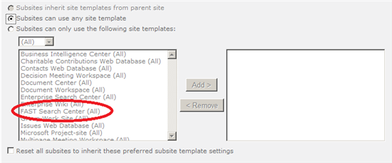
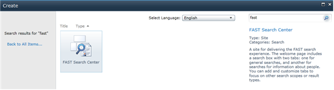

Recently I found out that, my Fast Search Center was not available from the “New Site” menu. Both the english as well the dutch fast search template was not available.

As I saw this happen before, I checked out the site collection features overview, to enable the “SharePoint Server Enterprise Site Collection features”. I had to scratch my head twice when I saw that that feature was already activated: that feature should add fast search center templates to the available templates. Next thing I did was navigate to the “Page Layout and Site Template settings”, to make sure that the Fast Search Center template was available for creating sub-sites. To my surprise, the template was available! Still, I couldn’t select that template when creating a new site.



I remembered that there is a hidden sitecollection feature (search extensions) that needs to be enabled to make use of the Fast specific features like visual best bets and that enables the administration links to visual best bets, user contexts and site promotion/demotion. After activating that feature, the Fast Search center template became available.



This is strange, because when checking that feature.xml, we learn the following:

```xml
<?xml version="1.0" encoding="utf-8" ?> <!-- Copyright (c) Microsoft Corporation. All rights reserved. --> <Feature Id="5EAC763D-FBF5-4d6f-A76B-EDED7DD7B0A5" Title="$Resources:SearchExtensionsFeatureTitle;" Description="$Resources:SearchExtensionsFeatureDescription;" DefaultResourceFile="Microsoft.Office.Server.Search" SolutionId="7ED6CD55-B479-4EB7-A529-E99A24C10BD3" Version="14.0.0.0" Scope="Site" Hidden="TRUE" xmlns="http://schemas.microsoft.com/sharepoint/"> <ElementManifests> <ElementManifest Location="webPartDWPFiles.xml"/> <ElementManifest Location="ExtendedSearchAdminLinks.xml"/> </ElementManifests> </Feature> ```

- There is no feature receiver
- There is no feature dependency
- The feature only
    - Adds a webpart (webpartdwpfiles.xml)
    - Adds Search admin links (ExtendedSearchAdminLinks.xml)

For some reason this only happened for _existing_ site collections. That made me think about some recent changes to the platform:

- SP1 was installed
- SP1 for language packs was installed
- CU June was installed.

When deactivating the hidden feature (Search Extensions), the english template was gone again, whereas the dutch search template still existed. I definately this needs some further investigation.

As it only happened for the sites that existed _before_ that change, my guess it has to do with a combination of those updates. For new sites, everything works as intended. My _guess_ is that it has to do with the combination of installed/registred language packs and the activation/deactivation of the search extension feature, which provides a default language resource named "Microsoft.Office.Server.Search".
