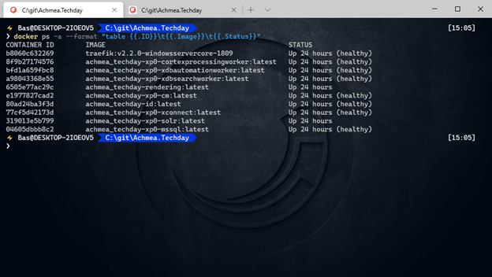
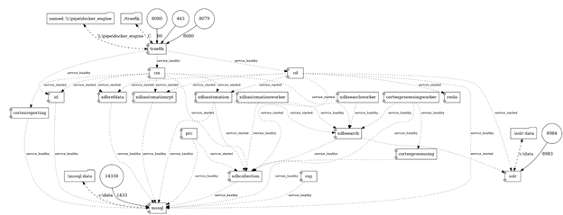
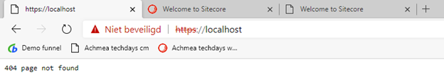
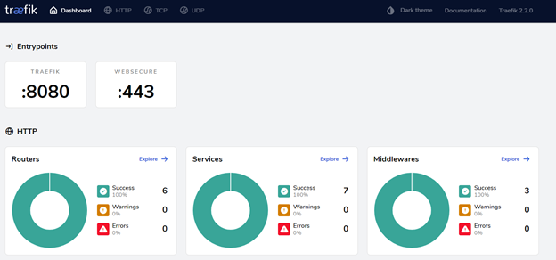
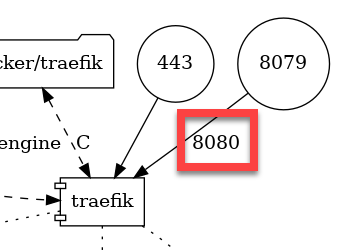
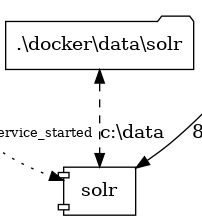
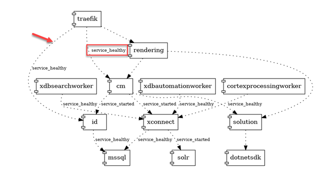
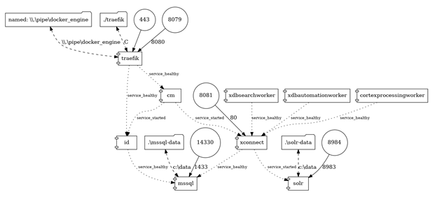
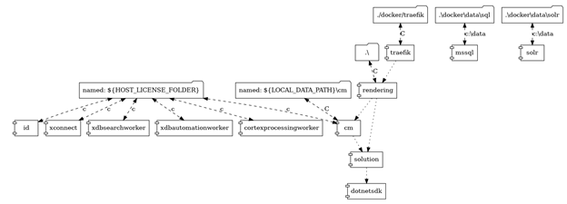

After following the [“getting started”  guide by Nick Wesselman](https://www.linkedin.com/pulse/sitecore-100-released-great-day-developers-nick-wesselman/), I had my first Sitecore 10 environment up and running in Sitecore, so there is no need to write about the convenient installation. But being new to Docker and (thus) new to the new approach that Sitecore uses for these development environments, I struggled a little bit in _understanding_ how everything worked together. I wanted to know about the structure, dependencies. As I couldn’t find any blogpost on the new structure/setup and how all the roles correlate to each other and how the dependencies are working, I decided to dive into it and share it. Note: there is a lot of information on the [Sitecore DevEx Containers documentation site](https://containers.doc.sitecore.com/docs/intro) and it explains how things can/should be achieved, I can really recommend this site.

When taking a look at all the docker containers that are running after completing Nick’s tutorial, we do see that 10 containers were started. This is for the “xp0” One “traefik” container and 9 sitecore containers.



You might recognize the different sitecore roles, but how do they depend on each other? Where do they come from? How do you customize the solution? What does the network look like? What is exposed and what not? In order to understand how everything works together, I tried to visualize the composition and explain it. I did this for the XP0 setup.

# The role decomposition

Aside from the sitecore roles, the only role which might not be familiar to you, is traefik. According to [their website](https://doc.traefik.io/traefik/):

_Traefik is an open-source Edge Router that makes publishing your services a fun and easy experience. It receives requests on behalf of your system and finds out which components are responsible for handling them._

It basically listens to requests on a certain port and redirects them to the correct role.

# The docker composition visualized – identify the important configuration assets

To gain all the insights, I started to visualize the docker-compose files. For the XP0 I ended up with the following composition:


The XP1 composition has the following composition (with 19 roles):



In one blink of an eye, a few important configuration settings can be identified:

- Open ports
- Port mappings
- Volume mapping
- Dependencies between roles
- Containers that do not show up in docker

Important configuration that this diagram doesn’t tell us

- Hostnames

## Open Ports

All exposed ports are the 5 ports which are encircled:

- 443 (Traefik)
- 8079 (Traefik)
- 14430 (SQL)
- 8081 (xConnect)
- 8984 (Solr)

The Traefik role exposes the 443 and 8079 ports. When navigating to ```https://localhost:443``` nothing is presented, as seen in the following screenshot:



However, when navigating to [http://localhost:8079](http://localhost:8079), an interesting site shows up: the Traefik dashboard:



Something which is remarkable in this entrypoint configuration, is the entrypoint configuration. Apparently, it exposes ports 443 and 8080, but the 8080 port is not in the list of exposed ports.

## Port mapping

The reason behind this difference, is the fact that traefik _itself_ is configured to listen to ports 443 and 8080. Docker is configured to _listen_ to port 8079 and _redirect_ the traffic to port 8080 internally. The same applies for the 443 port, but it is internally mapped to the same port:



The same method is used to map port 14330 to 1433 for the sql role, 8081 to 80 for xConnect and 8984 to 8983 for Solr.

## Volume mapping

Another important piece of configuration is the volume mapping. These volume mappings are indicated by the folder icons:



The following folders are mounted:

- Traefik: ./docker/traefik to c
- Rendering: ./ to C
- CM: named: ${LOCAL\_DATA\_PATH}\\cm to C
- SQL: .\\docker\\data\\sql to c:\\data
- SOLR: .\\docker\\data\\solr to c:\\data
- Multiple roles – named: ${HOST\_LICENSE\_FOLDER}

Some folders appear to be mounted to “C”. This is not the case, but probably a problem in my visualization software.

## Dependencies between roles

The thin dotted lines between the rectangles mark the dependencies (One of these dependencies is marked by the red arrow). For the purpose of convenience, the port and volume mappings are omitted in this visualization



These dependencies might have a small note (as seen in the red bounded box). This note indicates the required state of the role it _depends_ on, before it can be started. In this case, Traefik has a dependency on identity, “rendering” and “_Content management_”, where the required status for both cm as well as identity is marked as “service\_healthy”, in other words: if the CM or identity server doesn’t come up healthy, traefik does not start as well. This dependency is not present for the asp.net core rendering host.

_Note: In my humble opinion, this requirement is a small drawback for a development environment: a lot of debugging and analysis happens in these environments. Whenever you made configuration error, implemented a bug or whatsoever, traefik will not start and, thus, you will not be able to access your CM environment and see whatever error happened._

_Note 2: please take note of the fact that there isn’t a direct dependency of CM directly on the SQL database. As the CM requires xConnect to start “healthy”, which has a dependency on SQL as well, this dependency is implicit._

## Containers that do not show up in docker

You might wonder why there are just 10 containers up and running in an XP0 environment, while the dependency diagram shows 12 different roles. The 2 roles which are “extra” are “Solution” and dotnetSDK; Especially the “Solution” role is “special”.

This solution role is actually a builder role and gathers all source code available. Within this docker container, the complete solution will be build, using a special crafted “dotnet sdk” container (which contains a nifty solution to cache the nuget layer. [More on this can be read here](https://blog.baslijten.com/how-to-use-the-nuget-azure-artifact-credential-provider-with-a-net-docker-build-container-to-connect-to-authenticated-azure-devops-feeds/)). In a future blogpost, more will be elaborated regarding building the solution.

## Missing insights in this overview

The one piece of configuration that really misses, are the configured hostnames which Traefik is listening to. The is not to strange: the software visualizes the docker-compose dependencies, volume mappings and port mappings. Docker is _not_ configured to listen to a specific hostname; but the role Traefik is. As this is software specific configuration, the visualization software is not able to visualize this.

# Where can the configuration be found

To make things easy (or flexible) multiple files can be used to configure docker. In a default situation (which is the case as well for this getting started example), the configuration will be stored in docker-compose.yml _and_ docker-compose.override.yml – these can be found in the root of your workspace.

To clear up whatever is being configured in what file, I created two specific diagrams: one for the standard docker-compose.yml file, and one for the docker-compose.override.yml.

### Docker-compose.yml



### Docker-compose.override.yml



# Summary

Starting with Sitecore on docker might be overwhelming, but having a clear view on all the roles and the the corresponding configurations, probably help you to understand the docker-composition.
