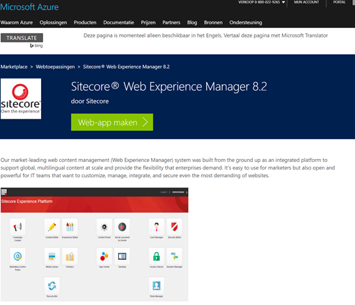
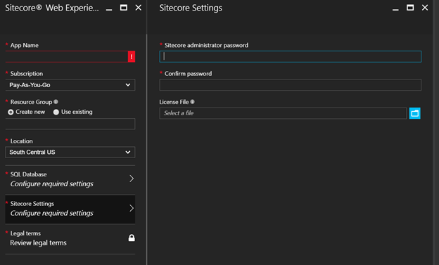
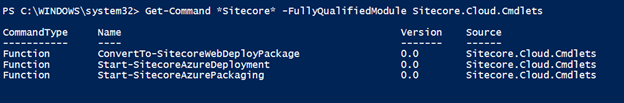
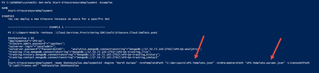
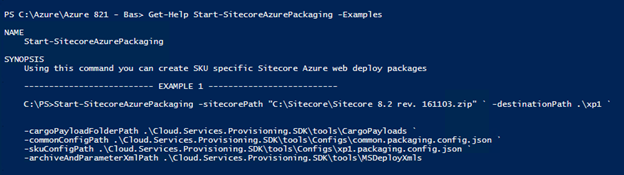
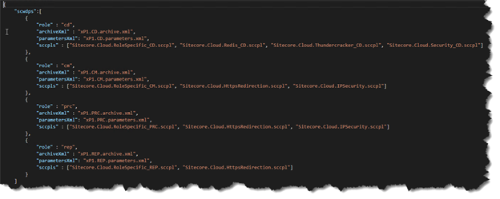
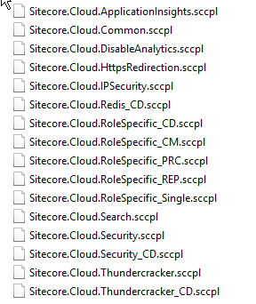
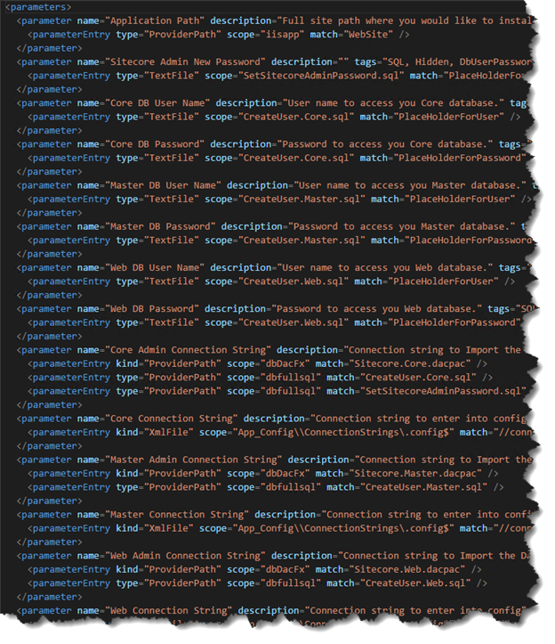

With the release of 8.2 Update 1, Sitecore also introduced support for Azure Web Apps. This release is, in my opinion, a major step for Sitecore as this update makes it very convenient to deploy to Azure using the Azure Marketplace or the provided PowerShell scripts, that’s why I think that this release is even bigger than Sitecore 8.2 initial. This deployment pattern is an interesting pattern to use on premise as well, although not all of the services can or should be used on premise. This blogpost describes how the Sitecore Azure Toolkit works. My next blogpost will describe how to use this toolkit to create your own custom web deployment packages, both for Azure _and_ your on premise installation, with even older versions than Sitecore 8.2

_Note: be careful when deploying to your own Azure subscription: when managed incorrectly, a Sitecore deployment on Azure can cause Azure to provision an extensively scaled environment, which generates many resources. Be careful as the cost of this could be high._

**Update: modified the blogpost slightly thanks to excellent feedback from Rob Habraken, Steve McGill and Michael West. Thanks guys!**

# _How Sitecore gets deployed to Azure_

There are a few different ways to deploy Sitecore to Azure, but two of them make the most sense

- Deploy from the Azure Marketplace
- Deploy using PowerShell

Using the [Azure Marketplace](https://azure.microsoft.com/nl-nl/marketplace/partners/microsoft/appsvc_sitecore_xm/), a one-click-deployment is initiated (I won’t go too deep into how to provision this app, as [Praveen Kumar Sreeram already blogged about it](https://praveenkumarsreeram.com/2016/12/06/create-sitecore-web-experience-platform-8-2-on-azure-platform-as-a-service/)) :

When deploying this app, just a few parameters are needed which have to be provided during the creation steps. The required parameters are limited to Database settings, resource group name, license file and … the admin password!

 

This app provides a basic Sitecore 8.2 XM installation: no XDB whatsoever. The cool thing about the technique about this provisioning method is that it uses the same techniques as I describe in this blogpost: ARM templates and Web Deploy packages.

## Deploying using PowerShell using the Sitecore Azure Toolkit

Another mechanism that can be used to deploy to Azure is PowerShell. Sitecore provided the Sitecore Azure Toolkit, which contains a few beautiful gems, but more on that later. This package contains a few folders:

- Copyrights
- Resources
- Tools

The resources folder contains an 8.2.1 folder (which implies that support for other versions will be added in the future) with 3 folders: CargoPayloads, configs and msdeployxmls.

The tools folder contains a few assemblies and a PowerShell module, which provides three different public Cmdlets:

To deploy a new Sitecore environment to Azure, the Start-SitecoreAzureDeployment can be used, however, it requires a few parameters, with the most important being the ARM Template path and the ARM Parameter file:

## ARM-what?

ARM-templates are Azure Resource Management templates that allow you to deploy an application using a declarative template. With a single template, it’s possible to deploy multiple services with their dependencies. It’s a JSON file in a specific structure which describes dependencies of services, their names, usernames, passwords etcetera. I won’t go too deep into the current implementation and how Sitecore used it, as they did a solid job on providing these. If you want to get more knowledge on ARM, you can get a lot of information on [here](https://azure.microsoft.com/en-us/resources/templates/). The templates themselves can be downloaded [here](https://github.com/Sitecore/Sitecore-Azure-Quickstart-Templates).

This template needs to be fed with parameters to be able to do its job:

 

The template above, which is used for the XP1 provisioning, needs the Sitecore admin password, MongoDB ConnectionStrings, SQL Server credentials, the license file and the packageURL of the web deploy packages, in total 4 of them: for Content Management, Content Delivery, Reporting and Processing. . Interesting to note is These packages can be downloaded on dev.sitecore.net. In a classic (on premise) situation we were always forced to create role packages ourselves. How many people created PowerShell, batch files or other smart solutions to generate those role packages for us? Well, Sitecore created tooling for this job and I am pretty positive about it! And the fun part: this tool can be used to create your own packages, which can be used to deploy to Azure _and_ on premise!

## How are Web Deploy packages created?

A Web Deploy package 101: this is a package that can be deployed to Azure or IIS using MSDeploy and contains the website files, database files and a lot of other information. In this Web Deploy package, a parameters.xml can be supplied as well, which describes what parameters can be provided during deployment. Using this packaging technique, the same deployment package can be used for different environments, while providing different parameters for every environment. These parameters can be supplied by specifying the values in the msdeploy command, using a setparameters.xml or by using an ARM template.

The Sitecore Azure Toolkit contains a cmdlet to create Sitecore Web Deploy packages. One very important note:

_How the Sitecore Azure toolkit creates web deploypackages is NOT a standard way of doing this. Usually, these packages are created using MsBuild during build, but Sitecore had to create this alternative, as it would become way to complex to create web deploy packages and maintain flexible configurations. Cargo payloads, the common and sku config are terms that Sitecore introduced._ 

It requires the Sitecore package and some locations in which specific configurations are stored:

- Cargo Payload
- Common config
- SKU Config path
- MSDeploy XML

The configuration in this location is needed to create the new role-based Web Deploy packages: the standard zip of the webroot (Data/Databases/Website) will be converted to a Web Deploy solution which can be deployed to Azure or your local IIS environment and all the configuration required, per role, as described on docs.sitecore.net and in the installation notes, will automatically be applied. But how?

Basically it works this way:

- skuConfig path: defines the kind of configuration for which the Web Deploy packages need to be created (in our case, XP1). The contents define which configs to apply.
- commonConfig: the config that always needs to be applied, in any case. The contents define which configs to apply.
- Cargo payload folder: the set of actions that need to be applied to add, for example, Application Insights support.
- Archive and ParameterXML Path: the manifest and parameters.xml that need to be part of the Web Deploy packages.

In a “normal” situation these changes would have to be made manually or using own PowerShell scripts. These actions always consisted of:

- Enabling/disabling patch files
- Adding/removing files
- Changing configuration

And that’s exactly what this PowerShell does for us.

### Common and SKU config

Sitecore introduced the common and SKU config to be able to design roles and supply the required archive.xml, required parameters.xml and the cargo payload actions that need to be applied for that role. Those Cargo payloads are specified by the sccpls. sccpl is propably an abbreviation for **S**ite**C**ore**C**argo**P**ay**L**oad.

### Cargo Payload

The cargo payload is something that was introduced by Sitecore, to define transformations for existing web deployment packages and is, thus, not part of the Microsoft msbuild toolkit but is delivered with the Sitecore Azure Toolkit. It defines a set of configuration changes that can be applied to the Sitecore Web Deploy package and are tied to a central theme. Those themes are specified in the common and sku config and may contain one or more of the following themes

When unzipping these files, a few different folders are shown, which are tied to some actions.

- **copy to root** contains an action to copy the items to the root of the _web deployment package (for example SQL provisioning scripts, I will get back to this later)_
- **copy to website** contains files which need to be copied to the site root
- **XDTs** are XML Document Transform files (configs to transform, for example, the web.config or any other XML.)
- **IoActions:** an xml which contains information on patch files: which one needs to be disabled or enabled

These are actions that Sitecore defined which can be used to transform the data in this folder into the Web deploy package. For example, the Sitecore.Cloud.ApplicationInsights.sccpl contains two actions: Copy To Website and XDTS. using this technique, the "vanilla" on premise Sitecore installation does not contain Application insights, while it can be added to the packages that have to be used on azure. The copy To Website contains all patch-files and the Microsoft.ApplicationInsights binaries, while the XDT contains logic to alter the web.config and to add configuration to the connectionstrings.config

Below is an example of the IoAction file:

 

### Archive and Parameters

The archive and parameter.xml are two files that need to be copied to the root of the web deploy package. This is an example of the parameter.xml of the CM role:

It contains a lot of parameters which may be different on every deployment and/or every role, that’s why they need to be parameterized ;).

 

# Taking a look into the Web Deploy packages

Using the Start-SitecoreAzurePackaging cmdlet, the Web Deploy packages will be created. For the XP1 SKU, this will result in 4 different kind of packages: CD, CM, PRC and REP. The paths to these packages can be supplied to the config file, mentioned earlier (and I will get back into that).  When taking a closer look INSIDE the packages, the following structure can be seen (in this case the CM version). I will highlight a few observations:

### Directory structure

As opposed to the default structure (Data, Database, Website), a totally different structure can be seen. Inside the Content folder the actual website can be found, while /data and /databases seem to be missing.

The /database folder is _not_ available anymore: the database will be provisioned using the dacpac files, while the \*.sql scripts are being executed after provisioning. References can be found in the parameters.xml that I shared previously. A nice addition is that the SetSitecoreAdminPassword.sql will be executed after installation: this means that the default password “b” will be overwritten!

### Parameters.xml

As described previously: this file describes which parameters are required to deploy this package.

### Website and the /data folder

The actual website can be found in the /content folder. When taking a closer look we find that the contents of the old /data folder is located in /app\_data. The reason for this is _probably_ that only website roots can be deployed to Azure, thus a /data folder wasn’t an option anymore. This means that your license.xml will be deployed to the /app\_data as well.

# When a plan comes together

In this (lengthy) blogpost I talked about the ARM templates, their parameters, the required packages that needed to be created and how these parameters worked. Some parameters need to be specified in the ARM parameters template, such as SQL username, password and the Web Deploy packages, which can be used to deploy to the correct instance. The ARM template in itself deploys the different Web Deployment packages to the different Azure Web Apps and takes care of all the required parameters in the parameters.xml. This toolkit can be used to create custom configurations and opens up opportunities to include specific customizations in your baseline!
