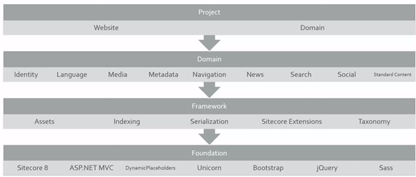
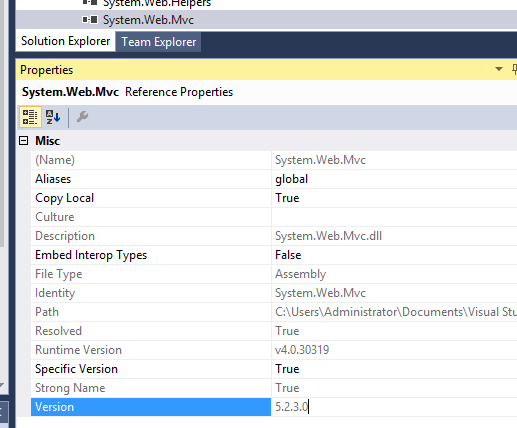
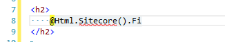
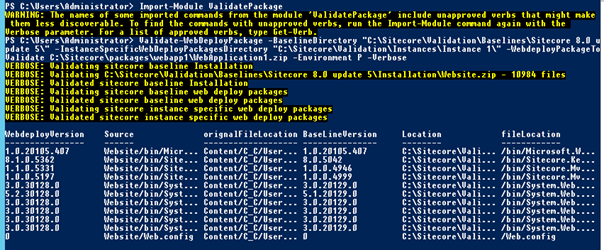
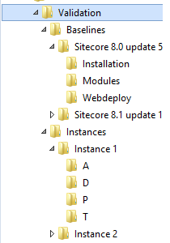

When writing code for Sitecore, this code should someday be deployed to an existing Sitecore environment. Preferably, this should happen “the first time right”. One of our guidelines to achieve this is: Don’t overwrite Sitecore files. Don’t update existing files of other packages. Don’t upgrade assembly versions. Don’t break your site. It might cause a lot of trouble without knowing where to look. When we were still working with SharePoint, there was an internal mechanism to _create_ and _remove_ deployment packages. Developers had to do their best to overwrite out of the box files, as packaging mechanisms were introduced which explicitly required to select the files that you wanted to deploy. I was (and I am) wondered that Sitecore doesn’t offer this feature (well, not as I expected it), and thus I decided to write a blogpost on what shortcomings we see, how to solve them and how to verify that things will good right.

_Source code for the [Sitecore Validate Webdeploy packages](https://github.com/BasLijten/Sitecore-Validate-Webdeploy-packages) is provided on github._

## Our Sitecore Environments

First of all, a small explanation on our Sitecore environment is needed before we can progress with our observations and solutions.

In our company, we will host hundreds of sites in the near future. To accomplish that, we have multiple Sitecore instances (thus separate Sitecore installations), running multiple versions and each Sitecore instance may host multiple websites, varying from 1 to more than 100 different websites. We try to keep all of our guidelines, deployments and environments as standard as possible: that way, it’s easy to switch sites/deployments between environments, to keep a single deployment strategy, modify that strategy without breaking things and to shift developers over projects as well. It may be possible that multiple different project teams are working simultaneous on different websites that in the end will be hosted on the same Sitecore instance.

We use the same standards for our native Asp.net applications (MVC apps, WebAPI’s), but of course every technology stack may have their own extended rules and guidelines. In our case, we are using the following toolset to build and deploy our software:

- TDS – Create our content packages (layouts, templates, settings, minimal content)
- TFS – our code repository
- Microsoft Release manager – orchestration tool to deploy packages over DTAP
- Microsoft Web deploy – deploy code packages
- Sitecore Ship – deploy content

## Baselining is key

We decided to create a baseline for every Sitecore version that we host. This baseline consists of several layers:

<table><tbody><tr><td width="132"><strong>Layer</strong></td><td width="472"><strong>Description</strong></td></tr><tr><td width="132"><strong>Sitecore</strong></td><td width="472">The Sitecore version, with all it’s configuration and all preinstalled Sitecore modules, for example:

·&nbsp;&nbsp;&nbsp;&nbsp;&nbsp;&nbsp;&nbsp;&nbsp; Sitecore 8.0 update 5

·&nbsp;&nbsp;&nbsp;&nbsp;&nbsp;&nbsp;&nbsp;&nbsp; SOLR

·&nbsp;&nbsp;&nbsp;&nbsp;&nbsp;&nbsp;&nbsp;&nbsp; Multiple Sites Manager</td></tr><tr><td width="132"><strong>Nuget</strong></td><td width="472">All commonly nuget packages that most developers use when building new solutions, for example:

·&nbsp;&nbsp;&nbsp;&nbsp;&nbsp;&nbsp;&nbsp;&nbsp; Microsoft.AspNet.MVC

·&nbsp;&nbsp;&nbsp;&nbsp;&nbsp;&nbsp;&nbsp;&nbsp; Microsoft.Owin

·&nbsp;&nbsp;&nbsp;&nbsp;&nbsp;&nbsp;&nbsp;&nbsp; Microsoft.AspNet.WebAPI

·&nbsp;&nbsp;&nbsp;&nbsp;&nbsp;&nbsp;&nbsp;&nbsp; Microsoft.Owin.Security

·&nbsp;&nbsp;&nbsp;&nbsp;&nbsp;&nbsp;&nbsp;&nbsp; Etc…</td></tr><tr><td width="132"><strong>Achmea</strong></td><td width="472">All web deploy packages that we created ourselves which are a pre-requisite for our websites:

·&nbsp;&nbsp;&nbsp;&nbsp;&nbsp;&nbsp;&nbsp;&nbsp; SEO components

·&nbsp;&nbsp;&nbsp;&nbsp;&nbsp;&nbsp;&nbsp;&nbsp; Federated Authentication

·&nbsp;&nbsp;&nbsp;&nbsp;&nbsp;&nbsp;&nbsp;&nbsp; Commonly used practices

·&nbsp;&nbsp;&nbsp;&nbsp;&nbsp;&nbsp;&nbsp;&nbsp; Logging

·&nbsp;&nbsp;&nbsp;&nbsp;&nbsp;&nbsp;&nbsp;&nbsp; Etc…</td></tr></tbody></table>

These three layers together are called the Sitecore baseline for Sitecore version x.x and is comparable to, in [Sitecore habitat](https://github.com/Sitecore/Habitat) terms, the Foundation. A project is, thus, based on the Foundation and has the freedom to build it’s own project, domain and Framework layer, as long it respects the packages and their versions that are provided with the Baseline.

Projects are _not_ allowed to update the assemblies in this Foundation to a next version, this is centrally managed by the owner of the baseline/platform. In other words: they are not allowed to overwrite _any_ file on the filesystem. All the files that they deploy must follow naming conventions, to be sure that they will not overwrite other projects files as well.

We facilitate developers to get the right version of packages by supplying different nuget feeds: When working on a (new) project, that developer has to connect to a nuget feed for a separate Sitecore baseline version, to include the right assemblies in his project. We have nuget feeds for Sitecore ([structured by the idea](https://community.sitecore.net/developers/f/8/p/1761/5299#5299) of [Sean Holmesby](https://community.sitecore.net/members/seanholmesby_5f00_202016474) on the [Sitecore community forum](https://community.sitecore.net/members/seanholmesby_5f00_202016474)), nuget feeds for the allowed third party nuget packages and a nuget feed for our own code.

In addition to these feeds, we also provide a store with all nuget packages, that have to be deployed to the developers Sitecore instance.

## Sitecore development – where does it break things?

So far so good. With all these baselines it’s important to be sure that the baseline doesn’t get damaged. With a single team working on a single site, it shouldn’t be too much of a problem when a version gets overwritten, but when working with multiple teams on multiple sites, with multiple code bases and in multiple instances, chances will increase by big numbers that soon (tm, blizzard ;)) “things” will break. And believe me, been there, done that, on the SharePoint platform. We don’t want to get there again anymore. Never.

But how easy is it to break “things”, then? Well: very easy. Assume that you create a new, empty web application project to start some Sitecore development for Sitecore 8.0 update 5. The first thing you do, is adding some Controllers and some views. To use the views “in the Sitecore way”, it’s important to include some Sitecore assemblies, these are copied from the Sitecore directory, a pretty common set are the following assemblies:

- Sitecore.Kernel
- Sitecore.Mvc.Analytics
- Sitecore.Mvc
- System.Web.Mvc
- System.Web.WebPages

The next thing that may be needed, are standard Nuget packages, for example, the Microsoft.AspNet.MVC libraries: with a simple instruction, the latest version of these libraries will be installed: install-package Microsoft.AspNet.Mvc

So what did we achieve, with those few actions?

1. The referenced files are all set to copy local = true. Which means: those files are copied into the webdeploy package on build and will be deployed to Sitecore. 
2. The web.config is also set to copy local = true. This breaks Sitecore, as it has a heavily modified web.config.
3. Due to the installation of the Microsoft.AspNet.Mvc package, the System.Web.Mvc gets upgraded from version 5.1.1.0 to version 5.2.3.0. Assume that we didn’t copy the web.config: This would have broken Sitecore _again,_ as there should have been created a assembly redirection binding. This can’t be patched into Sitecore, but should have been done with a manual action. The result: an unsupported scenario, as seen in [this knowledge base article](https://kb.sitecore.net/articles/087164). We also had official word from Sitecore regarding this subject, although MVC 5.2 works in a lot of scenarios.

So with some minimal actions, we managed to

1. Overwrite installation files
2. Break Sitecore
3. Get into an unsupported state, _if_ we had fixed the web.config. Sitecore 8.0 works with MVC 5.1 and following this [Sitecore compatibility Table](https://kb.sitecore.net/articles/087164) only 5.1 is supported. We had contact with Sitecore regarding this subject and they confirmed that upgrading to 5.2 was not supported.

## How to solve these issues

As all of the above issues are mitigated by our development standards and guidelines, all of the above issues have been mitigated ;)

No, I’m just kidding. Guidelines _alone_ don’t help you. Standards and guidelines help us to think about how software should be written, helps us to maintain and deploy it in a stable way. But without tooling, without help, developers ‘tend’ to take shortcuts or accidentally make mistakes. So we have to help them prevent taking those shortcuts.

### Offer a baseline nuget feed

This one I already wrote about. Offer a nuget feed with all packages/assemblies that you allow, this will make it lots easier for the developer to use the correct version

### Prevent assemblies from being copied into the deployment packages

There are a few options:

#### Copy local false

This one is a bit harder. It’s easy to give instructions to the developer to set “copy local” to false. But this may break the intellisense in the Razor views and sometimes breaks the build:

Because of this behavior, this is not a solution for us.

#### TDS

If you are using TDS, use TDS to exclude those files. See [this blogpost](http://www.seanholmesby.com/fixing-visual-studio-intellisense-in-sitecore-mvc-views/) from Sean Holmesby on how to do this. This, however, does not work with web deploy packages and is not suitable for us.

#### Web Deploy and the Web Publish Pipeline (wpp)

If you are using Web deploy packages, like we do, it’s also possible to create a <projectname>.wpp.targets file. [This page](http://www.asp.net/web-forms/overview/deployment/advanced-enterprise-web-deployment/excluding-files-and-folders-from-deployment) explains how to use this file. As the file is accepted by msbuild as well, it can be used to create packages _without_ those files

### Project templates

Create default project templates with

- The basic Sitecore assemblies referenced
- A basic .wpp.targets file with a lot of files already excluded
- A default web.config that will not be copied

This will help to prevent a lot of commonly made mistakes.

## Helping isn’t enough: Seeing is believing!

With above tools in place, it’s still possible to create packages that overwrite system files. Verify every single package that will be installed, _before_ it will be deployed to the different environments. Just compare the contents of the web deploy package to baseline Sitecore installation, to the custom baseline packages (the nuget files and your generic packages) and to the other projects, to prevent conflicts. How did I do that?

1. I made a baseline directory for a specific Sitecore version and created two different directories in it:
    - Installation
    - Webdeploy packages
2. I maded an “Instance” folder with a specific “Sitecore instance <name>” folder in it, which is used for all the projects that will be deployed to the same Sitecore instance. In this folder, I have the folder D(evelopment), T(est), A(cceptance) and P(roduction). This leads to the following structure:
    - Instance
        - <Instance name>
            - D
            - T
            - A
            - P
3. In the Installation folder, I placed a copy of the Sitecore zip file (that can be downloaded from dev.sitecore.net). In addition to that, I created a zip of the Website folders of the Content Management and Content Delivery servers and placed them into this installation folder. These baselines should be equal for all versions.
4. I placed The web deploy packages that I created to deploy the assemblies from the generic nuget packages in the webdeploy folder, together with my company specific solutions (thus the nuget layer and the achmea layer from the table at the start of this article)
5. The instance specific web deploy packages are copied into the instance folder. As the Lifecycle of the project specific packages could be low, they are deployed often, and chances are big that the Development version is not the same as the Production version. To be able to see the difference over different environments, these packages should be managed per environment.

The script that I created takes 4 input parameters: baseline directory, instance directory, the package to validate and the environment. It does do a few actions:

- Validate the webdeploy package against every package in the Sitecore baseline directory. Every duplicate file in the same path, will be reported. If the file is an assembly, the version will be reported as well
- Validate the webdeploy package against the nuget baseline. Every duplicate file will be reported, If the file is an assembly, the version will be reported as well
- Validate the webdeploy package against all the instance specific packages, depending on the environment. Every duplicate file will be reported, If the file is an assembly, the version will be reported as well

In the end, all the outcomes are merged and a report is being written to output.txt and the results will be returned; this way, the script can be used in automatic deployment scenario’s. An example output is the following:

In the example above, I am using the application that we just created. What did we learn from the output?

- I used the Sitecore 8.1 assemblies vs the Sitecore 8.0 baseline (and I didn’t do that on purpose, I really made a mistake ;)) -> break Sitecore
- I was about to upgrade the System.Web.Mvc version -> Unsupported scenario & break sitecore
- I was about to overwrite the web.config -> break Sitecore

Well, now we know how easy it is to prevent the world from making mistakes, one last question resides:

## How can YOU use that script?

The script is free to used and can be found [here](https://github.com/BasLijten/Sitecore-Validate-Webdeploy-packages). Although there is a readme.md, I’ll give quick instructions:

1. Copy the scripts to $home\\Documents\\WindowsPowerShell\\Modules\\ValidatePackage
2. Import-Module ValidatePackage
3. Create the following folder structure: 
4. Place a copy of your (vanilla) Sitecore installation in the right Installation directory, place your generic web deploy packages into the Webdeploy directory and place your project or instance specific packages into the Instances\\<instance>\\<environment> directory
5. Import-Module ValidatePackage
6. Validate-WebDeployPackage -BaselineDirectory "C:\\sitecore\\validation\\baselines\\sc 8.0 update 5\\" -InstanceSpecificWebDeployPackagesDirectory "c:\\Sitecore\\validation\\Instances\\<instance>\\" -WebdeployPackageToValidate "C:\\sitecore packages\\custom package.zip" -Environment "D" -Verbose

## Conclusion

Keeping your Sitecore installation clean and healthy can get complex with multiple teams. But with the right mindset, standards, guidelines, tooling and validations, this can easily be achieved. “Never trust other developers on their bright blue eyes” (a nice dutch saying), but verify everything they do. Manual verifications are almost impossible to do (you would make a lot of mistakes yourself, apart from the fact that it is very time consuming), so automation is key here.

Happy validation-time!
