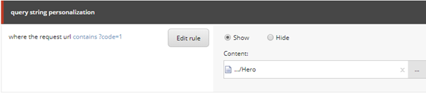
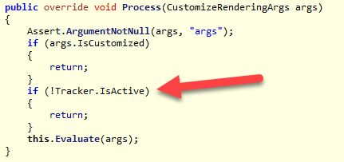
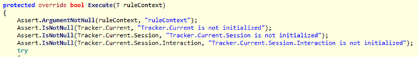
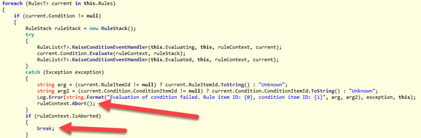
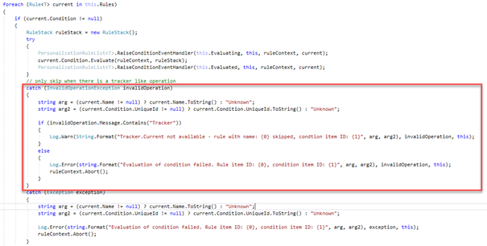

Due to different laws (European as well as local legislation) companies have be very conversative in how they process data, while they have to take care on how they track people. People have to consent whether or not they will be tracked or not. Within Siecore, you might do both. This blogpost shares how to use your cookie consent strategy within Sitecore. In short: There are three level of cookies: Functional, analytic and tracking cookies. Without responding to the cookie consent, Only functional cookies are allowed, while analytics and tracking cookies is forbidden until a user gives approval for these kinds of functionality. Within Sitecore, this is hard to implement, due to the internal workings of Sitecore analytics and (from what I think) Sitecore bug. This blogpost explains why this is hard and how to solve this.  
  
_PS: Different companies classify the Sitecore cookies under different levels. I have seen classifications of “Functional”, “Analytics” and “Tracking”. I won’t judge any choice, as I am not a person with a legal background and can’t judge on what all companies implement to prevent data from being collected. This is my personal view and the approach should be applicable to every level. This blogpost applies to Sitecore 9.X_

# Too long; Didn’t Read

When implementing logic in Sitecore to follow Cookie consent settings, the Sitecore tracker needs to be stopped. While basic conditions which don’t require the tracker should still work (aka the functional level), this is not the case. Stopping the tracker prevents Conditional Renderings from working. The fix for this issue (override the Personalize Pipeline and remove the check for Tracker.IsActive) brings another issue to the surface; when there is a Condition that causes an Exception (and there are loads of them) your conditions will not be evaluated anymore and the rendering will fall back to the default rendering. The RuleList<T>.Run stops evaluating conditions when a condition throws an error. The fix for this issue is to create a PersonlizeRuleList<t> class which derives from the RuleList<T>, override the Run logic and use that logic within the personalization pipeline.

Code can be found [here](https://github.com/BasLijten/sitecore-personalization-without-tracker).

# Sitecore analytics and the tracker – a functional perspective

When Sitecore analytics is enabled, various functionalities (but not limited to) are available, which all require the Sitecore Tracker (important):

1. Personalization (Until Sitecore 9.1 in process personalization was possible from Sitecore 9.1 the XM version is needed. Tracking might be disabled while still having making use of personalization rules) - _Out of the box functionality_
2. Analytics – User behavior is collected anonymously. IP addresses are redacted, browsing history. _Out of the box functionality_
3. Tracking – users may be identified and additional information might be stored into the XDB. Explicit action needs to be taken to store this information, which means this data is not stored out of the box. Using XDB to store data about people might fall under the GDPR law!

Depending on how the above functionality is plotted by your legal organization, out of the box functionality might or might not comply with the “Functional Level” – the level which should be applied without explicit consent. If your organization scores Personalization _and_ Analytics under the “Functional level” – congratulations, you could stop reading, as you won’t have to take any actions to comply.

In the story below I’ll discuss the different functionalities and why you might have a problem.

## Personalization - Basic functional working of Sitecore with rules and conditions

One of the most powerful capabilities of Sitecore is using personalization rules and conditions. As “personalization” may sound that it personalizes the website based on an identity, it may be a very general condition which doesn’t have to do anything with a person or identity. For example: Show a different rendering based on a querystring parameter:



In my _personal_ opinion, this is a basic functionality which should work in any scenario, even when analytics is turned off. Which means: conditions which require the Sitecore Tracker should not function.

## Sitecore Analytics – track anonymous data

In this functionality, Sitecore stores visitor information (useragent, resolution information, goals, events, page visited and a hashed ip-address). This functionality stores metadata about a certain visit, but no information about the visitor itself.

## Sitecore Tracking – track visitor information

Whenever a user submits (personal) data, this data could be stored. A developer would have to take explicit action to, for example, store email addresses, name and address data, personal interests or whatsoever. Based on this kind of data, personalization options _could_ be offered.

# Sitecore analytics and the tracker – a technical perspective

When Sitecore analytics is enabled, the functionalities above are all available. But they rely on a single mechanism: the Sitecore Tracker. This one should be active and is filled with a certain context.

The property “Tracker.IsActive” tells is if analytics is turned on, while the Tracker.Current should have a Tracking context for the current user. The “SC\_ANALYTICS\_GLOBAL\_COOKIE” goes hand in hand with this mechanism. It tells us a) who is this user and b) has the user already been classified (as a robot or human?))

# Cookie consent levels and Sitecore and their precautions

Most companies inject their cookie consent messages and choices using a tag managent system like GTM or Relay42. The default choice is level 1 (Functional) or no level, while visitors can explicitly choose for level 1, 2 or 3 (functional, analytics or tracking – see the similarity with the Sitecore functions?)

<table class="wp-block-table is-style-regular"><tbody><tr><td>Sitecore analytics<br>classified as</td><td>Precautions</td></tr><tr><td>Functional</td><td>No Actions</td></tr><tr><td>Analytics</td><td>Take actions to prevent Sitecore from loading the tracker before consent has been given</td></tr><tr><td>Tracking</td><td>Take actions to prevent Sitecore from loading the tracker<br>before consent has been given</td></tr></tbody></table>

When precautions need to be taken, based on your cookie consent levels and the Sitecore classification, the Tracker needs to be stopped as soon as possible. I won’t share code with the cookie consent logic, but this Tracker should be stopped directly after the following pipeline:

```
Sitecore.Analytics.Pipelines.StartAnalytics.CheckPreconditions
```

a custom pipeline should be implemented which, based on your cookie consent logic, should call the following code as long as no consent has been given:

```
Sitecore.Analytics.Tracker.Current?.EndTracking();
args.AbortPipeline();
```

# The Tracker has been stopped – now it gets hard

When the tracker stops tracking, the most basic functionality stops working as well: Personalization! As explained, this doesn’t have to rely on a person, identity or the current visits; conditions could go off on things like query strings as well! A few lines of code within the “Sitecore.Mvc.Analytics.Pipelines.Response.CustomizeRendering.Personalize” pipeline prevent the (basic) conditions from evaluating, as there is an explicit check on the “Tracker.IsActive”. but it has explicitly been stopped:



A quick fix was to override this processor and  remove the explicit check on the Tracker. But behavior wasn’t as obvious as it seemed:

<script src="https://gist.github.com/BasLijten/a9cc69ce5cb18315d496d5161f5d1e68.js"></script>

## Conditions might not evaluate

When working with basic conditions which do not require a tracker worked seamlessly. But when mixing up, behavior is unexpected. As an example, the rule “Where the **specific** campaign was triggered during the current visit”. This one has a dependency on the tracker. Based on the order of the conditions, the expected outcome will or won’t appear, see the included video below, as it explains the issue much better:

https://youtu.be/5Nsl1pLkdEA

## Conditions which require a Tracker throw an exception when it is not available

The HasCampaign condition for example has a few lines of code which chech whether or not the Sitecore Tracker is available:



Under the hood, these Asserts throw an “InvalidOperationException”.

## Conditions which throw an error cause the complete pipeline to abort

At the “RunRules” method in the personalizae pipeline, the code to run the rules can be found. It’s actual impementation is the default RuleList<T>.Run implementation, which is widely used within the Sitecore product.

My expectation was that the Run implementation would evaluate rules which throw an exception to false. This expectation was wrong, every exception aborts the pipeline, which means that no rule will be evaluated anymore:



## This cannot be fixed easily by Sitecore

As this function RuleList<T>.Run function is widely used, behavior of vital elements of Sitecore might change. Changing the Assert.IsNotNull implementation might lead to unexpected behavior as well, while changing each rule that requires a tracker to return false is a labour intensive approach as well.

# A Suitable approach

A more suitable approach, is to replace the RuleList<T>.Run function by another function which is only used by the personalization engine. We decided to duplicate the pipeline and make an own implementation of the Run logic. As extension methods weren’t possible, a new class “PersonalizedRuleList” was created which implements Run-logic which is suitable for processing the ConditionalRenderings.

The magic happens in this specific catch:



This will cause to the evaluation process to continue after an InvalidOperationException and causes all Conditions to evaluate successfully.
